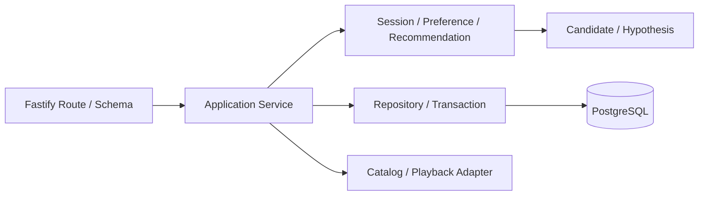

# BE Implementation Guide

**Supporting Artifact / Not a Source of Truth**。正式仕様は[Product Spec](../product-spec.md)と[Architecture](../architecture.md)。以下は2026-09-25の実装準備であり、本番実装済みという意味ではない。

## 最初に読むもの

[Decision](decision-log.md)→[Intent](design-intent.md)→[Evidence](evidence.md)を読み、対象R-IDをIssueに固定する。package manager、Node版、ORM/migration tool、本番ディレクトリは未決。PoCのpackage.jsonや起動コマンドを本番の正本へコピーしない。

## 全体の実装順序

これは推奨する依存順であり、新規IssueのScopeを自動決定しない。MUSTのログ・認可・冪等性・主要試験はP1から組み込む。P3まで先送りしない。

| 段階 | 成果 | 終了時に確認するもの |
| --- | --- | --- |
| P0 | Real Catalog / Playback PoC、Algorithm Simulation、Environment / DB foundation | [利用権](evidence.md#保存学習用途の追加確認)、Feature/Mapping/地域別実再生、[ML評価](../ML/evaluation.md)、DB接続・pooler・migration・rollback。未許諾データの永続化は合成fixtureで代替して別gateにする |
| P1 Walking Skeleton | Guest→Seed Search→1 Recommendation＋Trace→Playback→Feedback→Posterior→Next | 保存後だけ表示、他owner拒否、同一ID再送、応答消失、実再生開始と明示評価の対応、Secret非記録 |
| P2 Core Loop | 5有効Interaction、候補不足、Summary、Save、Continued Exploration | UNSURE計数、Probe上限、BLOCKED_CATALOG、Save非reward、checkpoint後も同じPreferenceを保持 |
| P3 Quality | Rating Revision、Aspect Question、Observability拡充、E2E、Performance、実Deployment | SHOULDはMUST完成後。canonical rebuild、CONTESTED、複数owner/instance、cold/warm、実端末・accessibility |
| P4 | Account、Guest移行、Intent、詳細History | 別Issueで人間判断。Auth完成をGuest Coreの前提にしない |

## Moduleの境界

Routeは入力schema、認証context、応答DTO、HTTP errorへ変換する。Applicationは一連の処理を調整し、DomainはRating・Context・制約・推薦判断を行う。Repositoryは同一transaction clientの生存期間を管理する。External Adapterは外部schemaを内部型へ変換し、timeout/429/一時障害/恒久不可を区別する。DomainはFastifyのRequest/Reply/Contextを受け取らない。実装上のinterfaceやディレクトリは必要最小限にする。

外部通信はlock取得前に行う。取得した候補snapshot/版をtransaction内で現在のStateと再照合し、古い場合は再試行する。Interaction＋Traceを一括保存してから応答する。同じownerが複数SessionでPreferenceを共有する場合は、Session行だけでなく共通Preference Stateを直列化する。lock取得順、timeout、deadlock retry、最大再試行回数は実装Issueで契約化する。

## API契約を固める順

1. Guest identityのCookie、expiry、CSRF/Origin、所有権エラーの公開形を決める（Account providerとは別）。
2. Request/Response schemaとDomain DTOを対応させる。型の共有はserverのruntime validationの代わりにしない。
3. Interaction ID / idempotency key、expected revision、State/feature/context/model versionを定義。同じkeyに違うpayloadの競合も定義する。
4. Playback eventをInteraction / Mappingに紐付ける。遅延failureや順序逆転はProduct O-01を解決してから計数へ接続する。
5. Trace・canonical Feedback・Stateをtransactionで整合させ、commit済み応答の再取得を提供する。

API route名は[既存PoC契約](../architecture.md#a-03-sessionと整合性)を参考にできるが本番確定ではない。Save/継続/Playback eventはPoCにない。Guessしたendpointを正式仕様として増やさない。

## Code Mapと差分

| 既存PoC | 確認できること | 本番までの差分 |
| --- | --- | --- |
| [fastify/app.ts](../../experiments/stack-bakeoff/backend/fastify/app.ts) | HTTP adapter | schema、response serialization、logger/redaction、Cookie、TanStack origin等の配置契約 |
| [shared/service.ts](../../experiments/stack-bakeoff/backend/shared/service.ts) | idempotency、canonical revision、推薦commit | owner共有State、正式Context/Anchor/Probe、再生計数、Save/継続。現ApiErrorのHTTP status依存も境界整理対象 |
| [shared/database.ts](../../experiments/stack-bakeoff/backend/shared/database.ts) | PoolClientでBEGIN/COMMIT/ROLLBACK/release | Neon endpoint/poolerとmigration、index、retention、復旧、総接続予算 |
| [backend.test.ts](../../experiments/stack-bakeoff/tests/backend.test.ts) | 共通HTTP/DB境界 | 本番schema/認証/複数Session owner/正式計数/Save/外部障害の回帰 |
| [scale.ts](../../experiments/stack-bakeoff/scripts/scale.ts) | 2process burstと履歴rebuild | 持続負荷、CPU/loop/query時間、Cloud測定 |

ファイル名の一致だけで本番実装済みとしない。PoC環境のtrust認証、固定local port、localStorage Guestは公開設定へ持ち込まない。

## ErrorとObservability

再試行可能な外部障害、validation、所有権拒否、revision conflict、候補枯渇、予期しない例外を機械的に識別できる形にする。Userへ内部stack/SQLを返さず、相関request/trace IDで追跡する。structured logはroute template・処理種別・結果・所要時間等のallowlistを基本にし、Cookie、Authorization、token、DB接続文字列、body、個人データ入りURLを出さない。Decision Traceは分析用の保存データであり、全内容をアクセスログへ流さない。保持/閲覧権限も決める。

## Verificationと変更時の確認

Domain数値/guardrail、Repository transaction、HTTP schema/owner、FE経由E2Eの順で失敗位置を分ける。更新の重複・rollback・commit後応答消失・異なるrevision・同owner別Sessionを優先する。性能は[測定計画](evidence.md#次回の測定計画)に従う。完了時はR-ID→Decision→Intent→Code/Testを更新し、未実施の外部・端末試験を明記する。
