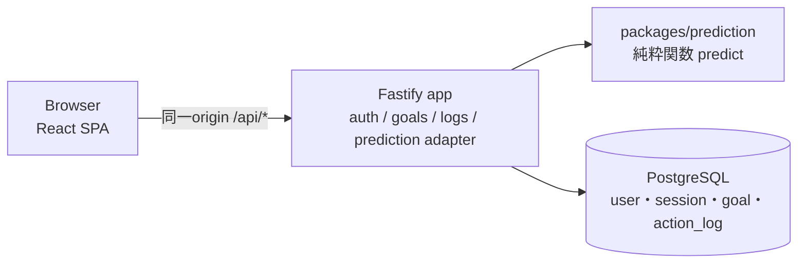

# ArchitectureとTechnology Stack

## 現行状態（2026-09-30）

Future ROI（[Product P-11](product-spec.md#p-11-future-roiの採用とcoreの境界)）の実現方式を記録する。予測モデル（[D-19](#d-19)〜[D-22](#d-22)）、Data Modelと記載済みの業務API・Prediction Engineの規則は確定。成功応答のデータ項目（DTO）・HTTP status等の未定義部分と文書間の解釈差は[契約の判断事項](contract-review-proposal.md)へ分ける。**2026-10-03、依頼者によるチーム合意報告を受け[D-23](#d-23)の基本構成を採用。[D-24](#d-24)／[D-25](#d-25)は検証・運用条件付きの第一候補。** [合意範囲](#2026-10-03の技術構成合意)を超えて認証・公開先・API細則を確定しない。2026-10-08時点のGoal・記録・Today APIと実APIを使う画面、既存ローカル検証記録、製品受入・公開配置等の残条件は[対応表](change-map.md#現在地の読み方)から確認する。純粋Prediction Engineと関連テストは[#103](https://github.com/jogi-hack-2026-team/jogi-hack-2026/pull/103)でmain統合済みで、#77で`/today`から呼ぶ形でアプリへ結合した。構成の採用や下記の契約をアプリ動作確認済みとは扱わない。

旧音楽案の設計・比較結果は[保管場所](../archive/music-exploration/README.md)に履歴として残す（[D-17](#d-17-音楽案に依存したarchitectureの適用終了)）。

2026-10-05、[Product R-11・P-15](product-spec.md#p-15-質問由来の見通しのmust追加方針)のMust追加と分担をPR #115でチーム採択した。当時のOPEN事項と2026-10-07の依頼者承認範囲の保存・予測接続契約は[D-26](#d-26)で区別する。旧`predict`の実績由来Engine契約・D-20の共通priorを保ちながら、別のR-11公開入口を使う。mainのFE接続状況は[対応表](change-map.md#r-11の既存issueへの対応)を参照し、製品受入とは分ける。

## System構成

Productと予測仕様から必要になる性質は「本人だけが記録を操作できる認証・記録と予測の整合・純粋な計算モジュール・決定的なテスト」。[D-23](#d-23)で、これを満たす基本構成として**1つのNodeアプリ（API＋静的配信）＋PostgreSQL** を採用し、コード上はモジュールで責務を分ける（モジュラーモノリス）。配備するサービスを増やさず、計算だけを切り離して検証・改善できる形を狙う。Microservices、Queue、Cache、ML frameworkは現時点で追加する根拠がない。下図のReact／Fastify／PostgreSQLはD-23の採用範囲、認証ライブラリ・テーブルは[D-24](#d-24)の条件付き第一候補。確定しているのは「Prediction EngineをUI・DB・HTTPから独立した純粋関数にする」という責務の分け方。[比較理由・弱点・増強の再検討条件](../experiments/architecture-verification/SELECTION-v3.1.md#9-技術を選ぶ理由と残る判断2026-10-02)を参照。

1〜2年の保守・継続開発は、2026-10-02に依頼者が説明整理の中心として指定した**比較の観点**であり、チーム合意済みの保守期間の受入条件ではない。2026-10-08、公開構成の検討条件を**本人アカウント・厳密に費用0円**とする依頼を受けた。[D-25](#d-25)の第一候補を更新し、無料枠上限では停止を受け入れる。1〜2年の無料継続や可用性を保証するものではなく、Product Specへ新しい要件を追加しない。3人での開発、Code Freeze（2026-10-12）までの学習・実装・検証への影響も[共通ルール](../AGENTS.md#11-技術選定)に従って確認する。TypeScript経験や締切の近さを技術の採用理由には使わず、実現可能性・負担の確認と分ける。全員に必要な操作と保守を説明できるかは採択前に確認する。



| モジュール | 責務 | 依存してよいもの |
| --- | --- | --- |
| `packages/prediction` | 予測の計算だけ。時刻・DB・HTTP・乱数の外部状態を持たない | なし（外部依存0） |
| `apps/api` の `auth` | 登録・ログイン・セッション（Better Authは条件付き第一候補） | DB |
| `apps/api` の `goals` / `logs` | Goal・記録のCRUD、所有者チェック、「今日」「昨日」の判定 | DB |
| `apps/api` の `prediction` | DBから入力を組み立て、Goalのtimezoneで`today`を計算し、`predict`を呼ぶ | `packages/prediction`、`goals` / `logs` |
| `apps/web` | 画面と表示文言。数値の計算をしない | APIの契約 |

機能ごとに処理をまとめる単一アプリ（modular monolith）の中で、HTTP層はstatus・DTO（送受信するデータ形式）への変換、application serviceは業務判断とtransaction（複数の更新を一組にする処理）、SQL adapterは永続化を担当する。依存の接続はアプリの構成起点で行い、EngineへDB・HTTP・UI・clockを持ち込まない。時刻から導く日付は入力として渡す。具体的なstatus・DTO・更新規則は[API契約](#api契約)の記載済み規則に従い、この分担だけで未記載・判断待ちの契約を確定しない。

interfaceは差替えやテストに必要な境界だけに置く。大がかりなClean Architecture、汎用Repository、DI containerは導入しない。共通化は同じ業務上の理由で変わる処理だけに限定し、巨大なutilsや将来の用途だけを理由にした汎用化を避ける。

入力検証は、UIの入力支援、APIの信用できない外部入力の検証、application service／Engineの業務不変条件、DBの一意性・参照整合性等の制約で役割が異なる。共有できる形式定義を使っても、各境界に必要な検証をDRY（重複削減）だけを理由に消さない。値・日付・NULLの規則は[Data Model](#data-model)と[Prediction Engine](#prediction-engine)を参照する。

### Repository構成

`packages/prediction` は実在する純粋Engineで、[利用条件と検証手順](../packages/prediction/README.md)を参照する。root workspace・health/SPA配信・Compose・単一コンテナ・Application CIは#70、DB schema/migrationは#74、認証/API保護/認証画面は#75で導入済み（[起動・検証手順](DEVELOPMENT_GUIDE.md#アプリを起動検証する)）。Goal APIは#76、記録・Today APIとEngine結合は#77でローカル実装済み。業務画面のmain実装と受入・公開の残条件は[対応表](change-map.md#現在地の読み方)へ集約し、Docker起動成功を業務機能全体の完成としない。

```text
package.json            npm workspaces（apps/web, apps/api, packages/prediction。2026-10-05に管理方式を採択、#70で導入）
packages/prediction/    src/{index,types,predict,observations,recovery,completion,random,config,errors}.ts, tests/, examples/
apps/api/               src/{server,container-start,app,config}.ts, src/{contracts,db,http,auth,goals,logs,prediction}/, migrations/, tests/
apps/web/               src/{main,router}.tsx, src/routes/, src/api/（#70。認証・起動確認画面）。src/ui/（デザイントークン・共通部品）、src/features/（画面ごとの部品）、src/copy/（画面の文言）、src/api/http.ts・goals-http.ts・today-http.ts（実APIの呼び出し）は#81（[ui/README](../apps/web/src/ui/README.md)）。src/features/goals/（Goalの一覧・作成・編集・削除）は#78
compose.yaml            ローカルDB＋単一SPA/APIコンテナ。dbだけのhost開発も可能
Dockerfile              単一SPA／APIコンテナ（Node 24.21.0）
```

## Technology Stack

**基本構成はFE側の依頼者報告とBE本人の了承記録に基づく採用記録（DECIDED）。認証・公開先は条件付き第一候補（RECOMMENDED / CONDITIONAL）。** 以下の合意範囲で分けて確認する。旧構成は[履歴](../archive/music-exploration/README.md)として保持する。起動構成は#70で現行の場所へ導入し、版は[2026-10-06の版固定](#2026-10-06の版固定と起動構成)を参照する。

### 2026-10-03の技術構成合意

採用する基本構成と理由は次のとおり。版・追加ツールは今回の合意では確定していない。追加ツールのうちworkspace管理とDB接続ライブラリは[2026-10-05の追加採択](#2026-10-05の追加採択)を参照する。

| 作る部分 | 採用する構成 | この構成にする理由 |
| --- | --- | --- |
| 共通の言語と実行環境 | TypeScript／Node | 画面・API・計算の型を共有し、実行環境を分散させない |
| 画面 | React＋Vite＋TanStack Router／Query | Reactは画面、Viteはビルド、Routerは画面遷移、Queryは取得・更新後の再取得を担当する |
| APIと共有契約 | Fastify＋TypeBox | 画面とAPIで同じデータ定義を使い、入力を実行時にも検証する |
| データ保存 | PostgreSQL | 記録の一意性と関連データの整合をDBの制約で守る |
| 配信 | 単一SPA／APIコンテナ | 画面とAPIを同じorigin（URLのスキーム・ホスト・ポート）で配信し、配備対象を少なくする |
| 予測 | 独立した純粋計算コア | 入力だけから同じ結果を返し、画面・DB・HTTPと分けて検証する |

**残る作業：** [#71](https://github.com/jogi-hack-2026-team/jogi-hack-2026/issues/71)〜#73の純粋Engineは[#103](https://github.com/jogi-hack-2026-team/jogi-hack-2026/pull/103)でmain統合済みで、#77でToday APIへ結合した。#70の基盤に対するローカル一式起動は#130で補完する。業務画面・公開配置・製品としての正式受入は未完了。FE担当は#78〜#81の具体的な先行範囲・依存変更を各Issueで確認する（[PR #92の確認](https://github.com/jogi-hack-2026-team/jogi-hack-2026/pull/92#issuecomment-5944800922)）。合意だけでHard依存・BLOCKEDを解除せず、[着手前の確認](DEVELOPMENT_GUIDE.md#着手前に読み直す)と対象Issueの承認済み範囲に従う。担当者氏名・ProjectsのStatusは推測しない。

| 2026-10-03時点の条件付き第一候補 | 当時から引き続き残る条件 |
| --- | --- |
| Better Auth（D-24） | 採用版、認証更新／DB復旧担当、CSRF／Origin細則・回数制限、復元後の削除user／password／account巻戻し対処、公開HTTPSの確認 |
| Cloud Run＋Neon（D-25） | 最終受入、regionの組合せ、予算・利用前提・運用担当、実Cloud／proxy／1 vCPU／休止後応答の確認。アカウント・課金・リソース作成と一般公開は別承認 |

この表は当時の合意範囲の履歴。**2026-10-08時点の公開第一候補はFE・BEともVercel Hobby、DBはNeon Free、ローカル開発はDocker**へ更新した（[D-25](#d-25)）。D-23の基本構成や当時の採用理由を置換した記録ではなく、公開ランタイムの差は採用前に検証する。

API成功DTO・status・PATCH・昨日の既存記録変更・unit編集はこの合意の対象外。[契約の判断事項](contract-review-proposal.md)で現行契約・#101のmain統合済み記録境界方針・残る未採択案を区別し、D-19〜D-22、当時のDONEのサーバー量補完（#148ではD-29の明示量へ変更）、SKIPPED入力amount禁止／保存NULL、T-14の500ms未満を変えない。#84のClose、Projects変更、本実装開始、Merge、クラウド作成はこの文書から自動実行しない。

**合意の出所：** FE側のDiscord上の了承は依頼者の報告に基づく。BE側は[本人による#84の了承記録](https://github.com/jogi-hack-2026-team/jogi-hack-2026/issues/84#issuecomment-5978901576)で確認できる。採用範囲は上記の基本構成に限り、D-24／D-25の最終採択・版・追加ツール・API細則は含めない。PR #85／#93の限定Approveを採択根拠へ読み替えない。

### 2026-10-05の追加採択

2026-10-03の合意で未採択だった追加ツールのうち、次の2つを採用する。#70の起動構成と#74のDB接続が、この2つに依存するため先に決める。

| 決める部分 | 採用 | 理由 | 比較していないもの |
| --- | --- | --- | --- |
| パッケージ・workspace管理 | npm workspaces | main統合済みの[`packages/prediction`](../packages/prediction/README.md)と[#84の検証コード](../experiments/architecture-verification/README.md)は、どちらもnpmのlockfileで依存を固定している。npmはNodeに付属し、導入する道具が増えない。管理対象は`apps/web`・`apps/api`・`packages/prediction`の3つ | pnpm等の別の管理ツールとの実測比較はしていない。lockfileとCIを作り直す利益は未確認 |
| PostgreSQLへの接続 | `pg` | #84の検証で、認証・DB・回数制限の確認を`pg`の接続poolで行った。[D-24](#d-24)の第一候補Better Authも、検証では同じ`pg`のpoolへ接続している | 別のdriverとの実測比較はしていない |

**この採択に含めないもの：** Node／npm／`pg`の版、SQLを直接書くかORMを使うか、migrationツール（`node-pg-migrate`は候補）、テストランナー（Vitest／fast-checkは候補。`packages/prediction`の現行runnerはNode標準）、pool数・`int8`変換などの接続設定、API細則。D-24／D-25の状態と残条件も変更しない。

**採択の出所：** 基盤担当（BE）の提案を[PR #116](https://github.com/jogi-hack-2026-team/jogi-hack-2026/pull/116)で公開し、同PRの承認レビューを上記2点への同意として扱う（PR本文に明記）。#70・#74の技術名とBLOCKED表記は、この採択だけで自動変更しない。Issue本文の更新と着手条件の確認は各Issueで行う。

[PR #93](https://github.com/jogi-hack-2026-team/jogi-hack-2026/pull/93)の比較説明はmain統合済み、[PR #96](https://github.com/jogi-hack-2026-team/jogi-hack-2026/pull/96)の追加実測もmain統合済みのSupporting資料。PR #96の[未解決レビュー](https://github.com/jogi-hack-2026-team/jogi-hack-2026/pull/96#pullrequestreview-5399521304)（Origin encoded-path疑いはレビュー時未実行、Cloud試験計画の古い記述、終了hookの承認主体）を構成合意で解消済みにしない。PR #96の競合解消・Foundation成功と、候補コード・保存ログ・既存レビュー指摘の対応は別に追跡する。

### 2026-10-06の版固定と起動構成

#70で起動構成を導入した。採択済みの基本構成とnpm workspaces／`pg`に、次の版・道具を固定する。版の採択は#70の実装PR（[Issue #70](https://github.com/jogi-hack-2026-team/jogi-hack-2026/issues/70)の開発情報に記載）の承認レビューを同意として扱う。

| 決める部分 | 採用 | 理由 | 比較していないもの |
| --- | --- | --- | --- |
| Runtime | Node 24.21.0（`package.json`の`engines`・`mise.toml`・Dockerfileで同じ版） | #84の検証（認証・DB・混合負荷・Linuxコンテナ）と同じ版。TypeScriptをNodeが直接実行できるため開発時の変換ツールが不要 | Node 22系／25系との実測比較はしていない。Engine検証CIのNode 22.15.1は検証版として維持 |
| ライブラリの版 | Fastify 5.12.5、@fastify/static 10.1.5、@fastify/type-provider-typebox 6.1.0、TypeBox 0.34.52、pg 8.23.0、React 19.3.0、Vite 8.3.1、TanStack Router 1.170.40／Query 5.104.0、TypeScript 5.9.3 | #84の候補検証で組み合わせて動作した版をlockfileで固定 | 最新版への追従は各Issueで判断 |
| テストランナー | Node標準`node:test`（APIも`packages/prediction`と同じ） | 既存Engineと同じで依存が増えない。APIテストは実PostgreSQLへ接続する | Vitest／fast-checkは未採択のまま（候補） |
| ローカルDB | ComposeのPostgreSQL 18。テストは`DATABASE_URL`、なければ開発依存`embedded-postgres`（Dockerのない端末向け。#84と同じ） | Docker有無に関わらずAPIテストを実DBで実行できる | — |
| 配信・終了 | APIが`WEB_DIST`のSPAを同一originで配信。保護hookを通過した存在しないAPI・対象外methodはJSON 404（未ログイン401・業務API Origin違反403）。SIGTERMで処理中要求を完了してからexit 0（猶予10秒） | #84 Linux試験のexit 137を本実装で避ける | 実クラウドでの確認は未実施（#75・#83） |
| 入力検証・エラー形式 | Ajvを`removeAdditional: false`・`coerceTypes: false`・`allErrors: true`にし、契約違反・DB制約違反（23505／23514）を`{ error: { code, message, fields? } }`の422へ変換 | [実装時に必要な対策](#実装時に必要な対策)の入力検証とエラー形式案を基盤で一度だけ実装する | 業務APIの成功DTO・statusは未定のまま |

この採択に含めるもの：上表の版・runner・ローカルDB・配信／終了・入力検証と共通エラー形式（422／404のenvelope `{ error: { code, message, fields? } }`とDB制約違反の変換）。含めないもの：migrationツール、認証ライブラリの版（#74・#75）、公開先（D-25）、業務APIの成功DTO・status・PATCH等の細則。stagingへの配置は公開先の承認待ちで、#70の該当項目は#75へ移管する。手順は[開発ガイド](DEVELOPMENT_GUIDE.md#アプリを起動検証する)を参照する。

### Docker一式起動の補完（#130）

既存D-23の単一SPA/API＋PostgreSQLを維持し、ローカルComposeの既定をDBのみから一式へ補完する。ユーザーの「全部起動できる状態まで、理由付きで」という依頼に対応する実装案であり、#130のレビュー・main反映で受け入れる。D-24/D-25の条件、Product要件・既存Hard依存は変更しない。[具体的な起動・復旧手順](DEVELOPMENT_GUIDE.md#dockerで一式を起動する)を参照する。

| 判断 | 理由・代替案・制約 |
| --- | --- |
| DB health→設定検査→migration→単一Node配信 | コンテナのrunningだけではDBは準備できていないため、Composeの`service_healthy`を使う。production認証設定をDB変更前に検査し、認証→アプリmigration成功後にHTTP listenerを開く。失敗はexit 1で配信を開始しない |
| コンテナ起動点で毎回migrationを実行 | 別のone-shot migration serviceは初回の依存順を示しやすいが、`docker compose restart app`やcontainer再起動は成功済みserviceを再実行しない。起動点なら毎回既存runnerのchecksum・transaction・advisory lockを使って確認できる。変更履歴・poolの責務と実行順は#74の方式を保持 |
| 同じprocessでserverを読み込む + Compose init | initがSIGTERMを単一Nodeへ転送する。handler登録前のmigration待機は既定のsignal終了（143）、配信後は既存serverの正常終了処理（0）を使う。migration poolを閉じてからruntime poolを作る。中断時はDB切断で未commitのtransactionをrollbackする |
| ローカル専用envとloopback公開 | Secretはユーザーが設定し、固定値・自動生成で永続credentialを作らない。DB passwordはURIへ埋め込まずPGPASSWORDで渡す。HTTP許可はloopback Composeだけ。既存project名/volumeを維持し、再作成や停止でデータを削除しない |
| Docker確認とhost watchを併用 | Dockerだけにhost編集の速度を求めるとbind mountやdev専用imageが増える。既存host Node/Vite watchを日常編集、Dockerのビルド済みSPA/APIを配信・起動順・認証・終了の確認に使う。FE/APIを別配備サービスにすると同一origin/Cookieの方針と起動単位が増えるため採用しない |

miseはhost Node 24.21.0の固定とnpmタスクの入口。DockerfileはNode image、CIはsetup-nodeで同じRuntimeを固定し、miseを実行しない。新しい依存・migrationツール・cloudリソースは追加しない。migration待ちが長くなる運用や複数配備単位が必要になった場合は、外部migration jobへの分離を再検討する。公開環境のDDL実行方針・権限設計は#83のレビューで決めるため、自動migrationはComposeのcommand上書きでローカル経路だけへ接続する。imageの既定CMDは`node apps/api/dist/server.js`で、直接使用する場合は事前にmigrationを成功させる必要がある。

Evidenceは[Compose検証](../scripts/smoke-compose.sh)と[Application CI](../.github/workflows/application.yml)。空のenv-file/別project/合成DBで起動・反復・restart、履歴不一致/設定不足の配信抑止、API/SPA/認証、正常終了、volumeとデータ保持を確認する。既存runnerのtransaction rollback・lock待ちは[回帰](../apps/api/tests/migrate.test.ts)・[pool責務テスト](../apps/api/tests/pool-responsibility.test.ts)で確認する。実行結果は#130/PRへ記録し、テストコードの存在を実行済み証拠としない。

### 2026-10-06のmigration方式（#74）

#74でDBスキーマとmigrationを導入した。採択は#74の実装PR（[Issue #74](https://github.com/jogi-hack-2026-team/jogi-hack-2026/issues/74)の開発情報に記載）の承認レビューを同意として扱う。

| 決める部分 | 採用 | 理由 | 比較していないもの |
| --- | --- | --- | --- |
| 認証テーブル | 固定版Better Auth 1.7.7（lockfile）の`getMigrations`を`db:migrate:auth`から呼ぶ。`user`・`session`・`account`・`verification`と、回数制限のDB保存用`rateLimit` | CLIの`@latest`取得を避け、実行時の設定（[authSchemaOptions](../apps/api/src/auth/options.ts)）と同じ定義からテーブルを作る（#84 F-9） | Better Auth自体の最終採択（D-24）は別。2回目以降の実行で`rateLimit.lastRequest`の型警告（期待number／実際int8）が出るが差分は作られない |
| アプリテーブル | `apps/api/migrations/NNNN_name.sql`を名前順に、1ファイル1トランザクションで適用する小さなrunner（[migrate.ts](../apps/api/src/db/migrate.ts)）。`schema_migrations`に名前とSHA-256を記録し、適用済みファイルの変更は失敗にする。advisory lockで同時実行を直列化 | `goal`・`action_log`の2表にSQLを直接書けば足り、新しい依存を増やさない。CI・本番で`@latest`を取得しない | `node-pg-migrate`等のツールは不採用（必要になった時点で再検討） |
| 実行順 | `db:migrate` ＝ `db:migrate:auth` → `db:migrate:app`。[`db:seed:demo`](operations/demo-seed.md)は認証作成済みuserIdへ明示実行 | `goal.user_id`が`"user"(id)`を参照するため。自動Seedで既存データをresetしない | — |
| `updated_at` | 両表のBEFORE UPDATE triggerでDBが進める | 上書きの有無を追う列を、アプリの書き忘れで止めない | — |
| 認証用poolのint8 | 認証専用poolだけTEXT形式のint8を数値に変換し、安全な整数範囲 `[-(2^53-1), 2^53-1]` の外は例外にする（[pool.ts](../apps/api/src/db/pool.ts)）。アプリ用poolはpgの既定（文字列）のまま | `rateLimit.lastRequest`（int8）の文字列連結で429の待ち時間が異常値になる問題（#84 F-10）を、他の型・他のpoolへ影響させずに直す | auth poolも応答／文実行を5秒で制限し、idle errorを単独処理する |
| 認証DDLと失敗復旧 | 固定版の生成SQLを1 transactionで適用し、table作成後のindex失敗もrollbackする | 再実行時に部分schemaを残さない（[回帰](../apps/api/tests/migrate.test.ts)） | 既存schemaの手動変更・古い部分適用は自動削除しない |
| migrationの時間制限 | 専用poolは接続確立だけ5秒。advisory lock待ち・DDL実行にHTTP用の5秒制限を使わない | 他instanceのmigrationが終わるまで直列化する（[回帰](../apps/api/tests/pool-responsibility.test.ts)） | 長時間待機はoperatorが原因を確認し中止する |

### 2026-10-06の認証実装（#75）

#75でR-01（メール＋パスワードの登録・ログイン・ログアウト、未ログインは画面とAPIを使えない）を実装した。採択は#75の実装PR（[Issue #75](https://github.com/jogi-hack-2026-team/jogi-hack-2026/issues/75)の開発情報に記載）の承認レビューを同意として扱う。D-24の「条件付き第一候補」は、残条件（認証更新／DB復旧担当、復元後の巻戻し対処、公開HTTPSでの確認）が済むまで維持する。

| 決める部分 | 採用 | 理由 |
| --- | --- | --- |
| ライブラリと版 | Better Auth 1.7.7（#74で固定）。メール＋パスワード、DBセッション、同一originのCookie、`/api/auth/*` | #84・#96で登録〜ログアウト・回数制限・Cookie属性・Linuxコンテナを実測した版。自作よりパスワード・セッションの保守責任が小さい |
| Fastifyとの接続 | [bridge.ts](../apps/api/src/auth/bridge.ts)。URLは`BETTER_AUTH_URL`から組み立て、client IPはFastifyの`trustProxy`判定の結果だけを専用headerで渡し、複数のSet-Cookieをそのまま転送する | 公式ガイドの形では、Host偽装・X-Forwarded-For偽装による回数制限の回避と、sign-outのCookie消去漏れが起きうる（#84 F-5〜F-7） |
| 保護の既定 | [guards.ts](../apps/api/src/http/guards.ts)はrouterの確定routeで判定する。登録済み`/api/health`・`/api/auth/*`以外の業務APIはセッション必須（route未定義のAPI pathも401）。業務APIの状態変更（GET／HEAD／OPTIONS以外）は許可originのOriginヘッダーが必須（違反は403 `ORIGIN_REJECTED`） | 追加し忘れで公開されるAPIを作らない。`SameSite=Lax`だけでは同一siteの別originを防げない（#84 F-8）。認証endpointは固定版Better Authの`trustedOrigins`・Referer／Fetch Metadata検査に委ね、業務APIの「Originなしは403」とは異なる。#76・#77はこのhookの内側に置く |
| session更新とlogout故障 | 保護APIでgetSessionが返す複数のSet-Cookieを転送し、DB expiry延長とCookie更新を揃える。画面は通信例外・API errorを表示しbusyをfinallyで解除、logout error時は遷移しない | 通常時のlogoutではDB session削除とCookie消去を確認する。Better Auth 1.7.7はDB削除例外を内部でlogして成功を返すため、その故障時の保存済み旧Cookie失効は保証しない。fail-closed処理・復旧／再試行の方式はD-24/#75/#84の人の判断待ち |
| Cookie | HttpOnly・SameSite=Lax・Path=/。`BETTER_AUTH_URL`がhttpsなら`Secure`と`__Secure-`接頭辞。本番（`NODE_ENV=production`）はhttpsのURLを必須にし、ローカルのコンテナ確認だけ`BETTER_AUTH_ALLOW_HTTP=1`で許可 | staging／本番で`Secure`が付かない設定ミスを起動時に止める |
| 回数制限 | DB保存（`rateLimit`表）。1 IPあたり60秒にsign-in／sign-up各5回（`AUTH_SIGN_IN_MAX`／`AUTH_SIGN_UP_MAX`で上書き）、その他の認証endpointは100回。429の`X-Retry-After`は整数秒で、画面は残り秒数を数えて表示し、経過後に再試行できる | 再起動・複数instance・並列要求をまたいで効く（#84で実測）。現行アプリの[並列受入回帰](../apps/api/tests/auth-concurrency.test.ts)（#142）で、2instance・IP/endpoint隔離・拒否時のDB不変・再起動・期限切れ窓からの並列再開を確認する。共有回線のデモ会場向けの上限は未合意のため環境変数で変えられる |
| Secret・URL | `BETTER_AUTH_SECRET`（本番必須、32文字以上。開発では`apps/api/.local/auth-secret`に自動生成）、`BETTER_AUTH_URL`（本番必須）、`AUTH_TRUSTED_ORIGINS`（任意）、`TRUST_PROXY_HOPS`（既定0） | 実値をGitへ入れず、開発者ごとの生成を手順から外す。proxyのhop数は公開先の実形式で確認する（#83） |
| 画面 | `/`は公開トップ（P-16）。`/login`・`/register`は[AuthPage](../apps/web/src/routes/AuthPage.tsx)。[router](../apps/web/src/router.tsx)はURLに現れない2つのまとまり（pathless layout route）で分ける：認証画面はログイン済みなら戻り先へ移り、Goal4画面はログインの確認を1か所で行う（未ログインは元のURLを戻り先にログインへ、確認できない通信失敗はログインへ送らず「接続できませんでした」）。ログイン後・ログアウト後は履歴を置き換える。戻り先はアプリ内pathだけ。ログアウトはGoal一覧のアカウントメニュー。セッション切れ（401）は理由付き（`reason=expired`）で再ログインへ誘導。404・エラー・読込中はルーター全体の既定の画面。Goalの記録の履歴は`/goals/$goalId/history`（カレンダー）。デスクトップ幅ではログイン必須の画面の外側（AppShell）に画面全体の上のバーを出。上のバーは1段にし、Goalの作成・編集と記録の履歴では画面ごとの上のバーの代わりに戻り先と見出し（[DeskHeader](../apps/web/src/ui/components/DeskHeader.tsx)）を出す（#146） | R-01の画面要件。Goal・記録の画面は#78〜#81、デザインに合わせた画面とルート構成は#146 |

未実施: staging（公開HTTPS）でのCookie属性・複数Set-Cookie・転送ヘッダーの実形式・休止後の応答の確認（公開先D-25の承認待ち。#70から移管した項目を含めて#83へ引き継ぐ）。認証ライブラリのsupported版／advisoryの更新担当とDB復旧担当、復元後の全session失効・旧Cookie 401の確認手順はチームで決める（#84の[復元後session失効手順](../experiments/architecture-verification/candidate-1.7.7/RESTORE-PROCEDURE.md)は合成DB限定の案）。

以下の比較表は2026-09-30の候補提案と2026-10-02の比較説明を保持したもの。版・追加ツール・migration順・代替候補の不採用を含む表全体を採択した記録ではない。現在の採用範囲は上記とD-23〜D-25で確認する。

<details>
<summary>2026-09-30の候補と2026-10-02の比較を見る（現在の採用範囲は上記）</summary>

| Requirement | Candidates | 候補（確定待ち） | 推奨する理由の要約 | 第一候補にしない理由（採択待ち） |
| --- | --- | --- | --- | --- |
| API契約と予測の入出力を保守しやすくする | TypeScript / Python | **TypeScript（Node 24 LTS、npm workspaces）** | 型と検証の境界をFE/BE/Engineで追いやすい。CPU計算をHTTPから分離する条件は残る | Python：現行の閉形式・DPに専用のML基盤は不要で、別言語の契約変換・実行環境・更新を増やす利益が未確認 |
| SPAの画面遷移・サーバー状態 | React＋Vite＋TanStack Router＋TanStack Query / Next.js / TanStack Start | **React＋Vite＋TanStack Router＋TanStack Query** | 認証後の記録操作が中心。RouterはURLと画面遷移、Queryは取得・更新後の再取得を担う。#85で最小画面と同一origin配信を確認。**FE基盤の採択は別途チーム合意が必要** | Next.js・Start：現行要件にはSSRやserver functionsを加える利益が小さい。Router/Queryの採用候補はStartの採用を意味しない |
| APIとWebの契約の共有 | 共有スキーマ（TypeBox）/ 手書きの型 / OpenAPI生成 | **TypeBoxの共有スキーマ。OpenAPI生成は当初構成に含めない候補** | 入力検証・応答の直列化・Webの型と実行時検証を同じ定義から使える（#85で確認） | 手書きの型だけでは実行時の入力を検証できない。OpenAPI生成は外部利用者や多言語クライアントが必要になったときに再検討 |
| HTTP API | Fastify / Hono / Express | **Fastify** | スキーマ検証を契約に結び付けられ、#85で認証・DB・ログ・終了処理の接続を確認できた | Honoとは僅差で未実装。Expressを含めて、別構成で同じ検証・エラー・運用処理を保守する利益は未確認 |
| 関係データ・一意制約 | PostgreSQL / SQLite | **PostgreSQL** | `(goal_id, local_date)`の一意制約・外部キー・ユーザーごとの分離。Managedの選択肢が多い | SQLite：公開環境での永続ボリューム管理が必要 |
| DBアクセスとmigration | `pg`＋SQL / Drizzle / Prisma | **`pg`＋素のSQL＋`node-pg-migrate`** | アプリの主要2テーブルの制約・所有者条件・読み取り整合をSQLで直接確認できる。認証テーブルは別にある | ORM：現行規模で別のスキーマ定義・更新経路を加える利益が未確認。`node-pg-migrate`とORMの比較実測はない |
| migrationの実行順 | — | **`db:migrate:auth` → `db:migrate:app` → `db:seed:demo`**（`db:migrate`は前2つを順に実行） | 認証テーブル（`user`）を`goal`が参照するため。Better Authの公式手順は`npx auth@latest migrate`だが使わず、lockfileで固定した版のライブラリから`getMigrations`を呼ぶ（#85 F-9で再現を確認） | — |
| 認証 | Better Auth / Firebase Authentication / Supabase Auth / 自作 | **Better Auth（メール＋パスワード、DBセッション、Cookie）。条件を満たした場合の推奨** | 同じPostgreSQLに認証とアプリのデータを寄せられる。#85で登録〜ログアウト・DB保存のレート制限を実測 | Managed認証は未実装で費用比較も不足。継続する更新・復旧をチームが担えなければ再検討。自作はパスワード・セッションの安全性を自分たちで保守する責任が大きい |
| 数値計算（Beta-Geometricの分位点、Gamma・Beta乱数） | 自作 / jStat等 | **自作（分位点は任意精度整数による厳密比較、乱数はMarsaglia–Tsang法）。ただしI-03でゲートを設ける** | 必要な処理は少なく、乱数を注入できる形にしやすい。分位点は浮動小数点の特殊関数（lgamma）を使わない方が境界で正確（PR #86レビュー） | 外部ライブラリ：依存に対して使う範囲が小さい。**リスク**：特殊関数・サンプラーの実装ミス。既知値・極端なパラメータ・テストベクトルのテスト（T-15）で保証できなければ、I-03の中で小さな成熟ライブラリへ切り替える |
| テスト | Vitest＋fast-check / Jest | **Vitest＋fast-check** | Viteと設定を共有。事前検証でランダム入力が実装の欠陥を見つけたため、性質ベースのテストを採用 | Jest：ESM・TSの追加設定 |
| E2E | Playwright CLI＋Skill | **Playwright CLI（主要Flowのみ）** | [AI開発ツールの方針](../AI_DEVELOPMENT_TOOLS.md)どおり | Playwright MCPの常時利用 |
| デプロイ | [D-25](#d-25) | 1コンテナ＋Managed PostgreSQL | — | — |

技術ごとの用途、比較案、弱点、根拠の支持範囲は[既存の比較文書 §9](../experiments/architecture-verification/SELECTION-v3.1.md#9-技術を選ぶ理由と残る判断2026-10-02)へまとめる。表の「第一候補にしない」は現時点の提案であり、チームが不採用を確定した記録ではない。**推奨（RECOMMENDED）は採択前の第一候補、条件付き（CONDITIONAL）は追加条件を満たす場合の候補、未決定（OPEN）は選択・条件がまだ決まっていない状態。採用済み（DECIDED）と区別する。** 現在の状態は上記の合意範囲とD-23〜D-25で確認する。

予測方式D-19〜D-22は採用済みで、実装言語・Web/API・認証・配備先の採択とは別である。#85ではT-14を未実施だったが、その後の[予測モデルEvidence](prediction/evidence.md#dpとmonte-carloの比較)には試作DPの単体計測がある。その後の純粋Engineの実装T-14は[#103の検証CI](../packages/prediction/README.md#検証ci)で確認する。**試作の計測、純粋EngineのT-14、採用環境での実Engine混合負荷・コンテナ・配備先の性能確認は別の証拠**であり、最後の条件を完了したことにはならない。

</details>

### 2026-10-06のGoal API（#76）

#76でR-02のGoal API（一覧・作成・取得・編集・削除）を実装した。[API契約](#api契約)の記載済み規則（未ログイン401、他人404、入力不正422、timezoneはIANA名のみ、記録があるGoalの`timezone`・`initialProgress`変更禁止）はそのままに、未定義だった成功DTO・status・PATCHの細則・一覧の今日状態・記録開始日の保存を次のとおり実装案を記録した。採択は人による#76の実装PR（[Issue #76](https://github.com/jogi-hack-2026-team/jogi-hack-2026/issues/76)の開発情報に記載）の承認レビューを同意として扱う。記録API・`/today`の未定義部分（#77）と、R-11の回答保存（[D-26](#d-26)）はここに含めない。

| 決める部分 | 採用 | 理由 |
| --- | --- | --- |
| Goal DTO | 一覧・取得・作成・編集で共通の1形（[goal.ts](../apps/api/src/contracts/goal.ts)）：`id, title, unit, totalRequired, sessionAmount, initialProgress, timezone, recordStartDate, hasLogs, unitLocked, goalSettingsRevision, today, todayStatus`。`user_id`・`created_at`・`updated_at`は返さない | 画面が一覧とフォームで必要な導出値（記録の有無、Goalのtimezoneでの今日と記録状態）を同じ形で受け取れる。`hasLogs`は「timezoneと初期量を変更できない」表示（R-02）に、`today`／`todayStatus`は一覧の今日状態に使う |
| status | `GET` 200、`POST` 201、`PATCH` 200（更新後のGoal）、`DELETE` 204（bodyなし）。他人・存在しない・uuidでないidは404 `NOT_FOUND` | [契約の判断事項](contract-review-proposal.md#apiの未定義部分)の案のうち最も単純な形。uuidでないidはDBへ渡さず、存在を明かさない404へ揃える |
| 一覧の今日状態 | 配列（wrapperなし）、作成時刻・同時刻ならid順。各Goalに`today`（そのGoalのtimezoneでの暦日）と`todayStatus`（`DONE`／`SKIPPED`／`UNRECORDED`。行がなければ`UNRECORDED`） | Goalと`hasLogs`・今日の記録状態をREPEATABLE READの同じsnapshotで読み、最初のGoal SELECT後に時計を1回取得する。行なしをSKIPPEDにしない（P-14） |
| 作成 | `initialProgress`省略時は0。timezoneは`地域/都市`形式か`UTC`で、ICUが解決できる名前だけ（略称`JST`・固定オフセット`+09:00`は422）。記録開始日は作成時刻をそのtimezoneで暦日にした値で固定し、`goal.record_start_date`（[migration 0002](../apps/api/migrations/0002_goal_record_start_date.sql)）へ保存して`recordStartDate`で返す | [初期進捗と日々の記録の境界](#初期進捗と日々の記録の境界)の最小案。ブラウザの既定timezoneは画面の責務で、APIは明示送信を受ける |
| 編集 | 省略した項目は維持。`null`・空object・未知の項目は422。記録が1件でもあるGoalで`timezone`または`initialProgress`を**異なる値**へ変えると422 `GOAL_HAS_LOGS`（違反項目を`fields`に列挙し、他の項目も書き込まない）。同じ値の再送は変更と見なさない。記録がない間はtimezoneを変えても`recordStartDate`は動かさず、`today`は新しいtimezoneで決める | フォーム全体を再送する画面でも失敗しない。判定はGoal行のロック内で行い、同時の記録追加とずれない |
| 削除 | 204。紐づく記録は外部キーの連鎖削除 | R-02「削除すると記録も消える」 |
| 検証エラー | 違反項目をすべて`fields`に返し、同じ項目に複数の規則が当たる場合は最初の1件にまとめる。整数は`int4`の範囲、titleは1〜100文字で空白のみ不可、型の変換なし。PostgreSQLのtextに保存できないNUL（U+0000）はPOST/PATCHのschemaで拒否し、他の違反と同じ422 `VALIDATION_ERROR`の`body/title`へ含める。日本語・絵文字・改行などNUL以外は既存の範囲を保つ | 項目ごとの422表示（R-02、#78）。DBのCHECKと保存可能な文字の範囲を先に検証し、項目名のない制約違反422や保存時500に頼らない。[HTTP/DB回帰](../apps/api/tests/goals-title-validation.test.ts)で二重送信・混在fields・拒否時の回答版/snapshot/実ログ/metadata不変を確認する（#140） |
| 時計 | `buildApp`の`now`で注入し、既定は現在時刻。作成はpool取得・BEGIN後の1時刻を`created_at`・初回`updated_at`・記録開始日に共用する。Goalのtimezoneでの「今日」はAPI層で決める（[local-date.ts](../apps/api/src/goals/local-date.ts)） | pool待ちの日またぎで開始日と作成日時をずらさない。GET/listのsnapshot、作成の待機、PATCHのGoal lock待ちを[通常操作の回帰](../apps/api/tests/goals-concurrency.test.ts)で検証する。Engineは時計を読まない（[D-23](#d-23)の責務分担） |

PATCHはREAD COMMITTEDを明示し、Goal行だけをFOR UPDATEで取得して、待機後の別SQLでログ有無を確認する。DB接続の既定がREPEATABLE READでも、新しいstatement snapshotでGoal lock保持中にcommitされた初回ログをR-02の判定へ含める。アプリ用poolも取得済みclientのsocket errorとquery期限を処理し、rollback失敗後にerrorなしでreleaseしても期限切れclientを再利用しない（[pool責務の回帰](../apps/api/tests/pool-responsibility.test.ts)）。

含めないもの：記録API・`/today`（#77）、R-11の回答項目（D-26採択後に任意項目として追加）、一覧の件数上限・ページング、時刻列の公開。migration 0002は空のGoal表だけへ必須列を追加する。排他lock下で既存Goalを検出するとtransactionをrollbackし、未合意の開始日をDBサーバーの日付で埋めない。既存Goalの互換・補完方針は人の判断待ちで、旧版0002を適用済みならchecksum差異も自動回避しない。

### 2026-10-06の記録・Today API（#77）

この節は#77当時の判断記録。現在のDONE量必須・設定版・単位保全・作成キーは[D-29](#d-29-量と作成操作の保全148)で更新する。

#77でR-03・R-04の記録API（作成・上書き・一覧）とR-05〜R-08の`/today`を実装し、main統合済みの純粋Engine（`packages/prediction`）をアプリへ結合する実装案を用意した。記載済み規則（今日・昨日かつ記録開始日以降だけ、DONEの量省略時は`sessionAmount`、SKIPPEDの量は禁止、同じ日は上書き、401／他人404／422）はそのままに、未定義だった成功DTO・status・一覧の期間・`yesterdayMissing`の条件・snapshotの取り方・Engineの読み込み方を次のとおり実装案を記録した。採択は人による#77の実装PR（[Issue #77](https://github.com/jogi-hack-2026-team/jogi-hack-2026/issues/77)の開発情報に記載）の承認レビューを同意として扱い、自己レビューやCI成功で採択済みとは扱わない。R-11の出所・条件付き回数・表示context（[D-26](#d-26)）と、予測の実行方式（同期かworker）はここに含めない。

| 決める部分 | 採用 | 理由 |
| --- | --- | --- |
| Log DTO | `{ localDate, status, amount }`。SKIPPEDの`amount`は`null`（[log.ts](../apps/api/src/contracts/log.ts)） | Engine入力と同じ形で、画面が「量なし」を省略とnullで二重に扱わずに済む |
| `PUT /logs/:localDate` | 作成も上書きも200＋Log。body：`{ status, amount?, expectedGoalSettingsRevision }`。DONEでは`amount`必須。古い設定版は409。SKIPPEDに`amount`があれば422（`body/amount`）。窓の外は422 `LOG_DATE_OUT_OF_WINDOW`（messageに許可する2日を含む）、記録開始日前は422 `LOG_DATE_BEFORE_START`。窓の判定が先で、両方に当たる日は`OUT_OF_WINDOW` | 作成と更新を画面が区別する必要がない。窓と開始日の判定はREAD COMMITTEDでGoal行の排他ロックを取得した後に時計を1回読み、同時のPATCHと同GoalのPUTを順序づける。同日のUPSERT待ちも時計取得前のGoal lockで直列化する |
| `GET /logs?from&to` | 記録済みの行だけを行動日の昇順で返す。`from`・`to`は任意で両端を含み、省略時は全期間。逆転・実在しない日付・未知のqueryは422。UNKNOWNの合成行は返さない | MVPの履歴表示に十分。件数上限・ページングは必要になった時点で追加 |
| `GET /today` | `{ today, yesterday, todayLog, yesterdayMissing, prediction }`。`todayLog`は未記録ならnull。`yesterdayMissing`は**昨日が記録開始日以降で、昨日の記録がない**ときだけtrue。`prediction`はEngineの`PredictionResult`をそのまま返す（応答schemaはEngine型と双方向の互換を型検査する） | 開始日前の昨日に問いかけを出さない条件（P-14）をAPI側で1か所に持ち、画面は`yesterdayMissing`だけを見ればよい |
| snapshotと時計 | pool取得・BEGIN・最初のGoal SELECTでsnapshotを確定した後に時計を1回読み、Goalと全記録を`repeatable read` / `read only`の1 transactionで取得し、接続を返してから`predict`を呼ぶ（[prediction/store.ts](../apps/api/src/prediction/store.ts)、[routes.ts](../apps/api/src/prediction/routes.ts)） | 日付境界で`today`と記録が食い違わず、途中で挟まる記録の更新と混ざらない。BEGINだけではsnapshotは確定しない。[通常操作の回帰](../apps/api/tests/record-concurrency.test.ts)でpool待ち・最初のSELECT待ち・PATCH／同日PUT待ちの日跨ぎと初回PUT／PATCHの両順序を検証する |
| Engineの読み込み | `@futureroi/prediction`をAPIのworkspace依存にし、packageの`exports`からビルド済み`dist`（JSと`.d.ts`）を読む。root scriptsは`build:prediction`を`typecheck`・`test`・`dev:api`の前に実行し、`workspaces`の順序でpredictionを先にbuildする。コンテナはbuild stageの`dist`を実行stageへコピーする | packageのsourceは`.js`拡張子でimportしており、Node直接実行では`dist`が要る。Engine package内のコマンド・テスト・検証CIは変えない |
| Engineのエラー | 保存済みデータから作った入力を`PredictionInputError`／`PredictionConfigError`が拒否した場合は500 `PREDICTION_FAILED`（reason・pathをログに残す） | 利用者の操作では直せない状態で、422にすると画面が入力エラーとして扱ってしまう |
| 実行方式 | MVPは同期で`predict`を呼ぶ。呼び出しは[engine.ts](../apps/api/src/prediction/engine.ts)の`runPrediction`に閉じる | T-14は実Engineで各回34〜75ms。混合負荷の結果（[2026-10-05の実測](#第一候補の検証状況84--85)）を受けて同一プロセス内のworkerへ移すかは#84の残判断で、移す場合もrouteを変えない |

この#77実装に含めないもの：R-11（[D-26の#133追加](#2026-10-07の保存予測接続133)へ分離）、記録の削除（UNKNOWNへ戻す操作は未採択）、Logの競合revision／409（未採択。同じ日のPUTは最後の保存が残る）、worker実行、staging。

### 第一候補の検証状況（#84 / #85）

[Issue #84](https://github.com/jogi-hack-2026-team/jogi-hack-2026/issues/84)で第一候補を最小構成で実測した（PR #85でmain済み、Supporting Artifact）。詳細は[検証報告](../experiments/architecture-verification/REPORT.md)と[訂正後の比較 v3.1](../experiments/architecture-verification/SELECTION-v3.1.md)。この報告自体の結論は「条件付きで採用可能」であり、**検証成功やPR統合は採択ではない**。その後の基本構成の採用は[別の合意報告](#2026-10-03の技術構成合意)に基づく。下表は#85当時の確認範囲で、[PR #96](https://github.com/jogi-hack-2026-team/jogi-hack-2026/pull/96)の追加実測・未解決レビューや本実装の状況とは分ける。

| 区分 | 内容 |
| --- | --- |
| 確認できた（ローカル、Node 24.21.0） | 登録→ログイン→再読み込み→ログアウト（APIと実ブラウザ）。未認証は401、他人のGoalは404。Cookie属性（HttpOnly・SameSite=Lax・httpsでSecure）。認証エンドポイントのOrigin検査。DB保存のレート制限が再起動・複数instance・並列をまたいで効く。空DBからのmigrationの再現。1プロセスでSPAとAPIを同一origin配信。SIGTERMで処理中のリクエストを完了してから終了 |
| 見つかった問題（対処を確認済み） | 既定の入力検証が契約違反を受理する（F-1〜F-3）。公式ガイドの変換routeでは全クライアントがレート制限を共有しうる（F-5）。DB接続の既定設定で429の待ち時間が異常値になる（F-10）。同期の計算がAPI全体を止める（混合負荷） |
| 未確認 | Prediction Engineの単体性能（T-14）。コンテナのビルド。Cloud Run＋Neonでの動作・休止後の応答・転送ヘッダーの実形式とhop数。実ブラウザでのCSRF。費用の実測。Firebase・Hono・TanStack Startの実装比較。混合負荷はApple M5の複数コアで計測しており、Cloud Runの1 vCPUでのworkerの効果は未確認 |

**2026-10-02追加実測（採択は保留）：** 上の表は#85時点の履歴。旧1.7.6と隔離候補1.7.7を再実行し、候補修正後は認証/DB31・rate-limit11・追加回帰37 PASS（実Chrome9項目含む）。アプリ状態変更APIのOrigin拒否とauth専用int8 parserを確認したが、復元で削除user/古いpasswordも戻る問題の運用対処は未決。[Linuxコンテナ](../experiments/architecture-verification/LINUX-2026-10-02.md)のbuild/認証/DBは成功。修正前SIGTERMはexit137、承認済み最小終了hook後v6 9・追加9条件v7 29 PASS、全要求200・DB保持・10秒以内exit0。Windowsも終了試験失敗。実Engine/クラウド/費用は未検証。[追加報告と採用ブロッカー](../experiments/architecture-verification/FOLLOWUP-2026-10-02.md)を優先して読む。D-23〜D-25、Product要件、関連Issueの依存・Ready/BLOCKEDは変更しない。

**実Engineの追加検証（採択は保留）：** [2026-10-05の履歴](../experiments/architecture-verification/REAL-ENGINE-2026-10-05.md)ではApple M5・Node24で単体T-14が34〜75ms。旧混合負荷は実際の将来DONE回数119／399／1094とwarmup応答混入が判明したため、意図した120／400／1095の証拠には使わない。[2026-10-07の訂正・追加報告](../experiments/architecture-verification/REAL-ENGINE-2026-10-07.md)に独立oracle・cohort・worker失敗回帰、現main Engineと公開R-11の別検証を記録する。1vCPU・実Cloud・最悪入力は未検証で、workerの本採択は決めていない。

### 実装時に必要な対策

技術に依存しない要件は確定とし、具体策は第一候補を採用した場合の案（#85の対処）として記録する。各Issueの受け入れ条件への反映は、技術選定の確定後に行う。

| 対策 | 要件（技術に依存しない） | 第一候補での具体策（#85） | 対応Issue |
| --- | --- | --- | --- |
| 入力検証 | 契約違反（未定義の項目、型の違い、状態と量の組み合わせ違反）は黙って受理せず422にする。違反した項目をすべて返す | 厳格な検証設定（`removeAdditional: false`・`coerceTypes: false`・`allErrors: true`）、検証エラーを422の共通形式へ変換、Type Providerをpluginごとに再適用（F-1〜F-4） | #70・#76・#77、表示は#78 |
| レート制限 | ログイン等の認証操作に回数制限を設け、再起動・複数instanceでも効く。制限中は待ち時間を画面で伝える。共有回線（デモ会場）でも正当な利用者を止めない上限にする | DB保存のレート制限、信頼するproxyのhop数からクライアントIPを1つに決めて渡す修正版の変換route、`int8`を数値で読むDB接続設定と適用範囲の決定（F-5〜F-7、F-10） | #74・#75 |
| CSRF / Origin | 状態を変えるAPIは、別originからのCookie付き要求を受け付けない方針を決める（`SameSite=Lax`だけでは同一siteの別originを防げない） | 方針は未決（F-8）。Origin検査を足すかをチームで決め、実ブラウザで確認する | #75・#76 |
| 予測計算によるAPIの停止 | 予測の計算中も、記録・Goal操作・セッション確認を待たせない | T-14（500ms未満）を維持して計測する。計算時間に応じて同一プロセス内のworkerで実行する案（混合負荷で、同期実行では計算時間がそのままCRUDの待ち時間になり、worker 2本では数msのままだった） | #72・#73・#77 |
| migrationの版固定 | CI・本番で依存ツールの`@latest`を取得しない | 固定版のライブラリから`getMigrations`を呼ぶ（F-9） | #74 |
| 公開先のリージョン | DBとアプリの距離を作成前に決める | #85のNeon／Cloud Runのregion調査は履歴。現在のVercel Hobby／Neon Freeで選べるregionの組と遅延を再確認する | #70・#83 |
| 配備先での未確認項目 | 本番でしか見えない問題を最終公開前に確認する | [D-25](#d-25)の公開ランタイムとDockerの差、休止後の応答、proxy／hop数、DB接続数、予測CPUと混合負荷。[採用前の最小検証](operations/release-demo.md#公開候補の採用前に行う最小検証)で#70→#75→#83の未確認項目を追う | #70・#75・#83 |

### 検証コードとの差分（変更案・未合意）

正本（本書・Product Spec）は変更していない。#85の検証コード（`experiments/architecture-verification/src/contracts.ts`、`migrations/001_app.sql`）との差分を、変更案と理由として記録する。合意した項目だけ、正本へ反映する。

| 項目 | 正本（現在） | 検証コード | 変更案 | 理由 |
| --- | --- | --- | --- | --- |
| DONEの量 | #77では省略時補完 | 必須（クライアントが送る） | **#148で明示量＋設定版へ変更**（D-29） | 別画面の設定変更で表示量と保存量を違わせない |
| T-14 | `requiredFutureDone = 120, 400, 1095`で500ms未満 | 混合負荷も判断材料にし、計算が長ければworkerで実行 | **500ms未満を維持**。混合負荷の確認を追加の受け入れ条件にするかを相談 | 単体の速さと、他のリクエストを止めないことは別の性質 |
| 単位の値 | `minutes` / `sessions` | `minutes` / `count` | どちらかに統一。案：`count` | 「回」の意味が名前から読み取りやすい。検証コードで動作確認済み |
| 量の型 | integer | numeric | 案：integerを維持 | 分・回は整数で足り、比較・合計で誤差が出ない |
| タイトルの最大長 | 100 | 120 | 案：100を維持（どちらでもよい） | 画面の1行に収める目安 |
| `action_log`の主キー | `id`（uuid）＋`(goal_id, local_date)`の一意制約 | `(goal_id, local_date)`を主キー | 案：複合主キーへ変更 | APIは日付で記録を特定し、`id`を使う場面がない |
| 記録の時刻列 | `created_at` / `updated_at` | `recorded_at` | 案：正本を維持 | 上書きの有無を追える |
| エラーの形式 | 422とだけ記載 | `{ error: { code, message, fields?: [{ path, message }] } }`。DB制約違反も422 | 案：検証コードの形式を契約に追加 | 項目ごとのエラー表示（R-02）に必要 |
| `/today`の読み取り順 | 記載なし | Goalと記録を1つのsnapshotで取得、時計は1回だけ読む、DB接続を返してから予測を計算 | **#77の実装案・人のPR承認待ち**（[記録・Today API](#2026-10-06の記録today-api77)） | 日付の境界で`today`と記録が食い違うのを防ぐ |

## Data Model

```sql
-- 認証テーブル（"user"・session・account・verification・rateLimit）は固定版Better Auth 1.7.7のgetMigrationsで作る（#74、db:migrate:auth）
CREATE TABLE goal (
  id              uuid PRIMARY KEY DEFAULT gen_random_uuid(),
  user_id         text NOT NULL REFERENCES "user"(id) ON DELETE CASCADE,
  title           text NOT NULL CHECK (char_length(title) BETWEEN 1 AND 100),
  unit            text NOT NULL CHECK (unit IN ('minutes', 'sessions')),
  total_required  integer NOT NULL CHECK (total_required > 0),
  initial_progress integer NOT NULL DEFAULT 0 CHECK (initial_progress >= 0),
  session_amount  integer NOT NULL CHECK (session_amount > 0),
  timezone        text NOT NULL,            -- IANA名（例 Asia/Tokyo）
  record_start_date date NOT NULL,          -- 記録開始日。作成時のtimezoneでの暦日で固定（#76、migration 0002）
  created_at      timestamptz NOT NULL DEFAULT now(),
  updated_at      timestamptz NOT NULL DEFAULT now()
);
CREATE TABLE action_log (
  id          uuid PRIMARY KEY DEFAULT gen_random_uuid(),
  goal_id     uuid NOT NULL REFERENCES goal(id) ON DELETE CASCADE,
  local_date  date NOT NULL,
  status      text NOT NULL CHECK (status IN ('DONE', 'SKIPPED')),
  -- CHECKは結果がNULLでも通過するため、DONE側でNULLを明示的に拒否する
  amount      integer CHECK ((status = 'DONE' AND amount IS NOT NULL AND amount > 0) OR (status = 'SKIPPED' AND amount IS NULL)),
  created_at  timestamptz NOT NULL DEFAULT now(),
  updated_at  timestamptz NOT NULL DEFAULT now(),
  UNIQUE (goal_id, local_date)
);
```

- 記録のない日はUNKNOWNとして解釈し、行を作らない。
- 目標期日（targetDate）は持たない。MVPの表示に使わないため（期日到達確率は[D-21](#d-21)で不採用）。
- `initial_progress`は「記録開始日の前日までに終えた量」（既定0）。現在の実績は常に `initial_progress ＋ 記録開始日以降のDONEのamountの合計` で計算し、別に保存しない。開始日前の新規ログは拒否し、初期量から過去の行動状態・遷移を作らない。
- 記録が1件でもあるGoalでは、`timezone`と`initial_progress`を変更できない（過去の`local_date`の基準や、過去の予測の意味が変わるため。timezoneの移行処理はMVPで扱わない）。

**実装（#74・#76）**: 上のSQLは[apps/api/migrations/0001_goal_action_log.sql](../apps/api/migrations/0001_goal_action_log.sql)（`updated_at`はtriggerで更新）と、`record_start_date`を足す[0002_goal_record_start_date.sql](../apps/api/migrations/0002_goal_record_start_date.sql)（#76）として適用済み。`npm run db:migrate`が認証→アプリの順に実行し、空のDBへの初回適用・2回目の差分なし・各制約の拒否は[migrate.test.ts](../apps/api/tests/migrate.test.ts)で確認する。方式は[2026-10-06のmigration方式](#2026-10-06のmigration方式74)を参照。

### 初期進捗と日々の記録の境界

**境界方針はDECIDED（2026-10-03、[P-14の依頼者承認](product-spec.md#p-14-記録のルール)）。保存方式は下記の最小案を#76で実装し、採択は#76のPR承認で確認する（[Goal API](#2026-10-06のgoal-api76)）**。初期進捗と日々のログを開始日で分ける。初回ログ日を開始日にすると、記録忘れや初回保存の延期で境界が動き、翌日補完と整合しないため、Goalの安定した暦日を使う。

最小案は、Goal作成時のtimezoneで作成日時を暦日に変換し、その日を固定の記録開始日とする。既存の`created_at`とtimezoneは作成時の算出には使えるが、記録がないGoalではtimezoneを変更でき、現在のtimezoneで再算出すると境界がずれる。例：`2026-10-03T00:30:00Z`はAsia/Tokyoでは10/3、America/Los_Angelesでは10/2。現行schemaは作成時timezoneを保持しないため、この2列だけで変更後も元の開始日を確実に復元することはできない。

**実装（#76）**: 固定暦日を1項目保持する。`goal.record_start_date`に作成時刻をGoalのtimezoneで暦日にした値を保存し、Goal DTOの`recordStartDate`で画面・#77と共有する。作成時timezoneの履歴は持たない。ログがない間のtimezone変更を一律禁止する追加規則にはせず、変更後も開始日は動かさず、今日・昨日だけを変更後のGoal timezoneで判定する（[goals.test.ts](../apps/api/tests/goals.test.ts)）。開始日前・今日昨日以外のPUT拒否は#77で実装する。変更後の今日が開始日より前なら、その日も記録対象にしない。ログがある場合のtimezone・初期量の変更禁止は維持する。

既存Goalは本番DBが未作成のため存在せず、互換処理は実装していない。既存行がある環境へ適用する場合は、現在のtimezoneや最古ログで黙って開始日を埋めず、開始日前ログを自動削除・除外・初期量へ移し替えない方針で別途判断する。初期量から開始日や`observedDays` / `recordedDays`を推測しない。

## API契約

業務APIは`/api`配下。Goal・記録APIでは未ログインは401、他人のGoalは404（存在を明かさない）、入力不正は422。同一originのCookieセッション、Better Authと`/api/auth/*`の経路は[D-24](#d-24)の条件付き第一候補を#75で実装したもの（[認証実装](#2026-10-06の認証実装75)）。未ログインの401と別originからの状態変更の403（`ORIGIN_REJECTED`）は`/api/*`共通のhookが返す。認証endpoint自体のエラー形式はBetter Authのまま（`{ code, message }`）で、業務APIの共通error形式へ揃える範囲は未決定。

以下はmethod / pathと記載済みの規則の一覧。Goal APIの成功DTO・status・PATCHの省略・null・空body・一覧の今日状態は[2026-10-06のGoal API](#2026-10-06のgoal-api76)、記録APIの成功DTO・status・SKIPPEDの応答量・期間と`/today`の細則は[2026-10-06の記録・Today API](#2026-10-06の記録today-api77)へ実装案を記録した。人のPR承認レビューで採択を確認する。R-11の任意回答・回答版と明示query読取は[D-26](#2026-10-07の保存予測接続133)の依頼者承認範囲で追加する。それ以外の未定義部分は[提案表](contract-review-proposal.md#apiの未定義部分)で判断する。DONEのamountは必須で、画面が表示した量を送る。PATCH／PUTは設定版、POSTはUUIDキーを必須とする（[D-29](#d-29-量と作成操作の保全148)）。SKIPPED入力のamountは禁止（[#77の受入条件](https://github.com/jogi-hack-2026-team/jogi-hack-2026/issues/77)）、保存値は[Data Model](#data-model)のNULLと区別する。今日・昨日の補完／訂正と記録開始日の方針は[#101](https://github.com/jogi-hack-2026-team/jogi-hack-2026/pull/101)でmain反映済みのProduct R-03・R-04・P-14を参照する。[契約の判断事項](contract-review-proposal.md#昨日補完と再送競合)では、この現行方針と、未決の具体保存・DTO・再送／競合方式を分ける。

| Method / Path | 内容 |
| --- | --- |
| `/api/auth/*` | Better Authのハンドラ（`sign-up/email`・`sign-in/email`・`sign-out`・`get-session`等。#75で実装）。業務APIの確定契約とは別。回数制限超過は429と`X-Retry-After`（整数秒） |
| `GET /api/goals` | 自分のGoal一覧。作成順の配列で、各Goalに`today`（Goalのtimezoneでの暦日）・`todayStatus`・`hasLogs`、`unitLocked`・`goalSettingsRevision`を含む（#76、#148）。Goal DTOは記録した累計`progressDone`（`initialProgress`＋今日までのDONEの量。Todayの`prediction.progress.done`と同じ数え方で、総量を超えうる）も含み、一覧の進捗表示に使う（#146） |
| `POST /api/goals` | UUID `Idempotency-Key`必須。初回201＋Goal DTO、同owner/key/bodyの再送200＋現在DTO。異body409、削除後410（D-29）。body：`title, unit, totalRequired, initialProgress, sessionAmount, timezone`。初期量の既定は0で、記録開始日の前日までの量。timezoneは有効なIANA名のみ（それ以外は422）。記録開始日は作成時のtimezoneの暦日で固定し`recordStartDate`で返す（#76） |
| `GET / PATCH / DELETE /api/goals/:goalId` | 取得（200）・編集（200。`expectedGoalSettingsRevision`必須、不一致409。値の省略は維持、`null`・設定／回答項目のないbodyは422）・削除（204。記録も連鎖削除）。他人・存在しないidは404。記録があるGoalで`timezone`・`initialProgress`を異なる値へ変えようとすると422 `GOAL_HAS_LOGS`（#76） |
| `PUT /api/goals/:goalId/logs/:localDate` | 記録の作成・上書き（200＋Log）。body：`status, expectedGoalSettingsRevision, amount`（DONE必須、SKIPPEDではamount禁止）。古い設定版は409。`localDate`がGoalのtimezoneで今日・昨日以外なら422 `LOG_DATE_OUT_OF_WINDOW`、固定した記録開始日より前なら422 `LOG_DATE_BEFORE_START`。どちらの違反でも記録・初期量を変更しない（#77） |
| `GET /api/goals/:goalId/logs?from&to` | 記録済みの一覧（行動日の昇順、両端を含む任意の期間。履歴表示用、#77） |
| `GET /api/goals/:goalId/today` | query省略は`{ today, yesterday, todayLog, yesterdayMissing, prediction: PredictionResult }`。`yesterdayMissing`は昨日が記録開始日以降で未記録のときだけtrue。1つのDB snapshotと1回の時計読み取りから組み立てる（#77） |
| `GET /api/goals/:goalId?view=r11` | 依頼者承認のR-11専用Goal DTO。raw回答・回答版を含む（#133）。query省略は旧Goal DTO。認証・owner条件、厳密queryの422は[D-26](#2026-10-07の保存予測接続133) |
| `GET /api/goals/:goalId/today?view=r11` | 依頼者承認のR-11専用Today DTO。保存回答と全実ログの同じsnapshotから、専用prediction・文脈・出所・nullable Planを返す（#133）。DB接続返却後に選択したEngineだけを最大1回実行する |

### 記録の上書きと予測の再計算

行動日は`localDate`（DBの`local_date`）、入力・更新時刻は`created_at` / `updated_at`であり、後者から行動日を推測しない。保存対象の日付と今日・昨日の判定はGoalのtimezoneでそろえる。UNKNOWNは行がない状態で、記録取消用DELETEは現行契約にない。

前日補完・訂正には、昨日が開始日以降という条件も必要。#77で`yesterdayMissing`をこの条件込み（昨日が記録開始日以降かつ未記録）で返す実装案を用意し、画面はこのflagだけで問いかけを出せる（[記録・Today API](#2026-10-06の記録today-api77)）。

同じGoal・日付のPUTは現行の一意制約に沿って置き換える。再送や訂正のたびに実績・遷移数を足す方式にせず、保存後の正規の記録集合から`actualDone`、隣接日の遷移数、事後分布と到達日DPを再計算する。UNKNOWNを飛び越えて前後の日を直接つながない。今日のDONE量は実績に1回だけ含め、計算手順の今日記録済み分岐に従う。過去のDONE量は保存値を使い、現在の`sessionAmount`で置き換えない。

APIが保存を確定した後、画面は記録・予測を再取得し、保存前の値を最新値として表示しない。遅れて到着した古い予測応答で最新の記録・表示を上書きしないことを受入条件とする。実現方法のrevision列・snapshot・公開エラー形式はここで採択せず、[#84の契約差分](#検証コードとの差分変更案未合意)と各実装Issueで判断する。

## Prediction Engine

モデル仕様の正本。理由と検証結果は[予測モデルの判断記録](prediction/decision-log.md)と[Evidence](prediction/evidence.md)。

本節の型・既定値・不足判定・式・T-01〜T-15は現行の実績由来モードの契約。R-11の回答由来モードをこの入力へ暗黙に混ぜない。共通priorを回答済みの値と扱う変更、回答だけで不足判定を解除する変更、`a`／`b`別の初期分布・保存snapshotを渡す拡張は[D-26](#d-26)の採択後に契約と回帰テストを更新する。

### インターフェース

説明のためTypeScriptで記述する。以下に明記した入出力の項目・規則・既定値は確定。`observedDays` / `recordedDays`の集計細則と公開エラー契約は[#103](https://github.com/jogi-hack-2026-team/jogi-hack-2026/pull/103)でmain統合済みの[集計metadataと計算エラー](#集計metadataと計算エラー)を参照する。[契約の判断事項](contract-review-proposal.md#engineと表示の不足)で現行Engine契約と未決のHTTP変換等を分ける。実装言語は[D-23](#d-23)の確定に従う。

```ts
type LocalDate = string; // 'YYYY-MM-DD'（Goalのtimezoneでの日付）

interface PredictionInput {
  goal: { totalRequired: number; initialProgress: number; sessionAmount: number };
  logs: { localDate: LocalDate; status: 'DONE' | 'SKIPPED'; amount: number | null }[];
  today: LocalDate; // 呼び出し側（API）がGoalのtimezoneで計算して渡す。Engineは時計を読まない
}

const DEFAULT_CONFIG = {
  modelVersion: 'behavior-persistence-m1-v1',
  prior: 2,            // a, b とも Beta(2,2)
  samples: 200,        // 完了の目安で使う事後サンプル数 K
  horizonDays: 1095,   // 完了の目安の打ち切り H
  seed: 20261012,
} as const;

function predict(input: PredictionInput, config = DEFAULT_CONFIG): PredictionResult;

interface PredictionResult {
  modelVersion: string;
  today: LocalDate;
  todayStatus: 'DONE' | 'SKIPPED' | 'UNRECORDED';
  progress: { done: number; total: number; completed: boolean };
  observations: { nDD: number; nDS: number; nSD: number; nSS: number;
                  effectiveTransitions: number; observedDays: number; recordedDays: number };
  posterior: { a: { alpha: number; beta: number }; b: { alpha: number; beta: number } };
  coreMetric:
    | { status: 'available'; g50: number; g80: number }
    | { status: 'insufficient'; reason: 'NO_SKIP_ORIGIN_TRANSITION' }
    | { status: 'not_applicable'; reason: 'TODAY_RECORDED' | 'COMPLETED' };
  completion:
    | { status: 'available'; scenario: 'TODAY_DONE' | 'CURRENT_STATE';
        p50Days: number | null; p80Days: number | null } // null = 3年（H日）以内に到達しない
    | { status: 'insufficient'; reason: 'NO_DONE_ORIGIN_TRANSITION' | 'NO_SKIP_ORIGIN_TRANSITION' }
    | { status: 'completed' };
  config: { prior: number; samples: number; horizonDays: number; seed: number };
}
```

### 集計metadataと計算エラー

2026-10-04 / **DECIDED（依頼者判断、#71）**。既存の観測窓と数値計算を変えず、呼び出し側が期間・記録の量・失敗原因を区別できる契約とする。

- `observedDays`は最古の明示ログ日から、今日記録済みなら今日／未記録なら昨日まで、両端を含む暦日数。UNKNOWN日も含む。`recordedDays`はその窓の一意な明示DONE／SKIPPED数。ログなしは両方0。初期進捗・Goal作成日・固定記録開始日から観測起点を推測しない。
- 例：DONE→UNKNOWN→SKIPPEDは期間3日・記録2日。30日経過して記録3日だけの場合を30日分の実データと誤解させないため、期間と明示記録を分ける。予測のデータ不足は日数で判定せず、既存の有効遷移起点の条件を維持する。
- 入力の誤りは`PredictionInputError`、計算設定の誤りは`PredictionConfigError`として区別し、`reason`と変更できない`path`を保持する。pathは入力・設定項目、または導出した計算値の場所（`UNSAFE_POSTERIOR`ならposterior以下）。呼び出し側はmessageの文章を解析せず、原因と問題箇所に応じて処理できる。
- この契約はEngineの例外分類で、HTTP status、API応答JSON、DB例外変換、画面表示は定めない。外部JSONの構造検証・transportへの変換は呼び出し側の責務で、未知の例外を成功Resultへ変換しない。

### モデル

- 対象：毎日1回の実行機会がある継続行動。状態はDONE / SKIPPEDの2つ。
- パラメータ：`a = P(DONE_{t+1} | DONE_t)`、`b = P(DONE_{t+1} | SKIPPED_t)`（1次・時間一様のMarkov連鎖）。
- 事前分布：`a ~ Beta(2,2)`、`b ~ Beta(2,2)`。Engineering Priorであり、人の行動にとって正しい事前分布とは主張しない（[D-20](#d-20)）。
- 事後分布：`a ~ Beta(2+nDD, 2+nDS)`、`b ~ Beta(2+nSD, 2+nSS)`。

### 状態の判定順

結果の状態は次の順で決め、上の判定が成り立ったら下の判定はしない（Product R-06〜R-08の優先順位）。テストの期待値もこの順に従う。

| 順 | 条件 | 中心指標 | 完了の目安 |
| --- | --- | --- | --- |
| 1 | 入力エラー（未来日付・重複日付など） | 結果を返さずエラー | 同左 |
| 2 | 達成済み（`actualDone ≥ totalRequired`） | `not_applicable / COMPLETED`（遷移数・今日の記録によらない） | `completed` |
| 3 | 未達成 | 今日が記録済みなら`not_applicable / TODAY_RECORDED`（遷移数によらない）。今日が未記録で`nSD+nSS = 0`なら`insufficient`。それ以外は`available` | DONE起点またはSKIPPED起点の遷移が0件なら、今日の記録状態によらず`insufficient`。それ以外は`available`（今日が未記録なら`TODAY_DONE`、記録済みなら`CURRENT_STATE`） |

例：`logs = []`かつ`initialProgress = totalRequired`なら、中心指標は`not_applicable / COMPLETED`、完了の目安は`completed`。未達成で今日のSKIPPEDだけが記録されている場合、中心指標は`not_applicable / TODAY_RECORDED`、完了の目安は`insufficient`。

### 手順

1. **観測列**：最も古い記録の日から、今日が記録済みなら今日まで、未記録なら昨日までの各日を、記録があればDONE / SKIPPED、なければUNKNOWNとする。今日より後の日付の記録は入力エラー。
2. **遷移数**：隣り合う2日がどちらもDONE / SKIPPEDのペアだけを数え、`nDD, nDS, nSD, nSS`とする。どちらかがUNKNOWNのペアは数えない。`effectiveTransitions = nDD+nDS+nSD+nSS`。
3. **実績**：`actualDone = initialProgress + Σ amount（今日までのDONE）`。呼び出し側で開始日以降の正規ログを用意する（既存Goalの互換処理は採択待ち）。Engineは初期量を過去のDONE / SKIPPEDへ変換しない。今日がDONE記録済みなら、今日の実際の`amount`もここに含まれる。`actualDone ≥ totalRequired`なら`completed = true`とし、中心指標は`not_applicable / COMPLETED`、完了の目安は`completed`。
4. **中心指標**（未達成かつ今日が未記録の場合だけ計算する。[判定順](#状態の判定順)の3）：
   - `nSD + nSS = 0`なら`insufficient`（事前分布だけの値を表示しない）。
   - `α = 2+nSD`、`β = 2+nSS`。今日サボった場合に遠ざかる日数`G`の事後予測分布はBeta-Geometric分布：`P(G > t) = B(α, β+t) / B(α, β) = Π_{i=0}^{t−1} (β+i)/(α+β+i)`（`t = 0, 1, 2, …`）。
   - `g50 = min{ t ≥ 1 : P(G > t) ≤ 0.5 }`、`g80 = min{ t ≥ 1 : P(G > t) ≤ 0.2 }`。CDFが閾値にちょうど一致する日も到達とみなす。
   - **厳密に計算する**：事前分布は整数（`prior = 2`）なのでα・βは整数。`N_t = Π (β+i)`、`D_t = Π (α+β+i)`を任意精度の整数（BigInt等）で持ち、`g50`は`2·N_t ≤ D_t`、`g80`は`5·N_t ≤ D_t`を満たす最小の`t`とする。乱数も浮動小数点も使わない。`lnB`（lgamma）の差のexpで計算すると、CDFが閾値に一致する境界で1日ずれる（α,β = 2〜20で722件中15件。[Evidence](prediction/evidence.md#中心指標の候補比較)）。`config.prior`が整数でない場合は設定エラーとする。
5. **完了の目安**（未達成の場合だけ計算する。[判定順](#状態の判定順)の3）：
   - `nDD+nDS = 0`なら`insufficient / NO_DONE_ORIGIN_TRANSITION`、`nSD+nSS = 0`なら`insufficient / NO_SKIP_ORIGIN_TRANSITION`。両方の状態からの遷移を1回以上観測するまで、事前分布だけで決まる部分を含む目安を表示しない（件数の閾値ではない）。
   - 「今日までの実績」と「明日以降に必要なDONE回数」を分ける。今日のDONEをDPの中で数え直さない。

     ```text
     if todayStatus == UNRECORDED:   projectedDone = actualDone + sessionAmount; startState = DONE; scenario = TODAY_DONE
     else:                           projectedDone = actualDone;                 startState = todayStatus; scenario = CURRENT_STATE
     if projectedDone >= totalRequired:  p50Days = p80Days = 0
     else: requiredFutureDone = ceil((totalRequired − projectedDone) / sessionAmount)
           DP(initialState = startState, futureDoneCount = 0, requiredFutureDone)
     ```

   - `requiredFutureDone > H`なら、DPをせずに両方`null`。
   - `m = 0 … K−1`について、[乱数の仕様](#乱数とサンプラーの仕様)に従い`a_m`、次に`b_m`を事後分布から抽選する。
   - 各`(a_m, b_m)`で、状態（DONE / SKIPPED）×`futureDoneCount`の確率を、明日（`d = 1`）から1日ずつ進める。`requiredFutureDone`回目のDONEが起きた日`d`（`1 ≤ d ≤ H`）の確率を`1/K`倍して混合分布に加える。
   - **確率の大きさで計算を打ち切らない。** 微小な確率でも、累積確率が閾値の近くにあると分位点を変えうる（PR #86レビュー：打ち切りでP50が3日から5日に変わる例。[Evidence](prediction/evidence.md#dpの微小確率の打ち切りpr-86レビュー対応)）。
   - 計算量の工夫（H日以内の累積確率を変えないものだけ）：配列は2組を使い回す。`d`日目に`futureDoneCount < requiredFutureDone − (H − d + 1)`の状態はH日以内に届かないので計算しない（その確率は「3年以内に未到達」に入る）。生きている状態が1つもなくなったら、以後の到達確率は厳密に0なので終了してよい。1抽選あたりの計算量は高々`H × requiredFutureDone`で、刈り込みによりおよそ`H²/4`以下になる。
   - `p50Days = min{ d : 累積 ≥ 0.5 − ε }`、`p80Days = min{ d : 累積 ≥ 0.8 − ε }`、`ε = 1e−12`。H日以内に届かなければ`null`（到達した分だけで分位点を計算しない）。`ε`は浮動小数点の丸め誤差（実測の最大は約3e−15）より十分大きくとった許容幅で、累積確率が閾値にちょうど一致する日を到達とみなすため（中心指標と同じ扱い）。真の累積確率が閾値より`ε`未満だけ小さい場合も到達とみなすが、その差は確率`1e−12`未満。
6. `modelVersion`と`config`を結果に含める。

### 乱数とサンプラーの仕様

暗号用ではない。全演算を符号なし32bit整数（`>>> 0`、乗算は`Math.imul`）で行い、実装による差をなくす。

```ts
// 抽選番号 m ごとのseed（MurmurHash3のfmix32で撹拌）
const fmix32 = (h: number) => { h ^= h >>> 16; h = Math.imul(h, 0x85ebca6b); h ^= h >>> 13;
  h = Math.imul(h, 0xc2b2ae35); h ^= h >>> 16; return h >>> 0; };
const seedFor = (seed: number, m: number) => fmix32((seed ^ Math.imul(m + 1, 0x9e3779b9)) >>> 0);

// SplitMix32：1回呼ぶごとにuint32を1つ返す
function splitmix32(s: number) { let state = s >>> 0;
  return () => { state = (state + 0x9e3779b9) >>> 0; let z = state;
    z = Math.imul(z ^ (z >>> 16), 0x21f0aaad); z = Math.imul(z ^ (z >>> 15), 0x735a2d97);
    z ^= z >>> 15; return z >>> 0; }; }

const uniform = (next) => (next() + 0.5) / 4294967296;                    // (0, 1)
const normal  = (next) => Math.sqrt(-2 * Math.log(uniform(next))) * Math.cos(2 * Math.PI * uniform(next));
// Gamma(α)（α ≥ 1）：Marsaglia–Tsang。Beta(α,β) = X/(X+Y)、X~Gamma(α)、Y~Gamma(β) の順に抽選
// 抽選順：rng = splitmix32(seedFor(seed, m)) から a_m（X→Y）、続けて b_m（X→Y）
```

テストベクトル（T-15）：

| 入力 | 期待値 |
| --- | --- |
| `seedFor(20261012, 0), (…, 1), (…, 2)` | `3373737972, 1247035355, 785837188` |
| `splitmix32(seedFor(20261012, 0))`の最初の3つ | `1452544342, 2306341868, 1978446536` |
| 上と同じ乱数列で`Beta(14,7)`、続けて`Beta(7,9)` | `0.7650622193905133`、`0.25593304542490336`（Node 24.21.0とNode 25.2.0で一致。`Math.log`等の実装に依存するため、Runtimeの版を変えたら再確認する） |

### 数学的な根拠（実装者向けの要約）

固定した`θ = (a, b)`の条件下では、今日サボった場合の完了日`T_skip`と今日やった場合の完了日`T_done`について、

```text
T_skip = T_done + G,   G ~ Geometric(b),   G ⫫ T_done | θ
```

が成り立つ（今日サボると、`G`日後に初めてDONEになった時点で、今日やった場合の出発点と同じ状態になるため）。無条件の独立（`G ⫫ T_done`）は成り立たない（どちらも同じθに依存する）。`G`を`b`の事後分布で積分したものがBeta-Geometric分布であり、中心指標は`a`・`totalRequired`・昨日の状態に依存しない。

### Known Limitations

1. 影響は再開までの待ち日数に集約される。連続日数による継続しやすさは表さず、強い継続傾向がある人では約1日小さく出る（控えめ側）。
2. 因果効果ではない。記録から推定した傾向が今後も続くと仮定している。
3. やらなかった日ほど未記録になる場合など、欠測が行動状態に依存する（MNAR）と、観測された遷移だけの予測には選択の偏りが残る。UNKNOWNのペアを除くことはその補正ではない。休んだ状態が欠けると楽観的になる可能性があるが、誤差の方向・大きさは欠測の仕組みによる。前日補完は欠測を減らす狙いで、実ユーザーでの効果と予測精度は未検証。
4. Beta(2,2)により、記録が少ない間は値が中央（確率0.5）側に寄る。
5. 毎日行うGoalのみ。1回の量は`sessionAmount`で固定して将来を計算する。

[Speekenbrink・Visser（2021）](https://arxiv.org/abs/2109.02770)は隠れMarkovモデルで、状態や時刻に依存する欠測の仕組みを無視すると推定に偏りが生じ得ることと、その仕組みを含むモデルの検証を示す。Future ROIの精度保証や、今日・昨日という編集期間の根拠ではない。

未観測状態を周辺化（可能な状態を足し合わせる）する代替案は今回は保留する。現行M1への数学的な推論として、`D → UNKNOWN → S`の欠測機構を無視した2日遷移の尤度でも、`a(1−a) + (1−a)(1−b)`となり、aとbが結び付く。MNARを扱うにはさらに欠測機構のモデルが必要で、現在の独立Beta更新をそのまま置き換える小修正では済まない。これは論文の実装を採用する決定でも、現行の条件付き見立てに未確認のバグがあるという主張でもない。D-19〜D-22のモデル変更・追加検証は今回の範囲外。

## Test Strategy

性質（T-01〜T-15）と各層で確かめる内容は確定。runnerはNode標準`node:test`を#70で採用（[版固定](#2026-10-06の版固定と起動構成)）。fast-check・Playwrightは[D-23](#d-23)の候補。

| 層 | 方法 | 内容 |
| --- | --- | --- |
| `packages/prediction` | `node:test`＋固定例・固定seed・独立オラクル（性質T-01〜T-15を具体例と閉形式で検査）。fast-check（性質ベースの入力生成）は未採択の候補 | 下表T-01〜T-15。CIで毎回実行 |
| `apps/api` | `node:test`＋PostgreSQL（Compose、CIのservice、または`embedded-postgres`） | 認証（未ログイン401、登録→再読み込み→ログアウト→旧Cookie 401、期限切れ、別origin403、https Cookie、DB保存の回数制限と再起動。[auth.test.ts](../apps/api/tests/auth.test.ts)）、Goal API（契約違反の422と全項目列挙、無効timezone、他人・uuidでないidの404、記録があるGoalの変更禁止、削除の連鎖、timezoneの日付境界。[goals.test.ts](../apps/api/tests/goals.test.ts)）、記録API（DONEの明示量必須、同日上書き、SKIPPEDの量拒否、今日・昨日の窓と開始日前、Asia/Tokyoの23:59→0:00、期間指定の一覧。[logs.test.ts](../apps/api/tests/logs.test.ts)）、Today API（`yesterdayMissing`の条件、Engineの`predict`との完全一致、記録後の再計算、達成済み。[today.test.ts](../apps/api/tests/today.test.ts)）、所有者チェック（他人は404）、`(goal_id, local_date)`の上書き、DB制約（DONE＋`amount`がNULLの挿入は失敗し、SKIPPED＋NULLは成功する）、今日・昨日以外、または記録開始日より前は422、timezoneの日付境界、無効なIANA名は422、記録があるGoalの`timezone`・`initialProgress`変更は422、`/today`の組み立て |
| `apps/web` | 手動チェックリスト＋Playwright CLI（主要Flow 1本） | 登録→Goal作成→記録→前日補完→Today Decision表示 |

| ID | Prediction Engineの性質 |
| --- | --- |
| T-01 | UNKNOWNを含む隣接ペアは遷移数に入らない |
| T-02 | Beta-Geometric：`Σ_t P(G=t) = 1`（数値誤差内）、`1 ≤ g50 ≤ g80`。CDFが閾値に一致する境界：`(α,β) = (5,5)`で`g50 = 1`、`(2,2)`で`g50 = 1`・`g80 = 3`。α = 2の閉形式`P(G>t) = β(β+1)/((β+t)(β+t+1))`と一致する |
| T-03 | `nSD`（再開できた回数）を増やしても`g50`は増えない。`nSS`を増やしても`g50`は減らない |
| T-04 | 中心指標は`a`の遷移数・`totalRequired`・`initialProgress`・`sessionAmount`を変えても変わらない |
| T-05 | Beta-Geometricの分位点が、「bを抽選→幾何分布を抽選」するMonte Carloの分位点と許容誤差内で一致する（テスト内でのみMCを使う） |
| T-06 | 恒等式オラクル：θ固定で、SKIP開始の到達日分布DP ＝ DONE開始の分布DP ⊕ Geometric(b)（最大誤差 < 1e−12） |
| T-07 | 決定性：同じ入力と`config`なら結果が完全に一致する |
| T-08 | 今日のDONEを二重に数えない。①実績 ≥ 総量なら、今日の記録状態・遷移数によらず`completed`（判定順2）。②前提「未達成・今日未記録・DONE起点とSKIPPED起点の遷移が各1件以上」で、残り1回なら`TODAY_DONE`で0日、残り2回ならDPの`requiredFutureDone = 1`。③前提「未達成・両起点の遷移が各1件以上」で、今日DONE記録済みかつ`amount ≠ sessionAmount`なら、実績に今日の`amount`を1回だけ含め、`CURRENT_STATE`から計算する |
| T-09 | `totalRequired`を増やすと`p50Days`・`p80Days`は早くならない。`initialProgress`を増やすと遅くならない |
| T-10 | `p80Days ≥ p50Days`。H日以内の到達が50%未満なら`p50Days = null`、80%未満なら`p80Days = null`。刈り込み（届かない状態だけを除く）ありとなしで分位点が一致する。**微小確率で打ち切らない**：開始DONE・`requiredFutureDone = 1`・`K = 2`・`H = 10`、等重みの`(a,b) = (0.9999999995, 0.5)`と`(1e−10, 1e−10)`で`p50Days = 3`。`requiredFutureDone = 1`では独立した式`F(d) = 1 − 平均[(1−a)(1−b)^(d−1)]`と、同じ`ε`の規則で分位点が一致する（0や1に近い抽選値を含める）。累積確率が閾値にちょうど一致する例（`(a,b) = (1, 0.3)`と`(0, 0)`で`F(1) = 0.5`）で`p50Days = 1` |
| T-11 | データ不足（前提：未達成）。中心指標は、今日が未記録かつ`nSD+nSS = 0`のときだけ`insufficient`。完了の目安は、`nDD+nDS = 0`または`nSD+nSS = 0`なら今日の記録状態によらず`insufficient`。達成済みが優先されること（`logs = []`かつ`initialProgress = totalRequired`で、中心指標`not_applicable / COMPLETED`、完了の目安`completed`）も確かめる |
| T-12 | 今日が記録済み（前提：未達成）。中心指標は遷移数によらず`not_applicable / TODAY_RECORDED`。完了の目安は、両起点の遷移が各1件以上なら`CURRENT_STATE`から計算し、不足なら`insufficient`（例：今日のSKIPPEDだけの記録では`not_applicable / TODAY_RECORDED`と`insufficient`） |
| T-13 | 今日より後の日付の記録・同じ日付の重複は入力エラー |
| T-14 | 性能：`requiredFutureDone = 120, 400, 1095`、`K = 200`でそれぞれ500ms未満（開発機で計測して記録）。試作（微小確率の打ち切りなし）ではNode 24.21.0で最大約260ms（[Evidence](prediction/evidence.md#dpとmonte-carloの比較)）。超える場合は完了の目安だけを後から計算する形に落とし、中心指標は止めない |
| T-15 | 数値部品を個別に検証：Beta-Geometricの整数比較が極端なパラメータ（`α, β`が2と数千）でも正しく終わる、Gamma・Betaサンプラーの平均と分散が理論値と許容誤差内、`seedFor`・`splitmix32`・Beta抽選のテストベクトル |

timezoneの日付境界（23:59 / 0:00）はEngineではなくAPI層のテストで扱う（Engineは`today`を受け取るだけ）。

### 記録補完訂正の受入確認

以下は#77・#79・#80で実装時に確認する条件・固定例であり、API・UIの実行済みテストではない。EngineのT-01・T-07・T-08・T-13を置き換えない。

| 確認 | 期待する結果 |
| --- | --- |
| UNKNOWNの補完・訂正 | 記録開始日を10/1以前、今日を2026-10-03として、10/1 DONE（量10）、10/2 UNKNOWN、10/3 SKIPPED、初期進捗0なら全遷移数0・実績10。10/2をDONE（量20）で補完すると`nDD=1, nDS=1`・実績30。10/2をSKIPPEDへ訂正すると`nDS=1, nSS=1`・実績10。その他の遷移数は0。事後分布・DPは各保存後の記録から再計算する |
| 同じ内容の再送 | 同じGoal・日付に同じPUTを複数回送っても1件のまま。実績・遷移数・予測は1回保存の場合と同じ入力・configに対して一致する |
| 昨日の量と既定値 | 昨日のDONE量を確認・編集できる。`sessionAmount`を後から変更しても過去の保存量は変わらず、量の訂正は対象日の上書きとして反映する |
| timezone・日またぎ | ブラウザとGoalのtimezoneが異なってもGoal側で今日・昨日を決める。入力中に日をまたいだ場合も保存時の窓で検証し、2日以上前になった記録を受け付けない。エラー時に保存成功と表示しない |
| 行動日と入力時刻 | 10/3に入力した10/2分は10/2の行に保存する。入力・更新時刻は10/3でも行動日・隣接ペアを移動させない |
| 保存と応答の競合 | 保存失敗では元の記録を成功扱いにしない。連続訂正・再取得で古い予測応答が後から返っても最新状態を上書きしない。未記録の問いかけは保存成功後だけ消し、既に記録された昨日の訂正入口を別に確認する |
| 初期値・開始当日 | 新規Goalの初期量の既定は0。開始日10/3・初期量100（10/2まで、昨日の10を含む）なら10/2のPUTは422で実績100のまま、問いかけ・訂正入口も出さない。10/3 DONE 20は保存でき、実績120。昨日の10を再加算して110や130にしない |
| 翌日補完・開始日前拒否 | 開始日10/3で初回ログなしのまま10/4になっても開始日は10/3。昨日10/3の補完を許可する。今日・昨日に入っていても開始日前なら422。開始日以降でも2日以上前の作成・訂正は422 |
| 境界・timezoneの安定性 | 作成日の暦日を採る案なら上のUTC時刻例で初回算出を確認。ログなしでtimezone変更後も開始日は固定し、現在の今日・昨日との両条件で検証する。ログありでは既存のtimezone変更禁止を維持する。保存・共有方式の採択後にAPI/UIで実行する |
| 初期量と遷移 | 初期量100・ログなしでも遷移数は全て0。仮想の過去DONE / SKIPPED行や観測日数を作らない。初期量だけで総量到達なら既存のCOMPLETED判定に従う |
| 既存Goal互換性 | 作成時timezoneの復元可否・開始日前ログ・重複量の有無を調査し、採択した互換方針で実績とログが意図せず変わらないことを確認。補完方式が未決の状態で互換性を保証しない |

## Deployment

| 項目 | 内容 |
| --- | --- |
| 形 | D-23の単一SPA／APIコンテナ＋PostgreSQLはローカルDockerで維持。公開候補はSPAの静的assets＋Fastifyの単一Fluid Function＋Neonで、同一originの`/api`と既存の業務・認証境界を保つ。コンテナを公開する方式との差は未検証 |
| 公開先 | [D-25](#d-25)：**FE・BEともVercel Hobby、DBはNeon Free、ローカル開発はDocker**が第一候補。本人アカウント・費用0円が前提で、採用確定・配備済みではない。作成・権限・公開操作は別途承認後 |
| 早期のstaging確認 | 本番でしか見えない問題（Cookie・`BETTER_AUTH_URL`・proxy・migration・環境変数・DB接続・cold start・SPA fallback・HTTPS）を早く見つけるため、最終公開を待たずに2段階で確認する。①I-01：healthだけのコンテナ（当時の候補）をstagingへ出し、DBへ接続できる ②I-06：stagingで登録・ログイン・セッション維持ができる。I-14は最終確認・E2E・Demo Seed・仕上げを担う。現在の第一候補ではFunctionで同等のhealth／DB・SPA確認を行う。公開先の承認が遅れた場合の既存移管例外（[#70](https://github.com/jogi-hack-2026-team/jogi-hack-2026/issues/70)のstaging項目を[#75](https://github.com/jogi-hack-2026-team/jogi-hack-2026/issues/75)へ、#75のstaging確認を[#83](https://github.com/jogi-hack-2026-team/jogi-hack-2026/issues/83)へ）に従い、移管先で未確認項目を追跡する。移管を公開確認済みと扱わない |
| 環境変数 | `DATABASE_URL`（必須）、`BETTER_AUTH_SECRET`、`BETTER_AUTH_URL`。任意の`HOST`・`PORT`・`WEB_DIST`・`LOG_LEVEL`・`SHUTDOWN_TIMEOUT_MS`は[.env.example](../.env.example)を参照。実値はProviderのSecret設定に置き、Gitへ入れない |
| デモ | Demo Seed（合成記録）を開発データと分けて投入。手順は[リリースとデモ](operations/release-demo.md) |

### 第一候補の評価理由と代替案

R-10の主要Flowを公開URLから使えるようにし、3人で機能QAを行うための候補。[VercelのネイティブFastify対応](https://vercel.com/docs/frameworks/backend/fastify)は`listen()`を使う既存APIを単一Vercel Functionとして扱い、Fluid Computeを使う。これを利用するため、Fastifyの全面的なフレームワーク置換は不要と考える。ただし本リポジトリのworkspace・静的配信・DB接続まで動くという推論は未検証で、設定・entrypoint等の最小適合は必要になり得る。公開運用をまとめ、NeonにDBサーバー管理を任せる利点と、無料枠・休止・関数のlifecycleへの適合コストを比較する。

| 候補 | 評価と残る弱点 |
| --- | --- |
| Vercel Hobby＋Neon Free（第一候補） | 既存Fastifyを使い、本人アカウント・無料プランで検討できる。非商用条件・共有制限・無料枠内の利用、CPU／DB／Cookie／SPAの実測が採用条件 |
| Render Free＋Neon Free（予備候補） | Dockerの変更が少ない。[15分無通信後に停止し、復帰は約1分](https://render.com/docs/free)。CPUの従来比較値は0.1 CPUだが、[現行料金表](https://render.com/pricing)は「1 CPU未満」と表記しているため実割当てを再確認する。予測性能とデモ開始時の待ち時間が弱点 |
| Cloud Run＋Neon（過去の第一候補） | 単一コンテナを維持できるが、[90日試用後は有料請求アカウントで無料枠外が課金対象](https://docs.cloud.google.com/free/docs/free-cloud-features)。試用を根拠に1〜2年の厳密0円を保証できない。従来の[比較理由・費用仮定](../experiments/architecture-verification/SELECTION-v3.1.md#配備cloud-runとneon)は履歴として保持 |
| Cloudflare Workers Free | [HTTP要求のCPU上限10ms](https://developers.cloudflare.com/workers/platform/limits/)に両予測経路が適合するか未確認。Nodeのwall timeから適否を断定せず、現時点では第一候補にしない |

### 無料運用の条件

2026-10-08に公式ページを確認した資料上の条件であり、本人アカウントの設定・利用量は未確認。作成前・採用前と運用中に実プランを確認する。

- [Hobby](https://vercel.com/docs/plans/hobby)／[Functions料金](https://vercel.com/docs/functions/usage-and-pricing)の現在の月間枠はActive CPU 4 CPU-hours、Provisioned Memory 360 GB-hours、100万関数呼出し等。CPUはコードを実行する時間で、DB待ちを含む経過時間とは異なる。無料枠到達では停止を受け入れ、有料への切替・追加購入で継続しない。Hobbyは多くの上限で30日待ちとなるが、対象ごとの停止・再開条件を実プランで確認する。通知は費用の強制上限ではない。
- [Fair Use](https://vercel.com/docs/limits/fair-use-guidelines)は個人・非商用用途に限定する。無収益だけで自動的に適合すると断定せず、制作への報酬等を含むプロジェクトの用途を採用前に照合する。用途が適合しなければ再検討する。
- 対象GitHubリポジトリは2026-10-08にAPIで`visibility=public`を確認。[Git文書](https://vercel.com/docs/git)の公開Organizationリポジトリ対応とprivate OrganizationのHobby制限を区別する。[一般limits](https://vercel.com/docs/limits)にはOrganization全般を制限する広い表記が残るため、具体的なGit文書を優先し、接続可否を採用前に確認する。公開設定を変更しない。[共有の制限](https://vercel.com/docs/deployments/troubleshoot-project-collaboration)もあり、3人へPro相当の管理権限を無料共有できるとは扱わない。本人による運用と、他2人が公開URLで機能QAを行う役割を分け、commit作者・Login Connections・forkの承認など自動配備の条件を確認する。
- [Neon Free](https://neon.com/docs/introduction/plans)も上限内で使う。CU-hours／通信枠到達ではcompute停止、storage上限では容量を増やす操作が失敗するため、DB書込失敗・復帰を利用者へ説明できるようにする。有料upgradeで回避しない。DBを頻繁に起こす監視を入れず、利用量・復旧担当と確認方法を公開前に決める。
- 無料枠・規約・料金・提供regionは将来変わり得る。1〜2年の継続は見通しであって保証ではない。条件変更、上限接近、必要な共有権限が無料で得られない場合は公開を止めるか構成を再検討する。独自ドメイン・有料追加機能等も0円の前提へ含めず、実費のある機能を追加しない。

### 公開ランタイムの残条件

Dockerを廃止せず、開発・再現・配信の確認に使う。公開は常駐NodeコンテナではなくFluid Functionで、休止・多instance・配信経路が異なる。[Node 24.xは対応するがmajorのみ選択でき、minor／patchは更新される](https://vercel.com/docs/functions/runtimes/node-js/node-js-versions)。ローカルの24.21.0を公開でも厳密に固定できるとは扱わず、実際のbuild／runtime版と互換性を記録する。

[`server.ts`](../apps/api/src/server.ts)が作る2つの`pg` pool（アプリ用5＋認証用2）について、[Vercelのpool lifecycleの説明](https://vercel.com/kb/guide/connection-pooling-with-functions)に従い休止前のidle接続解放・復帰・多instance時の総接続数を検証する。常駐サーバーのSIGTERM処理だけでは関数の休止を検証したことにならない。認証用の安全なbigint（`int8`）parser、アプリ用の文字列型、切断時の処理とtimeoutを保全し、単一poolやグローバルparserへ統合しない。[Neonのtransaction poolerはsession advisory lockを扱えない](https://neon.com/docs/connect/connection-pooling)ため、migrationはHTTP用poolと別の実行で**直結URL**を使い、transaction poolerへ流さない。現行runnerの認証→アプリ順・checksum・transaction・session lockを保つ。接続値や設定の変更は今回行わない。

[旧単体計測](../experiments/architecture-verification/REAL-ENGINE-2026-10-07.md)の最大約216.01ms（`predict`）／227.02ms（`predictWithQuestionPrior`）はWindows・Node24でのwall time（経過時間）で、Vercel Active CPUの実測ではない。同資料の旧mixed-loadは25PASS/1FAIL、overallExitCode=1、inline4rpsの546.83msによるE4 FAILとinline10rpsのCRUD p95 5秒超を保持する。[10-08の追加記録](../experiments/architecture-verification/REAL-ENGINE-2026-10-08.md)もこれを解消済みにしていない。単体成功から公開性能・無料枠内・同時利用可能人数を保証しない。T-14の500ms未満を維持し、両経路のCPUと混合負荷を測る。具体的な最小検証と記録先は[公開手順](operations/release-demo.md#公開候補の採用前に行う最小検証)・[#83](https://github.com/jogi-hack-2026-team/jogi-hack-2026/issues/83)。

## Demo Seedの所有権とreset（#82）

R-09の2つの合成履歴を、認証で作成済みのoperator指定userIdへ投入する。`demo_seed_goal`は`(user_id, slot)`を主キー、`goal_id`を一意にし、Goalの`(id, user_id)`への複合FKで所有者を一致させる。slotはfast／slowの2種類、seed_versionは1だけ。既存Goalはmarkerを持たず、変更しない。Goal削除ではmarkerとログがCASCADEする。

resetは同ユーザーの初回にも効くtransaction advisory lock→認証user存在確認→ID順Goal lock→別SQLで最新marker全件lock／照合→時計1回→専用Goal削除→新IDの2Goal＋60ログ作成→COMMIT。通常DELETEと同じGoal先lockで逆順のdeadlockを避け、READ COMMITTEDの次statementでCASCADE済みmarkerを読み直す。エラー時はrollbackし、COMMIT送信後の通信失敗は確定不明として返す。操作手順・期限・再実行・残る公開環境／Web受入は[Demo Seed](operations/demo-seed.md)。

## Architecture Decision Log

| ID | 日付 | 状態 | 判断 |
| --- | --- | --- | --- |
| D-15 | 2026-09-27 | SUPERSEDED by D-18 | 当時の[Node 24 LTS / npm](#d-15)採択 |
| D-17 | 2026-09-29 | DECIDED | [旧音楽案向け設計の適用終了](#d-17-音楽案に依存したarchitectureの適用終了) |
| D-18 | 2026-09-30 → 2026-10-03 | SUPERSEDED by D-23（基本構成の未定状態） | [旧開発スタックの一時退避](#d-18-旧開発スタックの一時退避)は履歴として保持。起動構成は#70で現行の場所へ導入（2026-10-06） |
| D-19 | 2026-09-30 | DECIDED | [予測モデルにM1（2状態Bayesian Markov）を採用、M0・M2は不採用](#d-19)（ADR-001） |
| D-20 | 2026-09-30 | DECIDED（旧predictの共通prior。R-11の依頼者承認範囲はD-26へ分離） | [事前分布をBeta(2,2)とする範囲と変更案](#d-20)（ADR-002） |
| D-21 | 2026-09-30 | DECIDED | [中心指標をBeta-Geometric分布の中央値とする](#d-21)（ADR-003） |
| D-22 | 2026-09-30 | DECIDED | [将来の日々のMonte Carloをやめ、DPで計算する](#d-22)（ADR-004） |
| D-23 | 2026-09-30 → 2026-10-03（2026-10-05・10-06追加） | DECIDED（基本構成、[FE報告・BE本人記録](#2026-10-03の技術構成合意)） | [言語・FE／API・DB・単一コンテナ・独立計算コアを採用](#d-23)。[npm workspacesと`pg`を追加採択](#2026-10-05の追加採択)。[版・runner・起動構成を固定](#2026-10-06の版固定と起動構成)。[migration方式を固定](#2026-10-06のmigration方式74)。既存方式の[Docker一式起動補完](#docker一式起動の補完130)は#130でレビュー |
| D-24 | 2026-09-30 → 2026-10-03（2026-10-06実装） | RECOMMENDED / CONDITIONAL（第一候補、最終採択待ち） | [Better Authは検証・運用条件付き](#d-24)。[#74で版固定、#75で実装](#2026-10-06の認証実装75)。公開HTTPS・運用担当は残条件 |
| D-25 | 2026-09-30 → 2026-10-03 → 2026-10-08 | RECOMMENDED / CONDITIONAL（第一候補、最終受入待ち） | [FE・BEともVercel Hobby＋Neon Free、ローカルDocker。厳密0円・非商用・検証条件付き](#d-25)。Cloud Runの旧候補記録を保持 |
| D-26 | 2026-10-05 / 2026-10-07 | 保存・予測接続と明示query読取は依頼者承認・チームレビュー対象。FE結合・製品受入の残条件を分離 | [回答由来の初期分布・更新・保存・表示の共通契約](#d-26) |
| D-27 | 2026-10-07 | 依頼者承認（CLI実装範囲、チームレビュー待ち） | [Demo Seed専用markerと新Goal IDによるtransaction reset](#d-27) |
| D-29 | 2026-10-09 | 依頼者の実装指示・チームレビュー対象 | [量・設定版・作成操作の保全](#d-29-量と作成操作の保全148) |

### D-27

Context: R-09の2パターンを繰り返しデモし、他データを保全して初期状態へ戻す必要がある。依頼者が#82の専用marker／新ID reset方針とローカル実装・Draft PRまでを承認した。公開環境や恒久資格情報の作成は含まれない。

Decision: [所有権marker](#demo-seedの所有権とreset82)で2Goalだけを管理し、同userIdのSeedを直列化して全体を1 transactionで置換する。時計はlock後1回、記録は基準日−31〜−2の30日、昨日／今日は空ける。新IDとする理由は、旧画面の遅延PUTや旧回答版を新しいデモへ混入させないため。回答は新schemaの既定値とし、認証行は変更しない。

Alternatives: タイトル／メールで対象を探して削除する方式は通常データを誤認する。ユーザーの全Goal削除は保全条件を満たさない。固定IDのログだけ置換する方式は遅延要求と回答版を引き継ぐ。通常Goal／Logs API経由の30日投入は現行の記録窓を広げる必要があり、Productの記録規則を変える。Compose自動Seedは再起動のたびにデモ操作を消す。

Consequences / Invariants: marker用の最小tableと複合unique制約を追加するが、通常Goal・他ユーザー・認証行を採用／削除しない。SQL途中失敗はrollback、COMMIT応答喪失は確定不明を返して再実行で収束する。reset後は一覧の再取得が必要。seed version追加、pattern追加、schema制約変更、同ID維持が必要になった場合に再検討する。新しい認証方式・一般APIの日付制約変更・公開DB操作・実データ・精度保証は対象外。Evidenceは[fixture／日付回帰](../apps/api/tests/demo-data.test.ts)と[専用DB回帰](../apps/api/tests/demo-seed.test.ts)、実行結果は対象PRへ記録する。

旧D-01〜D-14・D-16と比較・代替案は[旧Architecture Decision Log](../archive/music-exploration/docs/architecture.md#architecture-decision-log)に保管する。

### D-15

2026-09-27 / **SUPERSEDED by D-18** / Node 24 LTSとnpmを当時の開発Toolchainに採用した。[当時の判断理由](../archive/music-exploration/docs/architecture.md#d-15) / [Issue #49](https://github.com/jogi-hack-2026-team/jogi-hack-2026/issues/49)。新Productでは[D-23](#d-23)でTypeScript／Nodeの基本構成を採用したが、Node 24 LTS／npmを含む版と管理方式は今回の合意では未確定。

### D-17 音楽案に依存したArchitectureの適用終了

2026-09-29 / **DECIDED（依頼者判断に伴う適用範囲変更）** / 旧案のD-08〜D-14・D-16、A-01〜A-07を次のProductへ自動適用しない。旧判断、実験、未検証事項は[履歴](../archive/music-exploration/docs/architecture.md#architecture-decision-log)として保持する。[整理Issue #67](https://github.com/jogi-hack-2026-team/jogi-hack-2026/issues/67)。

### D-18 旧開発スタックの一時退避

2026-09-30の退避判断を、2026-10-03に**SUPERSEDED by D-23（基本構成の未定状態）**へ更新。旧Web/API・Compose・Application CIを[履歴](../archive/music-exploration/README.md)へ退避した理由と[整理Issue #67](https://github.com/jogi-hack-2026-team/jogi-hack-2026/issues/67)は保持する。D-23で新Productの基本構成を採用したが、旧設定・版の再採用や復元済みを意味しない。必要部分の復元は#70で行い、[版固定と起動構成](#2026-10-06の版固定と起動構成)に記録した。

### D-19

2026-09-30 / **DECIDED（依頼者判断）** / ADR-001。予測モデルにM1（2状態・1次・時間一様のBayesian Markov連鎖）を採用し、M0（iid Bernoulli）とM2（3状態：SKIPPED / DONE_1 / DONE_2+）は不採用とする。M2に固有の追加効果は最大約1.1日で、30日分の記録の1日を反転しただけで推定が最大約2.1日（P95）動く。状態依存がない場合に誤って効果を大きく出す割合もM2の方が多い。14〜60日分の記録ではどのモデルも選べない（判定保留95〜100%）。M0は再開しにくさを表せず、継続傾向がある人を一貫して小さく見積もる。[詳細](prediction/decision-log.md#adr-001-m1を採用しm0m2を不採用)。

### D-20

2026-09-30 / **DECIDED（依頼者判断）** / ADR-002。a・bとも事前分布をBeta(2,2)とする。合成ユーザー・14〜60日分の記録・今回の評価指標の範囲で、Beta(0.5,0.5) / Beta(1,1) / Beta(2,2)を比べ、少ないデータでの誇張・誤差・不安定さを最も抑えたEngineering Prior。実ユーザーデータから推定した事前分布ではない。[詳細](prediction/decision-log.md#adr-002-事前分布beta22)。

現行の実績由来モードにこの共通priorを適用する。R-11の回答別初期分布案は[D-26](#d-26)で採択待ちであり、質問回答だけの計算・不明時の共通prior・既存Goal互換性の適用範囲を決めてから、置き換える部分を本項と索引へ反映する。現時点でD-20全体を廃止・置換せず、比較結果を質問の数値校正へ転用しない。

### D-21

2026-09-30 / **DECIDED（依頼者判断）** / ADR-003。中心指標を「今日サボった場合に遠ざかる日数G」のBeta-Geometric事後予測分布の中央値`g50`とする。期待値（発散しうる）、完了日P50の差（分位点の差・打ち切りの影響）、期日到達確率の差（期日が必要）は不採用。[詳細](prediction/decision-log.md#adr-003-中心指標はbeta-geometric分布の中央値)。

### D-22

2026-09-30 / **DECIDED（依頼者判断）** / ADR-004。将来の日々のMonte Carloと共通乱数法（CRN）を使わない。中心指標は閉形式、完了の目安は事後サンプル（K=200）ごとに到達日分布をDPで厳密に計算する。決定的・再現可能で、シミュレーションノイズとCRNが不要になり、テストが書きやすい。[詳細](prediction/decision-log.md#adr-004-将来のmonte-carloをやめてdpで計算)。

### D-23

2026-10-03 / **DECIDED（基本構成、FE報告・BE本人記録）** / 2026-09-30のAI候補提案から[合意範囲と出所](#2026-10-03の技術構成合意)だけを採用へ更新。TypeScript／Node、React＋Vite＋TanStack Router／Query、Fastify＋TypeBox、PostgreSQL、単一SPA／APIコンテナと独立した純粋計算コアを採用する。責務は`packages/prediction`・`apps/api`・`apps/web`へ分ける。2026-10-03時点では、版・workspace管理・`pg`／`node-pg-migrate`／Vitest／fast-check等の候補ツール・API細則を追加採択していない。2026-10-05、このうちworkspace管理（npm workspaces）とPostgreSQLへの接続（`pg`）を[追加採択](#2026-10-05の追加採択)した。2026-10-06、#70でNode 24.21.0・ライブラリ版・`node:test`・起動構成を[固定](#2026-10-06の版固定と起動構成)した。#74でmigration方式（SQLファイル＋小さなrunner、固定版Better Authの`getMigrations`。`node-pg-migrate`は不採用）を[固定](#2026-10-06のmigration方式74)。fast-check・API細則は未採択のまま。認証・公開先はD-24／D-25の残条件を保持し、復元・実装・個別Issueの着手条件は別途追跡する。記録と予測の整合を保ち、配備・更新対象を少なくする狙い。[Technology Stack](#technology-stack)と[比較・残条件](../experiments/architecture-verification/SELECTION-v3.1.md#9-技術を選ぶ理由と残る判断2026-10-02)に候補提案を保持する。

### D-24

2026-10-03 / **RECOMMENDED / CONDITIONAL（第一候補、最終採択待ち）** / 2026-09-30の候補Better Authを、[合意範囲](#2026-10-03の技術構成合意)により検証・運用条件付きの第一候補として進める。メール＋パスワードの業務要件はR-01、DBセッション／Cookieは候補方式。版・認証更新／DB復旧担当・CSRF／Origin・回数制限・復元対処・公開HTTPSの確認を#75・#74・#84で追跡する。管理対象をDBへ寄せて記録との整合を設計しやすくする狙い。認証ライブラリの更新・復旧・障害対応を継続して担えることを条件とする。[比較理由と条件](../experiments/architecture-verification/SELECTION-v3.1.md#認証better-authとmanaged認証)を参照。PR #96のレビューやFirebase／Supabase Auth等の不採用まで合意したと扱わない。2026-10-06、#74で認証テーブルの作成に使う版を1.7.7に固定し、回数制限のDB保存テーブルをmigrationへ含めた（[migration方式](#2026-10-06のmigration方式74)）。本項の残条件は変えない。同日、#75で登録・ログイン・ログアウト・保護hook・回数制限・画面を[実装](#2026-10-06の認証実装75)した（ローカルとCIで検証。公開HTTPSは未確認）。

### D-25

2026-10-08 / **RECOMMENDED / CONDITIONAL（第一候補、最終受入待ち）** / 依頼者の本人アカウント・厳密0円・1〜2年の継続を視野に置く方針により、**FE・BEともVercel Hobby、DBはNeon Free、ローカル開発はDocker**を現在の第一候補とする。VercelのネイティブFastify対応を利用し、既存の業務・認証・Prediction境界と同一originを維持する狙い。[評価理由・代替案](#第一候補の評価理由と代替案)、[無料運用の条件](#無料運用の条件)、[公開ランタイムの残条件](#公開ランタイムの残条件)を参照。採用確定・デプロイ済み・外部作成や課金の許可ではない。機能QAは開発者3人、UX改善・初見理解確認は後続として分ける。[#83](https://github.com/jogi-hack-2026-team/jogi-hack-2026/issues/83)で採用前の検証・公開受入・運用条件を追跡し、既存の完了条件とHard依存を維持する。D-23の採用とローカルDockerは変更しない。

**2026-10-03の候補履歴（現在の公開第一候補は上記）：**

2026-10-03 / **RECOMMENDED / CONDITIONAL（第一候補、最終受入待ち）** / Cloud Run＋Neonを、[合意範囲](#2026-10-03の技術構成合意)により検証・運用条件付きの第一候補として進める。利用が少ない時間の計算資源を抑え、DBサーバー自体の管理を減らす狙い。[費用・代替案・残条件](../experiments/architecture-verification/SELECTION-v3.1.md#配備cloud-runとneon)を参照。単一SPA／APIコンテナとPostgreSQLはD-23の採用範囲だが、サービスの最終受入・一般公開・課金作成の許可ではない。#85のregion確認は2026-09-30の記録で、現在の提供地域と組合せは作成前に再確認する。予算・利用前提・担当・実Cloud／proxy／1 vCPU／休止後応答・費用は未確認。アカウント・課金・リソース作成は対象と費用を示した別承認後。旧比較は[履歴](../archive/music-exploration/docs/architecture.md#deploymentと費用)に保持する。

### D-26

2026-10-05 / **OPENの履歴、2026-10-07に下記方針を依頼者承認・チームレビュー対象へ更新** / [R-11・P-15](product-spec.md#質問から始める見通しr-11)の契約を具体化する。旧`predict`の共通`config.prior = 2`と実績起点の不足判定を保ち、R-11用の純粋入口を別に公開する。[PR #108の公開HEADの提案](https://github.com/jogi-hack-2026-team/jogi-hack-2026/blob/a4c383b1b2bc95e4a838727e5b7e4e28bb261ec0/docs/prediction/question-prior-proposal.md)全体は当時のSupporting Artifactとして保持する。

#### 2026-10-07の保存・予測接続（#133）

[Productの承認範囲](product-spec.md#r-11の保存予測接続方針2026-10-07)と[Issue #133](https://github.com/jogi-hack-2026-team/jogi-hack-2026/issues/133)を根拠に実装する。2026-10-07 03:12 UTC「仕上げていいよ」、03:26 UTC「続けて」により、Goal/Today GETの`?view=r11`専用DTO選択と公開route・HTTP回帰の仕上げも依頼者が承認した。以下の具体契約はチームレビュー対象で、Human Approve・Merge・FE結合・製品受入とは扱わない。

| 境界 | 契約と理由 |
| --- | --- |
| raw入力 | `questionPrior: { a, b }`、両key必須、各値LOW/MID/HIGH/UNKNOWN/null。POST省略は未回答、PATCH省略は維持、両nullは撤回。block全体null、片key、省略不明な内部Beta・mappingは422。必須回答を作らない |
| 回答版 | `expectedAnswerRevision`は0〜MAX_SAFE_INTEGER。回答PATCHで必須、質問を扱うclientはunit/sessionAmountのkeyを送るときも必ず同送する。owner限定Goal FOR UPDATEを取って確認し、不一致は同一内容でも409 `ANSWER_CONFLICT`、title等を含め全体rollback。回答だけの版で全Goal revisionではない |
| 互換書込 | 旧bodyの通常Goal更新は従来どおり。旧clientの実際のunit/sessionAmount変更も回答・snapshotを撤回し版を増やすので、古い回答編集を拒否できる。POST/PATCH成功は旧Goal DTOを保持し、回答編集後は新読取でraw／版／Todayを再取得する。token単独や無関係なtitleのみ＋tokenは422 |
| 公開読取 | `GET /api/goals/:goalId?view=r11`は旧Goalの全欄＋`schemaVersion: r11-v1`・raw `questionPrior`・`answerRevision`。`GET /api/goals/:goalId/today?view=r11`は旧Todayの基礎欄＋同schemaVersion・R-11 prediction・文脈`{ recordStartDate, unit, sessionAmount, goalSettingsRevision, unitLocked }`（#148で後2項目を追加。保存した回答snapshotの文脈は元3項目のまま）・a/b別provenance・nullable Plan。query省略は旧DTO/旧predict、Goal一覧・POST/PATCH成功も旧DTOを維持。viewは省略または文字列r11だけ、未知key・空値・重複・未対応値は共通422。認証401とowner限定404を両表現で保持。書込bodyと回答版はqueryに依存しない |
| 公開予測の表現 | R-11 predictionはmodelVersion `m1-question-prior-v1`、configはsamples/horizonDays/seedで旧スカラーprior欄なし。provenanceはa/b別NONE/QUESTION/RECORDS/QUESTION_AND_RECORDS。Planは未達成かつ完了不足のときだけ実残量・条件付き回数・最終回量、他はnull。raw回答・回答版はGoal読取に置き、保存mapping/snapshotはHTTPへ出さない。FEは専用型・表現別cache・出所表示を使い、旧実績専用変換へcastしない |
| 版の更新 | 新Goalは回答ありでも0。rawの実変更・撤回またはunit/sessionAmountの実変更で1回加算。回答なしの文脈変更も加算し、撤回後にresetしない。同じraw・同じ文脈はno-opで版／snapshotを保持。title/totalRequired/initialProgress/timezone、Logは版を変えない。上限で変更が必要なら500でrollbackし、丸め／wrapしない |
| 保存snapshot | [0003](../apps/api/migrations/0003_goal_question_prior.sql)でraw、bigint版、nullable JSON snapshotを追加。既存Goalは両null／版0で、既存Goal・実ログ・開始日・timestampを変えない。snapshotはschema `r11-prior-v1`、mapping `r11-strength4-v1`と全3写像、a/b初期Beta、unit/sessionAmount/recordStartDateを保存。保存mapping/snapshotはclientへ公開しない。破損・未知mapping版は500 `PREDICTION_FAILED`、最新mappingへfallbackしない。将来mappingを追加する場合は旧保存版のreaderを維持する |
| 文脈変更 | unit/sessionAmountが変わるPATCHでは回答block省略か両nullだけを許可し、UNKNOWNを含む回答を同時保存すると422で全体rollback。変更後GETで文脈・版を取得して任意に答え直す。timezoneは元のR-02の制限を維持し、回答を撤回しない。total/initial変更は残量・完了予測へ反映するが初期Betaを変えない |
| snapshot整合 | RCのGoal lock→版判定→別SQLのlogs EXISTS→既存R-02検証→Goal／raw／版／snapshot更新。PUTのGoal lock順序を維持。TodayはRRでGoal＋保存回答を最初のSELECTで確定→時計1回→全実ログ→commit／接続返却→純粋Engine。異なる回答版・ログ・日付を混ぜない |
| 純粋Engine | [question-prior.ts](../packages/prediction/src/question-prior.ts)の`predictWithQuestionPrior`。aはnDD+nDS、bはnSD+nSSが実記録の材料。numeric回答も材料、UNKNOWN/nullの内部Beta(2,2)は材料ではない。中心b／完了a+b、R-08→R-07優先。全ログと保存初期分布から再計算し、前回posteriorを次のpriorへ戻さない。既存数値核・K/H/seedを保ち、完了DPは要求ごとに最大1回。R-11 modelVersionは`m1-question-prior-v1`でconfigに旧スカラーpriorを偽装しない |
| 失敗復旧 | 409と通信失敗で入力を成功済みにせず、最新raw／文脈／版を再取得して明示的に再送する。GETの版一致だけでは自分の保存成功を証明しない。POST応答消失時の操作ID・自動再作成は対象外。FEは表現別cacheと古い応答抑止を持ち、旧Todayの実績専用変換へR-11応答をcastしない |

強度4の理由・未校正という限界は[Product](product-spec.md#r-11の保存予測接続方針2026-10-07)、検証は[保存・同時更新回帰](../apps/api/tests/question-prior.test.ts)、[公開GETと旧互換・出所・日跨ぎsnapshotのHTTP回帰](../apps/api/tests/question-prior-http.test.ts)、[既存Goalへのmigration](../apps/api/tests/migrate.test.ts)、[公開Engine回帰](../packages/prediction/tests/question-prior-public.test.mjs)を参照。旧共通priorと内部候補・独立oracleの回帰を保持する。FEのGoal/Today画面、worker採択、Docker、staging、実ユーザーでの校正はこのIssueの完了に含めない。

以下の表と期限は2026-10-05時点の未決履歴。現在の承認済み部分は上記へ分け、Supporting案全体の採択へ昇格させない。

| OPEN項目 | 影響と採択時に確認する内容 |
| --- | --- |
| 初期分布 | `a`と`b`それぞれの回答→分布の対応・強さ・不明時のfallback、入力検証。D-20の共通Beta(2,2)を残す範囲、T-11の不足判定との区別を明記する |
| 計算と表示の接続 | 回答だけ・回答＋実績・実績のみの出所、中心／完了別の表示可能条件をFE/BE/Engineで共有する。既存の中央値・閉形式・DP・状態優先を変更する必要があれば個別に提案する |
| Goal保存・訂正 | 生の回答と採用した分布の保存範囲、mapping／model／schemaの版、訂正revision、既存Goalの互換性、行動や量の編集時の扱いを決める。質問値をActionLogへ保存せず、初期量に加算しない |
| API／Engine契約 | Goal作成・取得・編集、`/today`、Engine入力・出力でどの項目を共有するかを決める。HTTP・DBを純粋Engineへ混ぜず、所有者条件・422・同日上書きを維持する。snapshot整合は未決の読み取り方式と合わせて決める |
| 受入・回帰 | 同じ回答snapshot＋同じ実ログからの再計算、UNKNOWNをまたがない更新、訂正／再送の二重加算防止、出所別不足表示を固定例で検証する。現行共通priorの回帰を残し、変更する期待値を採択根拠へ結ぶ |

公開案には回答別Betaと実績による起点別更新、強さ4／8の比較がある。共通priorのまま待つ案・条件付き計画だけの案より入力・保存・表示・互換性の変更が多い。R-11は質問由来の見通しを要求するため、これらの小さい案だけでR-11完了とはしない。一方、具体値は校正された値ではなく、計算一致の検証から予測精度や行動促進効果を保証できない。

人間の具体契約判断後、[既存Issueと追加UIへの対応表](change-map.md#r-11の既存issueへの対応)に沿って契約・実装・共有回帰を更新する。APIや初期分布の新しい型は今回の文書PRで確定しない。公開提案の検証成功を製品仕様・精度の採択へ昇格しない。入口・画面数・routesは#88の別レビューで扱う。[P-15の採択分担](product-spec.md#p-15-質問由来の見通しのmust追加方針)に沿い、KaitoのEngine・追加UI #117、BEの保存／API、FEの既存画面・組み込みを接続する。部品の受け渡し・状態所有者・共通ファイルの編集／衝突解消は未定で、数値・強さ・保存編集・更新競合を分担から確定しない。

**D-26具体仕様の判断目標日は2026-10-05（JST）。** 依頼者側の目標であり、FE／BEの返答確約やチーム合意の期限ではない。実際の採択時点・実装の個別期限は未定で、D-26の具体契約はOPENのまま扱う。


### D-29 量と作成操作の保全（#148）

2026-10-09 / **依頼者の実装指示・チームレビュー対象**。R-02〜R-04／P-20を満たす限定変更。#76／#77の量補完と可変unitを、[Issue #148](https://github.com/jogi-hack-2026-team/jogi-hack-2026/issues/148)の契約で拡張する。既存の回答版（D-26）と同日ログの上書き規則は保つ。

- **単位**：`unitLocked = unit_history_locked || initial_progress > 0`。DONE保存と永続markerを同一transactionへ入れる。Goal行の所有者付き排他lock後の旧状態で単位変更を拒否する。同unitは許可。markerを単純な現ログEXISTSから導く案は訂正で解除されるため採用しない。
- **設定CAS**：`goal_settings_revision`は非負int4、初期0。タイトル・単位・総量・1回量・初期量・timezoneの実変更で1回増加。no-op／回答のみ／ログは増加しない。PATCH・PUTは`expectedGoalSettingsRevision`必須。所有者付きFOR UPDATE取得後に比較し、古い版は同値でも409 `GOAL_SETTINGS_CONFLICT`、最大版の変更は422。単位固定違反は422 `GOAL_UNIT_LOCKED`で全体rollback。全Goal DTOとR-11 Todayの`context`へ版・固定flagを返す。
- **明示量**：DONEは正のint4 `amount`必須、SKIPPEDはamount禁止／保存NULL。API補完は設定更新と競合して表示量を変えるため廃止する。FEはGoal・日・量・版・元unit／timezoneを保存操作へ固定し、409後の最新GET成功まで再保存を止める。意味が同じときだけ元量で明示再保存する。
- **作成ledger**：POSTのUUID `Idempotency-Key`を小文字化し、ownerとの複合主キーで予約する。検証済みbodyを固定順でcanonical化し、省略initialProgress=0・questionPrior=両nullとしてSHA-256で照合する。予約とGoal作成は同じREAD COMMITTED transaction。競合INSERTを待った後、新しいSELECTで確定ledgerを読む。初回201、同body再送200＋`Idempotency-Replayed: true`（現在DTO）、異body409 `IDEMPOTENCY_CONFLICT`。Goal削除ではFK SET NULLでledgerのowner／元hashを保持し、再送410 `CREATE_RESULT_DELETED`。owner削除のみcascade、TTLなし。独立した予約commitは孤立行を生むため採用しない。
- **FE回復**：sessionStorageへowner・キー・元bodyのみを送信前に保存する（token／passwordなし）。戻る・reload・同account再認証で復元し、確定422または成功で消す。再送前の非cache session確認に加え、FEの`X-Create-Owner`をAPIで比較する。確認後にaccountが替わっても409 `CREATE_OWNER_CHANGED`として新ownerで作成しない。APIへの正規callerはUUIDキー必須で、このownerヘッダーは追加防御として任意。
- **回復が確認できないとき**：壊れたJSON・旧schemaは原文を保持し、初期描画を継続してPOSTを止め、一覧での確認を案内する。409 `IDEMPOTENCY_CONFLICT`は同keyの入力不一致として盲目的な再送を止める。409 `CREATE_OWNER_CHANGED`は作成時のaccountでの再認証と同key/bodyの明示確認へ案内し、通信失敗と区別する。どの場合も自動で回復情報を消したり新keyを作ったりしない。
- **FEの回復境界**：非queryの409回復GETもAbortSignalを渡し、離脱・owner／境界変更で中断する。反映前には開始時のownerとPrivateEpochの同一性を確認し、A→B→Aの旧応答もcacheへ戻さない。410 `CREATE_RESULT_DELETED`を受けた同owner／keyだけを、利用者の明示操作で終了する。入力を保持し、新keyは次の保存で初めて発行する。通信結果不明では同key再送を保つ。最新unitLockedと編集単位が食い違う場合は、他の入力を残して保存済み単位へ戻す明示操作を出す。

[migration 0005](../apps/api/migrations/0005_goal_data_integrity.sql)は旧migrationのchecksumを変更しない。Goal／logを排他lockし、旧ログのあるGoal（旧SKIP-onlyも含む）を保守的に固定する。backfill中だけupdated_at triggerを止め、保存量・日付・既存metadataを変更しない。アプリmigrationのtransaction内でDDL／backfill／ledgerをまとめ、再適用はno-op。Demo DONEも同transactionでmarkerを保存する。移行前SKIP-onlyのunit編集を制限すること、ledgerを永続保持することがtrade-off。

不変条件は「過去の量の意味」「表示量の保存」「stale更新の副作用なし」「同操作でGoalを増やさない」。同日ログ一般のrevision、削除CAS、cache方針（#153）、認証cache全体（#155）、#147の画面再設計は含めない。単位換算を製品要件として採用する、ledger保持方針を変える、設定以外のlost updateを扱う場合に再検討する。[専用合成DB・実ブラウザの検証記録](operations/issue148-verification.md)を参照し、CI／人工切断／人の試験を混同しない。本番適用・merge・deployは未実施。
