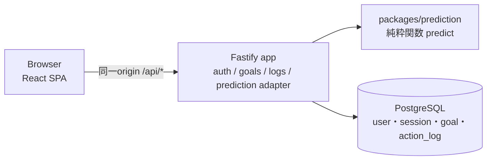

# ArchitectureとTechnology Stack

## 現行状態（2026-09-30）

Future ROI（[Product P-11](product-spec.md#p-11-future-roiの採用とcoreの境界)）の実現方式を記録する。予測モデル（[D-19](#d-19)〜[D-22](#d-22)）、Data Modelと記載済みの業務API・Prediction Engineの規則は確定。成功応答のデータ項目（DTO）・HTTP status等の未定義部分と文書間の解釈差は[契約の判断事項](contract-review-proposal.md)へ分ける。**2026-10-03、依頼者によるチーム合意報告を受け[D-23](#d-23)の基本構成を採用。[D-24](#d-24)／[D-25](#d-25)は検証・運用条件付きの第一候補。** [合意範囲](#2026-10-03の技術構成合意)を超えて認証・公開先・API細則を確定しない。**Product機能・Prediction Engine・DB・公開環境は未実装。** 構成の採用を動作確認済みとは扱わない。

旧音楽案の設計・比較結果は[保管場所](../archive/music-exploration/README.md)に履歴として残す（[D-17](#d-17-音楽案に依存したarchitectureの適用終了)）。

## System構成

Goal（ユーザーが決めた累積努力量の目標）に向けた毎日の記録から、今日休む場合の影響と完了の目安を示す。必要な性質は「認証・関係データの永続化・独立した計算・決定的なテスト・容易な配備」。[D-23](#d-23)で、**ブラウザー上の画面（SPA）と画面から呼ぶ処理（API）を1つのコンテナ（まとめて配備する単位）で実行し、PostgreSQLへ保存する構成**を採用した。計算コアはUI・DB・HTTPから独立した純粋関数にする。Microservices、Queue、Cache、ML frameworkは使わない。図のReact／Fastify／PostgreSQLは採用範囲、認証ライブラリ・テーブルは[D-24](#d-24)の条件付き第一候補。



| モジュール | 責務 | 依存してよいもの |
| --- | --- | --- |
| `packages/prediction` | 予測の計算だけ。時刻・DB・HTTP・乱数の外部状態を持たない | なし（外部依存0） |
| `apps/api` の `auth` | 登録・ログイン・セッション（Better Authは条件付き第一候補） | DB |
| `apps/api` の `goals` / `logs` | Goal・記録のCRUD、所有者チェック、「今日」「昨日」の判定 | DB |
| `apps/api` の `prediction` | DBから入力を組み立て、Goalのtimezoneで`today`を計算し、`predict`を呼ぶ | `packages/prediction`、`goals` / `logs` |
| `apps/web` | 画面と表示文言。数値の計算をしない | APIの契約 |

### Repository構成

```text
package.json            npm workspacesは候補（管理方式は未確定。apps/web, apps/api, packages/prediction）
packages/prediction/    src/{index,types,transitions,betaGeometric,completion,random}.ts, test/
apps/api/               src/{server,auth,goals,logs,prediction,db}/, migrations/
apps/web/               src/routes/, src/api/
compose.yaml            ローカル開発用 Web・API・PostgreSQL
```

## Technology Stack

**基本構成は依頼者の合意報告に基づく採用記録（DECIDED、公開確認待ち）。認証・公開先は条件付き第一候補（RECOMMENDED / CONDITIONAL）。** 以下の合意範囲で分けて確認する。旧構成は[履歴](../archive/music-exploration/README.md)として保持し、復元と動作確認は実装Issueで行う。

### 2026-10-03の技術構成合意

採用する基本構成と理由は次のとおり。版・追加ツールは今回の合意では確定していない。

| 作る部分 | 採用する構成 | この構成にする理由 |
| --- | --- | --- |
| 共通の言語と実行環境 | TypeScript／Node | 画面・API・計算の型を共有し、実行環境を分散させない |
| 画面 | React＋Vite＋TanStack Router／Query | Reactは画面、Viteはビルド、Routerは画面遷移、Queryは取得・更新後の再取得を担当する |
| APIと共有契約 | Fastify＋TypeBox | 画面とAPIで同じデータ定義を使い、入力を実行時にも検証する |
| データ保存 | PostgreSQL | 記録の一意性と関連データの整合をDBの制約で守る |
| 配信 | 単一SPA／APIコンテナ | 画面とAPIを同じorigin（URLのスキーム・ホスト・ポート）で配信し、配備対象を少なくする |
| 予測 | 独立した純粋計算コア | 入力だけから同じ結果を返し、画面・DB・HTTPと分けて検証する |

**次の作業：** Engine担当は[#71](https://github.com/jogi-hack-2026-team/jogi-hack-2026/issues/71)の「言語確定後、#70のMergeを待たずに雛形を作って先行可」という明示例外を確認する。基盤担当は#70の版・追加ツール・起動構成、FE担当は#78〜#81の具体的な先行範囲を各Issueで確認する。合意だけでHard依存・BLOCKEDを解除せず、[着手前の確認](DEVELOPMENT_GUIDE.md#着手前に読み直す)と対象Issueの承認済み範囲に従う。担当者氏名・ProjectsのStatusは推測しない。

| 条件付き第一候補 | 引き続き残る条件 |
| --- | --- |
| Better Auth（D-24） | 採用版、認証更新／DB復旧担当、CSRF／Origin細則・回数制限、復元後の削除user／password／account巻戻し対処、公開HTTPSの確認 |
| Cloud Run＋Neon（D-25） | 最終受入、regionの組合せ、予算・利用前提・運用担当、実Cloud／proxy／1 vCPU／休止後応答の確認。アカウント・課金・リソース作成と一般公開は別承認 |

API成功DTO・status・PATCH・昨日の既存記録変更・unit編集はこの合意の対象外。[未採択の契約案](contract-review-proposal.md)を維持し、D-19〜D-22、DONEのサーバー量補完、SKIPPED入力amount禁止／保存NULL、T-14の500ms未満を変えない。#84のClose、Projects変更、本実装開始、Merge、クラウド作成はこの文書から自動実行しない。

**合意の出所と公開確認：** 2026-10-03に依頼者がFE・BE二人の合意を報告したため、報告された基本構成だけをD-23へ記録した。**依頼者による合意報告であり、FE・BE本人による採択範囲の公開確認は待ち。** [#84](https://github.com/jogi-hack-2026-team/jogi-hack-2026/issues/84)または[PR #97](https://github.com/jogi-hack-2026-team/jogi-hack-2026/pull/97)に、両担当が上記の採用範囲とD-24／D-25・版・追加ツール・API細則を含めない範囲を明記したコメントまたは採択確認を含むApproveを残し、そのURLを本項へ追記する必要がある。PR #85の検証資料へのApproveや、D-23〜D-25の採択・FE先行合意を含まない[PR #93のApprove](https://github.com/jogi-hack-2026-team/jogi-hack-2026/pull/93#pullrequestreview-5390202983)を代用しない。公開記録の確認と先行文書のレビュー・統合をmain反映前の条件とする。統合手順と未実施事項はPR #97で追跡する。

[PR #93](https://github.com/jogi-hack-2026-team/jogi-hack-2026/pull/93)の比較説明と[PR #96](https://github.com/jogi-hack-2026-team/jogi-hack-2026/pull/96)の追加実測は未Mergeの別資料。PR #96の[未解決レビュー](https://github.com/jogi-hack-2026-team/jogi-hack-2026/pull/96#pullrequestreview-5399521304)（Origin encoded-path疑いはレビュー時未実行、Cloud試験計画の古い記述、終了hookの承認主体）を構成合意で解消済みにしない。コード・レビュー対応は今回行わない。

以下の比較表は2026-09-30の候補提案を保持したもの。版・追加ツール・migration順・代替候補の不採用を含む表全体を採択した記録ではない。現在の採用範囲は上記とD-23〜D-25で確認する。

<details>
<summary>2026-09-30の候補提案と比較を見る（現在の採用範囲は上記）</summary>

| Requirement | Candidates | 候補（確定待ち） | Why | Rejected（候補段階） |
| --- | --- | --- | --- | --- |
| 全員が書ける言語、Engineと画面で型を共有 | TypeScript / Python | **TypeScript（Node 24 LTS、npm workspaces）** | 全員の経験、FE/BE/Engineで型を共有できる。旧構成の起動設定を再利用できる | Python：Engineだけ別言語になり型・CIが二重化 |
| SPAの画面遷移・サーバー状態 | React＋Vite＋TanStack Router（＋TanStack Query）/ Next.js | **React＋Vite＋TanStack Router＋TanStack Query** | 画面は4〜5枚でSSR不要。FEとAPIを1プロセスで同一origin配信できる（#85で最小画面とSPA配信を確認）。**FE基盤はBEの選定と分けて先にチームで合意する**（レビュー合意、2026-10-01） | Next.js：SSR・Server Actionsの学習とAPIとの二重構成が不要 |
| APIとWebの契約の共有 | 共有スキーマ（TypeBox）/ 手書きの型 / OpenAPI生成 | **TypeBoxの共有スキーマ。OpenAPI生成はCode Freeze後** | 同じスキーマを入力検証・応答の直列化・Webの型と実行時検証に使える（#85で確認） | OpenAPI生成：12日では生成物の管理コストが先に立つ |
| HTTP API | Fastify / Hono / Express | **Fastify** | 旧構成で起動確認済み、Better AuthのFastify連携が公式Docsにある、スキーマ検証付き | Hono：Node常駐サーバーでは優位点が小さい |
| 関係データ・一意制約 | PostgreSQL / SQLite | **PostgreSQL** | `(goal_id, local_date)`の一意制約・外部キー・ユーザーごとの分離。Managedの選択肢が多い | SQLite：公開環境での永続ボリューム管理が必要 |
| DBアクセスとmigration | `pg`＋SQL / Drizzle / Prisma | **`pg`＋素のSQL＋`node-pg-migrate`** | テーブルは2つ、SQLをそのまま読める。Better Authも同じ`pg` Poolを使える | ORM：2テーブルに対してスキーマDSLと生成物の学習コストが大きい |
| migrationの実行順 | — | **`db:migrate:auth` → `db:migrate:app` → `db:seed:demo`**（`db:migrate`は前2つを順に実行） | 認証テーブル（`user`）を`goal`が参照するため。Better Authの公式手順は`npx auth@latest migrate`だが使わず、lockfileで固定した版のライブラリから`getMigrations`を呼ぶ（#85 F-9で再現を確認） | — |
| 認証 | Better Auth / Supabase Auth / 自作 | **Better Auth（メール＋パスワード、DBセッション、Cookie）** | 同じPostgreSQLに保存し、外部サービスを増やさない。公式DocsでFastify・`pg` Pool・migration CLIを確認（Context7、v1.6系、2026-09-30）。#85でbetter-auth 1.7.6の登録〜ログアウト・DB保存のレート制限を実測 | Supabase Auth：DB・認証の境界が外部に移る。自作：12日でのセキュリティリスク。Firebase Authentication：#84 v3.1で比較（セッションCookie・ADCも可能）、実装比較は未実施。逆転条件は「認証の運用をチームが担えるか」 |
| 数値計算（Beta-Geometricの分位点、Gamma・Beta乱数） | 自作 / jStat等 | **自作（分位点は任意精度整数による厳密比較、乱数はMarsaglia–Tsang法）。ただしI-03でゲートを設ける** | 必要な処理は少なく、乱数を注入できる形にしやすい。分位点は浮動小数点の特殊関数（lgamma）を使わない方が境界で正確（PR #86レビュー） | 外部ライブラリ：依存に対して使う範囲が小さい。**リスク**：特殊関数・サンプラーの実装ミス。既知値・極端なパラメータ・テストベクトルのテスト（T-15）で保証できなければ、I-03の中で小さな成熟ライブラリへ切り替える |
| テスト | Vitest＋fast-check / Jest | **Vitest＋fast-check** | Viteと設定を共有。事前検証でランダム入力が実装の欠陥を見つけたため、性質ベースのテストを採用 | Jest：ESM・TSの追加設定 |
| E2E | Playwright CLI＋Skill | **Playwright CLI（主要Flowのみ）** | [AI開発ツールの方針](../AI_DEVELOPMENT_TOOLS.md)どおり | Playwright MCPの常時利用 |
| デプロイ | [D-25](#d-25) | 1コンテナ＋Managed PostgreSQL | — | — |

</details>

### 第一候補の検証状況（#84 / #85）

[Issue #84](https://github.com/jogi-hack-2026-team/jogi-hack-2026/issues/84)で第一候補を最小構成で実測した（PR #85でmain済み、Supporting Artifact）。詳細は[検証報告](../experiments/architecture-verification/REPORT.md)と[訂正後の比較 v3.1](../experiments/architecture-verification/SELECTION-v3.1.md)。この報告自体の結論は「条件付きで採用可能」であり、**検証成功やPR統合は採択ではない**。その後の基本構成の採用は[別の合意報告](#2026-10-03の技術構成合意)に基づく。下表は#85当時の確認範囲で、[PR #96](https://github.com/jogi-hack-2026-team/jogi-hack-2026/pull/96)の追加実測・未解決レビューや本実装の状況とは分ける。

| 区分 | 内容 |
| --- | --- |
| 確認できた（ローカル、Node 24.21.0） | 登録→ログイン→再読み込み→ログアウト（APIと実ブラウザ）。未認証は401、他人のGoalは404。Cookie属性（HttpOnly・SameSite=Lax・httpsでSecure）。認証エンドポイントのOrigin検査。DB保存のレート制限が再起動・複数instance・並列をまたいで効く。空DBからのmigrationの再現。1プロセスでSPAとAPIを同一origin配信。SIGTERMで処理中のリクエストを完了してから終了 |
| 見つかった問題（対処を確認済み） | 既定の入力検証が契約違反を受理する（F-1〜F-3）。公式ガイドの変換routeでは全クライアントがレート制限を共有しうる（F-5）。DB接続の既定設定で429の待ち時間が異常値になる（F-10）。同期の計算がAPI全体を止める（混合負荷） |
| 未確認 | Prediction Engineの単体性能（T-14）。コンテナのビルド。Cloud Run＋Neonでの動作・休止後の応答・転送ヘッダーの実形式とhop数。実ブラウザでのCSRF。費用の実測。Firebase・Hono・TanStack Startの実装比較。混合負荷はApple M5の複数コアで計測しており、Cloud Runの1 vCPUでのworkerの効果は未確認 |

### 実装時に必要な対策

技術に依存しない要件は確定とし、具体策は第一候補を採用した場合の案（#85の対処）として記録する。各Issueの受け入れ条件への反映は、技術選定の確定後に行う。

| 対策 | 要件（技術に依存しない） | 第一候補での具体策（#85） | 対応Issue |
| --- | --- | --- | --- |
| 入力検証 | 契約違反（未定義の項目、型の違い、状態と量の組み合わせ違反）は黙って受理せず422にする。違反した項目をすべて返す | 厳格な検証設定（`removeAdditional: false`・`coerceTypes: false`・`allErrors: true`）、検証エラーを422の共通形式へ変換、Type Providerをpluginごとに再適用（F-1〜F-4） | #70・#76・#77、表示は#78 |
| レート制限 | ログイン等の認証操作に回数制限を設け、再起動・複数instanceでも効く。制限中は待ち時間を画面で伝える。共有回線（デモ会場）でも正当な利用者を止めない上限にする | DB保存のレート制限、信頼するproxyのhop数からクライアントIPを1つに決めて渡す修正版の変換route、`int8`を数値で読むDB接続設定と適用範囲の決定（F-5〜F-7、F-10） | #74・#75 |
| CSRF / Origin | 状態を変えるAPIは、別originからのCookie付き要求を受け付けない方針を決める（`SameSite=Lax`だけでは同一siteの別originを防げない） | 方針は未決（F-8）。Origin検査を足すかをチームで決め、実ブラウザで確認する | #75・#76 |
| 予測計算によるAPIの停止 | 予測の計算中も、記録・Goal操作・セッション確認を待たせない | T-14（500ms未満）を維持して計測する。計算時間に応じて同一プロセス内のworkerで実行する案（混合負荷で、同期実行では計算時間がそのままCRUDの待ち時間になり、worker 2本では数msのままだった） | #72・#73・#77 |
| migrationの版固定 | CI・本番で依存ツールの`@latest`を取得しない | 固定版のライブラリから`getMigrations`を呼ぶ（F-9） | #74 |
| 公開先のリージョン | DBとアプリの距離を作成前に決める | Neonに東京リージョンはない。Cloud Runとの組を決めてから作成する | #70・#83 |
| 配備先での未確認項目 | 本番でしか見えない問題を最終公開前に確認する | コンテナ、休止後の応答、転送ヘッダーの実形式とhop数、1 vCPUでのworker、リージョン間の遅延 | #70・#75 |

### 検証コードとの差分（変更案・未合意）

正本（本書・Product Spec）は変更していない。#85の検証コード（`experiments/architecture-verification/src/contracts.ts`、`migrations/001_app.sql`）との差分を、変更案と理由として記録する。合意した項目だけ、正本へ反映する。

| 項目 | 正本（現在） | 検証コード | 変更案 | 理由 |
| --- | --- | --- | --- | --- |
| DONEの量 | 省略可。省略時はAPIが`sessionAmount`で補う | 必須（クライアントが送る） | **正本を維持**。本実装は正本に従う | 量の既定値をサーバーで一元管理し、UIごとの補い方の違いを防ぐ |
| T-14 | `requiredFutureDone = 120, 400, 1095`で500ms未満 | 混合負荷も判断材料にし、計算が長ければworkerで実行 | **500ms未満を維持**。混合負荷の確認を追加の受け入れ条件にするかを相談 | 単体の速さと、他のリクエストを止めないことは別の性質 |
| 単位の値 | `minutes` / `sessions` | `minutes` / `count` | どちらかに統一。案：`count` | 「回」の意味が名前から読み取りやすい。検証コードで動作確認済み |
| 量の型 | integer | numeric | 案：integerを維持 | 分・回は整数で足り、比較・合計で誤差が出ない |
| タイトルの最大長 | 100 | 120 | 案：100を維持（どちらでもよい） | 画面の1行に収める目安 |
| `action_log`の主キー | `id`（uuid）＋`(goal_id, local_date)`の一意制約 | `(goal_id, local_date)`を主キー | 案：複合主キーへ変更 | APIは日付で記録を特定し、`id`を使う場面がない |
| 記録の時刻列 | `created_at` / `updated_at` | `recorded_at` | 案：正本を維持 | 上書きの有無を追える |
| エラーの形式 | 422とだけ記載 | `{ error: { code, message, fields?: [{ path, message }] } }`。DB制約違反も422 | 案：検証コードの形式を契約に追加 | 項目ごとのエラー表示（R-02）に必要 |
| `/today`の読み取り順 | 記載なし | Goalと記録を1つのsnapshotで取得、時計は1回だけ読む、DB接続を返してから予測を計算 | 案：契約に追加 | 日付の境界で`today`と記録が食い違うのを防ぐ |

## Data Model

```sql
-- Better Auth採択時の認証テーブルは候補。固定版getMigrations案はTechnology Stackを参照
CREATE TABLE goal (
  id              uuid PRIMARY KEY DEFAULT gen_random_uuid(),
  user_id         text NOT NULL REFERENCES "user"(id) ON DELETE CASCADE,
  title           text NOT NULL CHECK (char_length(title) BETWEEN 1 AND 100),
  unit            text NOT NULL CHECK (unit IN ('minutes', 'sessions')),
  total_required  integer NOT NULL CHECK (total_required > 0),
  initial_progress integer NOT NULL DEFAULT 0 CHECK (initial_progress >= 0),
  session_amount  integer NOT NULL CHECK (session_amount > 0),
  timezone        text NOT NULL,            -- IANA名（例 Asia/Tokyo）
  created_at      timestamptz NOT NULL DEFAULT now(),
  updated_at      timestamptz NOT NULL DEFAULT now()
);
CREATE TABLE action_log (
  id          uuid PRIMARY KEY DEFAULT gen_random_uuid(),
  goal_id     uuid NOT NULL REFERENCES goal(id) ON DELETE CASCADE,
  local_date  date NOT NULL,
  status      text NOT NULL CHECK (status IN ('DONE', 'SKIPPED')),
  -- CHECKは結果がNULLでも通過するため、DONE側でNULLを明示的に拒否する
  amount      integer CHECK ((status = 'DONE' AND amount IS NOT NULL AND amount > 0) OR (status = 'SKIPPED' AND amount IS NULL)),
  created_at  timestamptz NOT NULL DEFAULT now(),
  updated_at  timestamptz NOT NULL DEFAULT now(),
  UNIQUE (goal_id, local_date)
);
```

- 記録のない日はUNKNOWNとして解釈し、行を作らない。
- 目標期日（targetDate）は持たない。MVPの表示に使わないため（期日到達確率は[D-21](#d-21)で不採用）。
- `initial_progress`は「Future ROIで記録を始める前に完了していた量」。現在の実績は常に `initial_progress ＋ DONEのamountの合計` で計算し、別に保存しない。
- 記録が1件でもあるGoalでは、`timezone`と`initial_progress`を変更できない（過去の`local_date`の基準や、過去の予測の意味が変わるため。timezoneの移行処理はMVPで扱わない）。

## API契約

業務APIは`/api`配下。Goal・記録APIでは未ログインは401、他人のGoalは404（存在を明かさない）、入力不正は422。同一originのCookieセッション、Better Authと`/api/auth/*`の経路は[D-24](#d-24)の候補であり、R-01の確定要件と区別する。認証ライブラリのエラーを業務APIのstatus・共通error形式へ揃える範囲は未決定。

以下はmethod / pathと記載済みの規則の一覧。成功DTO・成功status、PATCHの省略・null・空body、Goal一覧の今日状態の表現、SKIPPEDの応答量は未定義であり、[提案表](contract-review-proposal.md#apiの未定義部分)で判断する。DONEのamount省略時はサーバーが`sessionAmount`で補う。SKIPPED入力のamountは禁止（[#77の受入条件](https://github.com/jogi-hack-2026-team/jogi-hack-2026/issues/77)）、保存値は[Data Model](#data-model)のNULLと区別する。今日の変更と昨日の未記録補完はProduct R-03・R-04・P-14を参照する。下表の「上書き」と#77を昨日の既存記録にも適用するかは[解釈の判断待ち](contract-review-proposal.md#昨日補完と再送競合)。

| Method / Path | 内容 |
| --- | --- |
| `/api/auth/*`（候補） | Better Auth採択時のハンドラ（登録・ログイン・ログアウト・セッション）。業務APIの確定契約とは別 |
| `GET /api/goals` | 自分のGoal一覧（今日の記録状態を含む） |
| `POST /api/goals` | 作成。body：`title, unit, totalRequired, initialProgress, sessionAmount, timezone`。timezoneは有効なIANA名のみ（それ以外は422） |
| `GET / PATCH / DELETE /api/goals/:goalId` | 取得・編集・削除。記録があるGoalで`timezone`・`initialProgress`を変えようとすると422 |
| `PUT /api/goals/:goalId/logs/:localDate` | 記録の作成・上書き。body：`status, amount?`。`localDate`がGoalのtimezoneで今日・昨日以外なら422 |
| `GET /api/goals/:goalId/logs?from&to` | 記録の一覧（履歴表示用） |
| `GET /api/goals/:goalId/today` | `{ today, yesterday, todayLog, yesterdayMissing, prediction: PredictionResult }` |

## Prediction Engine

モデル仕様の正本。理由と検証結果は[予測モデルの判断記録](prediction/decision-log.md)と[Evidence](prediction/evidence.md)。

### インターフェース

説明のためTypeScriptで記述する。以下に明記した入出力の項目・規則・既定値は確定。`observedDays` / `recordedDays`の集計細則、入力・設定エラーの全範囲と表現は[判断待ち](contract-review-proposal.md#engineと表示の不足)。実装言語は[D-23](#d-23)の確定に従う。

```ts
type LocalDate = string; // 'YYYY-MM-DD'（Goalのtimezoneでの日付）

interface PredictionInput {
  goal: { totalRequired: number; initialProgress: number; sessionAmount: number };
  logs: { localDate: LocalDate; status: 'DONE' | 'SKIPPED'; amount: number | null }[];
  today: LocalDate; // 呼び出し側（API）がGoalのtimezoneで計算して渡す。Engineは時計を読まない
}

const DEFAULT_CONFIG = {
  modelVersion: 'behavior-persistence-m1-v1',
  prior: 2,            // a, b とも Beta(2,2)
  samples: 200,        // 完了の目安で使う事後サンプル数 K
  horizonDays: 1095,   // 完了の目安の打ち切り H
  seed: 20261012,
} as const;

function predict(input: PredictionInput, config = DEFAULT_CONFIG): PredictionResult;

interface PredictionResult {
  modelVersion: string;
  today: LocalDate;
  todayStatus: 'DONE' | 'SKIPPED' | 'UNRECORDED';
  progress: { done: number; total: number; completed: boolean };
  observations: { nDD: number; nDS: number; nSD: number; nSS: number;
                  effectiveTransitions: number; observedDays: number; recordedDays: number };
  posterior: { a: { alpha: number; beta: number }; b: { alpha: number; beta: number } };
  coreMetric:
    | { status: 'available'; g50: number; g80: number }
    | { status: 'insufficient'; reason: 'NO_SKIP_ORIGIN_TRANSITION' }
    | { status: 'not_applicable'; reason: 'TODAY_RECORDED' | 'COMPLETED' };
  completion:
    | { status: 'available'; scenario: 'TODAY_DONE' | 'CURRENT_STATE';
        p50Days: number | null; p80Days: number | null } // null = 3年（H日）以内に到達しない
    | { status: 'insufficient'; reason: 'NO_DONE_ORIGIN_TRANSITION' | 'NO_SKIP_ORIGIN_TRANSITION' }
    | { status: 'completed' };
  config: { prior: number; samples: number; horizonDays: number; seed: number };
}
```

### モデル

- 対象：毎日1回の実行機会がある継続行動。状態はDONE / SKIPPEDの2つ。
- パラメータ：`a = P(DONE_{t+1} | DONE_t)`、`b = P(DONE_{t+1} | SKIPPED_t)`（1次・時間一様のMarkov連鎖）。
- 事前分布：`a ~ Beta(2,2)`、`b ~ Beta(2,2)`。Engineering Priorであり、人の行動にとって正しい事前分布とは主張しない（[D-20](#d-20)）。
- 事後分布：`a ~ Beta(2+nDD, 2+nDS)`、`b ~ Beta(2+nSD, 2+nSS)`。

### 状態の判定順

結果の状態は次の順で決め、上の判定が成り立ったら下の判定はしない（Product R-06〜R-08の優先順位）。テストの期待値もこの順に従う。

| 順 | 条件 | 中心指標 | 完了の目安 |
| --- | --- | --- | --- |
| 1 | 入力エラー（未来日付・重複日付など） | 結果を返さずエラー | 同左 |
| 2 | 達成済み（`actualDone ≥ totalRequired`） | `not_applicable / COMPLETED`（遷移数・今日の記録によらない） | `completed` |
| 3 | 未達成 | 今日が記録済みなら`not_applicable / TODAY_RECORDED`（遷移数によらない）。今日が未記録で`nSD+nSS = 0`なら`insufficient`。それ以外は`available` | DONE起点またはSKIPPED起点の遷移が0件なら、今日の記録状態によらず`insufficient`。それ以外は`available`（今日が未記録なら`TODAY_DONE`、記録済みなら`CURRENT_STATE`） |

例：`logs = []`かつ`initialProgress = totalRequired`なら、中心指標は`not_applicable / COMPLETED`、完了の目安は`completed`。未達成で今日のSKIPPEDだけが記録されている場合、中心指標は`not_applicable / TODAY_RECORDED`、完了の目安は`insufficient`。

### 手順

1. **観測列**：最も古い記録の日から、今日が記録済みなら今日まで、未記録なら昨日までの各日を、記録があればDONE / SKIPPED、なければUNKNOWNとする。今日より後の日付の記録は入力エラー。
2. **遷移数**：隣り合う2日がどちらもDONE / SKIPPEDのペアだけを数え、`nDD, nDS, nSD, nSS`とする。どちらかがUNKNOWNのペアは数えない。`effectiveTransitions = nDD+nDS+nSD+nSS`。
3. **実績**：`actualDone = initialProgress + Σ amount（今日までのDONE）`。今日がDONE記録済みなら、今日の実際の`amount`もここに含まれる。`actualDone ≥ totalRequired`なら`completed = true`とし、中心指標は`not_applicable / COMPLETED`、完了の目安は`completed`。
4. **中心指標**（未達成かつ今日が未記録の場合だけ計算する。[判定順](#状態の判定順)の3）：
   - `nSD + nSS = 0`なら`insufficient`（事前分布だけの値を表示しない）。
   - `α = 2+nSD`、`β = 2+nSS`。今日サボった場合に遠ざかる日数`G`の事後予測分布はBeta-Geometric分布：`P(G > t) = B(α, β+t) / B(α, β) = Π_{i=0}^{t−1} (β+i)/(α+β+i)`（`t = 0, 1, 2, …`）。
   - `g50 = min{ t ≥ 1 : P(G > t) ≤ 0.5 }`、`g80 = min{ t ≥ 1 : P(G > t) ≤ 0.2 }`。CDFが閾値にちょうど一致する日も到達とみなす。
   - **厳密に計算する**：事前分布は整数（`prior = 2`）なのでα・βは整数。`N_t = Π (β+i)`、`D_t = Π (α+β+i)`を任意精度の整数（BigInt等）で持ち、`g50`は`2·N_t ≤ D_t`、`g80`は`5·N_t ≤ D_t`を満たす最小の`t`とする。乱数も浮動小数点も使わない。`lnB`（lgamma）の差のexpで計算すると、CDFが閾値に一致する境界で1日ずれる（α,β = 2〜20で722件中15件。[Evidence](prediction/evidence.md#中心指標の候補比較)）。`config.prior`が整数でない場合は設定エラーとする。
5. **完了の目安**（未達成の場合だけ計算する。[判定順](#状態の判定順)の3）：
   - `nDD+nDS = 0`なら`insufficient / NO_DONE_ORIGIN_TRANSITION`、`nSD+nSS = 0`なら`insufficient / NO_SKIP_ORIGIN_TRANSITION`。両方の状態からの遷移を1回以上観測するまで、事前分布だけで決まる部分を含む目安を表示しない（件数の閾値ではない）。
   - 「今日までの実績」と「明日以降に必要なDONE回数」を分ける。今日のDONEをDPの中で数え直さない。

     ```text
     if todayStatus == UNRECORDED:   projectedDone = actualDone + sessionAmount; startState = DONE; scenario = TODAY_DONE
     else:                           projectedDone = actualDone;                 startState = todayStatus; scenario = CURRENT_STATE
     if projectedDone >= totalRequired:  p50Days = p80Days = 0
     else: requiredFutureDone = ceil((totalRequired − projectedDone) / sessionAmount)
           DP(initialState = startState, futureDoneCount = 0, requiredFutureDone)
     ```

   - `requiredFutureDone > H`なら、DPをせずに両方`null`。
   - `m = 0 … K−1`について、[乱数の仕様](#乱数とサンプラーの仕様)に従い`a_m`、次に`b_m`を事後分布から抽選する。
   - 各`(a_m, b_m)`で、状態（DONE / SKIPPED）×`futureDoneCount`の確率を、明日（`d = 1`）から1日ずつ進める。`requiredFutureDone`回目のDONEが起きた日`d`（`1 ≤ d ≤ H`）の確率を`1/K`倍して混合分布に加える。
   - **確率の大きさで計算を打ち切らない。** 微小な確率でも、累積確率が閾値の近くにあると分位点を変えうる（PR #86レビュー：打ち切りでP50が3日から5日に変わる例。[Evidence](prediction/evidence.md#dpの微小確率の打ち切りpr-86レビュー対応)）。
   - 計算量の工夫（H日以内の累積確率を変えないものだけ）：配列は2組を使い回す。`d`日目に`futureDoneCount < requiredFutureDone − (H − d + 1)`の状態はH日以内に届かないので計算しない（その確率は「3年以内に未到達」に入る）。生きている状態が1つもなくなったら、以後の到達確率は厳密に0なので終了してよい。1抽選あたりの計算量は高々`H × requiredFutureDone`で、刈り込みによりおよそ`H²/4`以下になる。
   - `p50Days = min{ d : 累積 ≥ 0.5 − ε }`、`p80Days = min{ d : 累積 ≥ 0.8 − ε }`、`ε = 1e−12`。H日以内に届かなければ`null`（到達した分だけで分位点を計算しない）。`ε`は浮動小数点の丸め誤差（実測の最大は約3e−15）より十分大きくとった許容幅で、累積確率が閾値にちょうど一致する日を到達とみなすため（中心指標と同じ扱い）。真の累積確率が閾値より`ε`未満だけ小さい場合も到達とみなすが、その差は確率`1e−12`未満。
6. `modelVersion`と`config`を結果に含める。

### 乱数とサンプラーの仕様

暗号用ではない。全演算を符号なし32bit整数（`>>> 0`、乗算は`Math.imul`）で行い、実装による差をなくす。

```ts
// 抽選番号 m ごとのseed（MurmurHash3のfmix32で撹拌）
const fmix32 = (h: number) => { h ^= h >>> 16; h = Math.imul(h, 0x85ebca6b); h ^= h >>> 13;
  h = Math.imul(h, 0xc2b2ae35); h ^= h >>> 16; return h >>> 0; };
const seedFor = (seed: number, m: number) => fmix32((seed ^ Math.imul(m + 1, 0x9e3779b9)) >>> 0);

// SplitMix32：1回呼ぶごとにuint32を1つ返す
function splitmix32(s: number) { let state = s >>> 0;
  return () => { state = (state + 0x9e3779b9) >>> 0; let z = state;
    z = Math.imul(z ^ (z >>> 16), 0x21f0aaad); z = Math.imul(z ^ (z >>> 15), 0x735a2d97);
    z ^= z >>> 15; return z >>> 0; }; }

const uniform = (next) => (next() + 0.5) / 4294967296;                    // (0, 1)
const normal  = (next) => Math.sqrt(-2 * Math.log(uniform(next))) * Math.cos(2 * Math.PI * uniform(next));
// Gamma(α)（α ≥ 1）：Marsaglia–Tsang。Beta(α,β) = X/(X+Y)、X~Gamma(α)、Y~Gamma(β) の順に抽選
// 抽選順：rng = splitmix32(seedFor(seed, m)) から a_m（X→Y）、続けて b_m（X→Y）
```

テストベクトル（T-15）：

| 入力 | 期待値 |
| --- | --- |
| `seedFor(20261012, 0), (…, 1), (…, 2)` | `3373737972, 1247035355, 785837188` |
| `splitmix32(seedFor(20261012, 0))`の最初の3つ | `1452544342, 2306341868, 1978446536` |
| 上と同じ乱数列で`Beta(14,7)`、続けて`Beta(7,9)` | `0.7650622193905133`、`0.25593304542490336`（Node 24.21.0とNode 25.2.0で一致。`Math.log`等の実装に依存するため、Runtimeの版を変えたら再確認する） |

### 数学的な根拠（実装者向けの要約）

固定した`θ = (a, b)`の条件下では、今日サボった場合の完了日`T_skip`と今日やった場合の完了日`T_done`について、

```text
T_skip = T_done + G,   G ~ Geometric(b),   G ⫫ T_done | θ
```

が成り立つ（今日サボると、`G`日後に初めてDONEになった時点で、今日やった場合の出発点と同じ状態になるため）。無条件の独立（`G ⫫ T_done`）は成り立たない（どちらも同じθに依存する）。`G`を`b`の事後分布で積分したものがBeta-Geometric分布であり、中心指標は`a`・`totalRequired`・昨日の状態に依存しない。

### Known Limitations

1. 影響は再開までの待ち日数に集約される。連続日数による継続しやすさは表さず、強い継続傾向がある人では約1日小さく出る（控えめ側）。
2. 因果効果ではない。記録から推定した傾向が今後も続くと仮定している。
3. やらなかった日ほど記録されないと、遠ざかる日数は小さめ、完了の目安は早めに出る。前日補完で減らすが、補正はしない。
4. Beta(2,2)により、記録が少ない間は値が中央（確率0.5）側に寄る。
5. 毎日行うGoalのみ。1回の量は`sessionAmount`で固定して将来を計算する。

## Test Strategy

性質（T-01〜T-15）と各層で確かめる内容は確定。ツール名（Vitest・fast-check・Playwright）は[D-23](#d-23)の候補。

| 層 | 方法 | 内容 |
| --- | --- | --- |
| `packages/prediction` | Vitest＋fast-check（性質ベース）＋固定例 | 下表T-01〜T-15。CIで毎回実行 |
| `apps/api` | Vitest＋ComposeのPostgreSQL | 所有者チェック（他人は404）、`(goal_id, local_date)`の上書き、DB制約（DONE＋`amount`がNULLの挿入は失敗し、SKIPPED＋NULLは成功する）、今日・昨日以外は422、timezoneの日付境界、無効なIANA名は422、記録があるGoalの`timezone`・`initialProgress`変更は422、`/today`の組み立て |
| `apps/web` | 手動チェックリスト＋Playwright CLI（主要Flow 1本） | 登録→Goal作成→記録→前日補完→Today Decision表示 |

| ID | Prediction Engineの性質 |
| --- | --- |
| T-01 | UNKNOWNを含む隣接ペアは遷移数に入らない |
| T-02 | Beta-Geometric：`Σ_t P(G=t) = 1`（数値誤差内）、`1 ≤ g50 ≤ g80`。CDFが閾値に一致する境界：`(α,β) = (5,5)`で`g50 = 1`、`(2,2)`で`g50 = 1`・`g80 = 3`。α = 2の閉形式`P(G>t) = β(β+1)/((β+t)(β+t+1))`と一致する |
| T-03 | `nSD`（再開できた回数）を増やしても`g50`は増えない。`nSS`を増やしても`g50`は減らない |
| T-04 | 中心指標は`a`の遷移数・`totalRequired`・`initialProgress`・`sessionAmount`を変えても変わらない |
| T-05 | Beta-Geometricの分位点が、「bを抽選→幾何分布を抽選」するMonte Carloの分位点と許容誤差内で一致する（テスト内でのみMCを使う） |
| T-06 | 恒等式オラクル：θ固定で、SKIP開始の到達日分布DP ＝ DONE開始の分布DP ⊕ Geometric(b)（最大誤差 < 1e−12） |
| T-07 | 決定性：同じ入力と`config`なら結果が完全に一致する |
| T-08 | 今日のDONEを二重に数えない。①実績 ≥ 総量なら、今日の記録状態・遷移数によらず`completed`（判定順2）。②前提「未達成・今日未記録・DONE起点とSKIPPED起点の遷移が各1件以上」で、残り1回なら`TODAY_DONE`で0日、残り2回ならDPの`requiredFutureDone = 1`。③前提「未達成・両起点の遷移が各1件以上」で、今日DONE記録済みかつ`amount ≠ sessionAmount`なら、実績に今日の`amount`を1回だけ含め、`CURRENT_STATE`から計算する |
| T-09 | `totalRequired`を増やすと`p50Days`・`p80Days`は早くならない。`initialProgress`を増やすと遅くならない |
| T-10 | `p80Days ≥ p50Days`。H日以内の到達が50%未満なら`p50Days = null`、80%未満なら`p80Days = null`。刈り込み（届かない状態だけを除く）ありとなしで分位点が一致する。**微小確率で打ち切らない**：開始DONE・`requiredFutureDone = 1`・`K = 2`・`H = 10`、等重みの`(a,b) = (0.9999999995, 0.5)`と`(1e−10, 1e−10)`で`p50Days = 3`。`requiredFutureDone = 1`では独立した式`F(d) = 1 − 平均[(1−a)(1−b)^(d−1)]`と、同じ`ε`の規則で分位点が一致する（0や1に近い抽選値を含める）。累積確率が閾値にちょうど一致する例（`(a,b) = (1, 0.3)`と`(0, 0)`で`F(1) = 0.5`）で`p50Days = 1` |
| T-11 | データ不足（前提：未達成）。中心指標は、今日が未記録かつ`nSD+nSS = 0`のときだけ`insufficient`。完了の目安は、`nDD+nDS = 0`または`nSD+nSS = 0`なら今日の記録状態によらず`insufficient`。達成済みが優先されること（`logs = []`かつ`initialProgress = totalRequired`で、中心指標`not_applicable / COMPLETED`、完了の目安`completed`）も確かめる |
| T-12 | 今日が記録済み（前提：未達成）。中心指標は遷移数によらず`not_applicable / TODAY_RECORDED`。完了の目安は、両起点の遷移が各1件以上なら`CURRENT_STATE`から計算し、不足なら`insufficient`（例：今日のSKIPPEDだけの記録では`not_applicable / TODAY_RECORDED`と`insufficient`） |
| T-13 | 今日より後の日付の記録・同じ日付の重複は入力エラー |
| T-14 | 性能：`requiredFutureDone = 120, 400, 1095`、`K = 200`でそれぞれ500ms未満（開発機で計測して記録）。試作（微小確率の打ち切りなし）ではNode 24.21.0で最大約260ms（[Evidence](prediction/evidence.md#dpとmonte-carloの比較)）。超える場合は完了の目安だけを後から計算する形に落とし、中心指標は止めない |
| T-15 | 数値部品を個別に検証：Beta-Geometricの整数比較が極端なパラメータ（`α, β`が2と数千）でも正しく終わる、Gamma・Betaサンプラーの平均と分散が理論値と許容誤差内、`seedFor`・`splitmix32`・Beta抽選のテストベクトル |

timezoneの日付境界（23:59 / 0:00）はEngineではなくAPI層のテストで扱う（Engineは`today`を受け取るだけ）。

## Deployment

| 項目 | 内容 |
| --- | --- |
| 形 | D-23で採用した単一SPA／APIコンテナ（Fastifyで同一origin配信）＋PostgreSQL。Cookie方式はD-24の候補、Managed DBの提供先はD-25の条件付き第一候補 |
| 公開先 | [D-25](#d-25)：Cloud Run＋Neonを推奨。アカウント・課金設定の作成は承認後 |
| 早期のstaging確認 | 本番でしか見えない問題（Cookie・`BETTER_AUTH_URL`・proxy・migration・環境変数・DB接続・cold start・SPA fallback・HTTPS）を早く見つけるため、最終公開を待たずに2段階で確認する。①I-01：healthだけのコンテナをstagingへ出し、DBへ接続できる ②I-06：stagingで登録・ログイン・セッション維持ができる。I-14は最終確認・E2E・Demo Seed・仕上げを担う。公開先の承認が遅れた場合の既存移管例外（[#70](https://github.com/jogi-hack-2026-team/jogi-hack-2026/issues/70)のstaging項目を[#75](https://github.com/jogi-hack-2026-team/jogi-hack-2026/issues/75)へ、#75のstaging確認を[#83](https://github.com/jogi-hack-2026-team/jogi-hack-2026/issues/83)へ）に従い、移管先で未確認項目を追跡する。移管を公開確認済みと扱わない |
| 環境変数 | `DATABASE_URL`、`BETTER_AUTH_SECRET`、`BETTER_AUTH_URL`。実値はProviderのSecret設定に置き、Gitへ入れない |
| デモ | Demo Seed（合成記録）を開発データと分けて投入。手順は[リリースとデモ](operations/release-demo.md) |

## Architecture Decision Log

| ID | 日付 | 状態 | 判断 |
| --- | --- | --- | --- |
| D-15 | 2026-09-27 | SUPERSEDED by D-18 | 当時の[Node 24 LTS / npm](#d-15)採択 |
| D-17 | 2026-09-29 | DECIDED | [旧音楽案向け設計の適用終了](#d-17-音楽案に依存したarchitectureの適用終了) |
| D-18 | 2026-09-30 → 2026-10-03 | SUPERSEDED by D-23（基本構成の未定状態） | [旧開発スタックの一時退避](#d-18-旧開発スタックの一時退避)は履歴として保持。復元・検証は未完了 |
| D-19 | 2026-09-30 | DECIDED | [予測モデルにM1（2状態Bayesian Markov）を採用、M0・M2は不採用](#d-19)（ADR-001） |
| D-20 | 2026-09-30 | DECIDED | [事前分布をBeta(2,2)とする](#d-20)（ADR-002） |
| D-21 | 2026-09-30 | DECIDED | [中心指標をBeta-Geometric分布の中央値とする](#d-21)（ADR-003） |
| D-22 | 2026-09-30 | DECIDED | [将来の日々のMonte Carloをやめ、DPで計算する](#d-22)（ADR-004） |
| D-23 | 2026-09-30 → 2026-10-03 | DECIDED（基本構成、依頼者による合意報告・公開確認待ち） | [言語・FE／API・DB・単一コンテナ・独立計算コアを採用](#d-23) |
| D-24 | 2026-09-30 → 2026-10-03 | RECOMMENDED / CONDITIONAL（第一候補、最終採択待ち） | [Better Authは検証・運用条件付き](#d-24) |
| D-25 | 2026-09-30 → 2026-10-03 | RECOMMENDED / CONDITIONAL（第一候補、最終受入待ち） | [Cloud Run＋Neonは条件付き。作成・課金・公開は別承認](#d-25) |

旧D-01〜D-14・D-16と比較・代替案は[旧Architecture Decision Log](../archive/music-exploration/docs/architecture.md#architecture-decision-log)に保管する。

### D-15

2026-09-27 / **SUPERSEDED by D-18** / Node 24 LTSとnpmを当時の開発Toolchainに採用した。[当時の判断理由](../archive/music-exploration/docs/architecture.md#d-15) / [Issue #49](https://github.com/jogi-hack-2026-team/jogi-hack-2026/issues/49)。新Productでは[D-23](#d-23)でTypeScript／Nodeの基本構成を採用したが、Node 24 LTS／npmを含む版と管理方式は今回の合意では未確定。

### D-17 音楽案に依存したArchitectureの適用終了

2026-09-29 / **DECIDED（依頼者判断に伴う適用範囲変更）** / 旧案のD-08〜D-14・D-16、A-01〜A-07を次のProductへ自動適用しない。旧判断、実験、未検証事項は[履歴](../archive/music-exploration/docs/architecture.md#architecture-decision-log)として保持する。[整理Issue #67](https://github.com/jogi-hack-2026-team/jogi-hack-2026/issues/67)。

### D-18 旧開発スタックの一時退避

2026-09-30の退避判断を、2026-10-03に**SUPERSEDED by D-23（基本構成の未定状態）**へ更新。旧Web/API・Compose・Application CIを[履歴](../archive/music-exploration/README.md)へ退避した理由と[整理Issue #67](https://github.com/jogi-hack-2026-team/jogi-hack-2026/issues/67)は保持する。D-23で新Productの基本構成を採用したが、旧設定・版の再採用や復元済みを意味しない。必要部分の復元と動作確認は#70等の実装Issueで行う。

### D-19

2026-09-30 / **DECIDED（依頼者判断）** / ADR-001。予測モデルにM1（2状態・1次・時間一様のBayesian Markov連鎖）を採用し、M0（iid Bernoulli）とM2（3状態：SKIPPED / DONE_1 / DONE_2+）は不採用とする。M2に固有の追加効果は最大約1.1日で、30日分の記録の1日を反転しただけで推定が最大約2.1日（P95）動く。状態依存がない場合に誤って効果を大きく出す割合もM2の方が多い。14〜60日分の記録ではどのモデルも選べない（判定保留95〜100%）。M0は再開しにくさを表せず、継続傾向がある人を一貫して小さく見積もる。[詳細](prediction/decision-log.md#adr-001-m1を採用しm0m2を不採用)。

### D-20

2026-09-30 / **DECIDED（依頼者判断）** / ADR-002。a・bとも事前分布をBeta(2,2)とする。合成ユーザー・14〜60日分の記録・今回の評価指標の範囲で、Beta(0.5,0.5) / Beta(1,1) / Beta(2,2)を比べ、少ないデータでの誇張・誤差・不安定さを最も抑えたEngineering Prior。実ユーザーデータから推定した事前分布ではない。[詳細](prediction/decision-log.md#adr-002-事前分布beta22)。

### D-21

2026-09-30 / **DECIDED（依頼者判断）** / ADR-003。中心指標を「今日サボった場合に遠ざかる日数G」のBeta-Geometric事後予測分布の中央値`g50`とする。期待値（発散しうる）、完了日P50の差（分位点の差・打ち切りの影響）、期日到達確率の差（期日が必要）は不採用。[詳細](prediction/decision-log.md#adr-003-中心指標はbeta-geometric分布の中央値)。

### D-22

2026-09-30 / **DECIDED（依頼者判断）** / ADR-004。将来の日々のMonte Carloと共通乱数法（CRN）を使わない。中心指標は閉形式、完了の目安は事後サンプル（K=200）ごとに到達日分布をDPで厳密に計算する。決定的・再現可能で、シミュレーションノイズとCRNが不要になり、テストが書きやすい。[詳細](prediction/decision-log.md#adr-004-将来のmonte-carloをやめてdpで計算)。

### D-23

2026-10-03 / **DECIDED（基本構成、依頼者による合意報告・公開確認待ち）** / 2026-09-30のAI候補提案から[合意範囲](#2026-10-03の技術構成合意)だけを採用へ更新。TypeScript／Node、React＋Vite＋TanStack Router／Query、Fastify＋TypeBox、PostgreSQL、単一SPA／APIコンテナと独立した純粋計算コアを採用する。責務は`packages/prediction`・`apps/api`・`apps/web`へ分ける。版・workspace管理・`pg`／`node-pg-migrate`／Vitest／fast-check等の候補ツール・API細則は今回追加採択しない。認証・公開先はD-24／D-25の残条件を保持し、復元・実装・個別Issueの着手条件は別途追跡する。比較提案は[Technology Stack](#technology-stack)に保持する。

### D-24

2026-10-03 / **RECOMMENDED / CONDITIONAL（第一候補、最終採択待ち）** / 2026-09-30の候補Better Authを、[合意範囲](#2026-10-03の技術構成合意)により検証・運用条件付きの第一候補として進める。メール＋パスワードの業務要件はR-01、DBセッション／Cookieは候補方式。版・認証更新／DB復旧担当・CSRF／Origin・回数制限・復元対処・公開HTTPSの確認を#75・#74・#84で追跡する。PR #96のレビューや他の認証候補の不採用まで合意したと扱わない。

### D-25

2026-10-03 / **RECOMMENDED / CONDITIONAL（第一候補、最終受入待ち）** / Cloud Run＋Neonを、[合意範囲](#2026-10-03の技術構成合意)により検証・運用条件付きの第一候補として進める。単一SPA／APIコンテナとPostgreSQLはD-23の採用範囲だが、サービスの最終受入・一般公開・課金作成の許可ではない。#85のregion確認は2026-09-30の記録で、現在の提供地域と組合せは作成前に再確認する。予算・利用前提・担当・実Cloud／proxy／1 vCPU／休止後応答・費用は未確認。アカウント・課金・リソース作成は対象と費用を示した別承認後。旧比較は[履歴](../archive/music-exploration/docs/architecture.md#deploymentと費用)に保持する。
