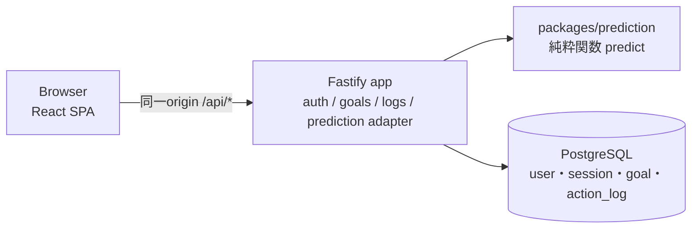

# ArchitectureとTechnology Stack

## 現行状態（2026-09-30）

Future ROI（[Product P-11](product-spec.md#p-11-future-roiの採用とcoreの境界)）の実現方式を記録する。予測モデル（[D-19](#d-19)〜[D-22](#d-22)）、Data Modelと、以下に明記した業務API・Prediction Engineの規則は確定。APIの成功DTO・HTTP status等の未定義部分と、文書間で解釈が一致しない部分は[契約の判断事項](contract-review-proposal.md)へ分け、契約全体が確定済みとは扱わない。**構成と技術（[D-23](#d-23)〜[D-25](#d-25)）は候補であり、技術選定の確定待ち**（別担当の精査結果と比較して確定する）。**Product機能・DB・公開環境は未実装。** 純粋Prediction Engineと関連テストは[#103](https://github.com/jogi-hack-2026-team/jogi-hack-2026/pull/103)でmain統合済みだが、アプリへの正式結合は未完了。下記の契約をアプリ動作確認済みとは扱わない。

旧音楽案の設計・比較結果は[保管場所](../archive/music-exploration/README.md)に履歴として残す（[D-17](#d-17-音楽案に依存したarchitectureの適用終了)）。

## System構成

Productと予測仕様から必要になる性質は「本人だけが記録を操作できる認証・記録と予測の整合・純粋な計算モジュール・決定的なテスト」。これを満たす最小構成の**候補**として、**1つのNodeアプリ（API＋静的配信）＋PostgreSQL** とし、コード上はモジュールで責務を分ける（モジュラーモノリス）。配備するサービスを増やさず、計算だけを切り離して検証・改善できる形を狙う。Microservices、Queue、Cache、ML frameworkは現時点で追加する根拠がない。下図とモジュール表の具体技術名は候補（[D-23](#d-23)）。確定しているのは「Prediction EngineをUI・DB・HTTPから独立した純粋関数にする」という責務の分け方。[比較理由・弱点・増強の再検討条件](../experiments/architecture-verification/SELECTION-v3.1.md#9-技術を選ぶ理由と残る判断2026-10-02)を参照。

低い月額費用と1〜2年の保守・継続開発は、2026-10-02に依頼者が説明整理の中心として指定した**比較の観点**であり、チーム合意済みの非機能要件ではない。月額の上限や保守期間の受入条件は未決定で、Product Specへ要件を追加しない。3人での開発、Code Freeze（2026-10-12）までの学習・実装・検証への影響も[共通ルール](../AGENTS.md#11-技術選定)に従って確認する。TypeScript経験や締切の近さを技術の採用理由には使わず、実現可能性・負担の確認と分ける。全員に必要な操作と保守を説明できるかは採択前に確認する。



| モジュール | 責務 | 依存してよいもの |
| --- | --- | --- |
| `packages/prediction` | 予測の計算だけ。時刻・DB・HTTP・乱数の外部状態を持たない | なし（外部依存0） |
| `apps/api` の `auth` | 登録・ログイン・セッション（Better Auth） | DB |
| `apps/api` の `goals` / `logs` | Goal・記録のCRUD、所有者チェック、「今日」「昨日」の判定 | DB |
| `apps/api` の `prediction` | DBから入力を組み立て、Goalのtimezoneで`today`を計算し、`predict`を呼ぶ | `packages/prediction`、`goals` / `logs` |
| `apps/web` | 画面と表示文言。数値の計算をしない | APIの契約 |

機能ごとに処理をまとめる単一アプリ（modular monolith）の中で、HTTP層はstatus・DTO（送受信するデータ形式）への変換、application serviceは業務判断とtransaction（複数の更新を一組にする処理）、SQL adapterは永続化を担当する。依存の接続はアプリの構成起点で行い、EngineへDB・HTTP・UI・clockを持ち込まない。時刻から導く日付は入力として渡す。具体的なstatus・DTO・更新規則は[API契約](#api契約)の記載済み規則に従い、この分担だけで未記載・判断待ちの契約を確定しない。

interfaceは差替えやテストに必要な境界だけに置く。大がかりなClean Architecture、汎用Repository、DI containerは導入しない。共通化は同じ業務上の理由で変わる処理だけに限定し、巨大なutilsや将来の用途だけを理由にした汎用化を避ける。

入力検証は、UIの入力支援、APIの信用できない外部入力の検証、application service／Engineの業務不変条件、DBの一意性・参照整合性等の制約で役割が異なる。共有できる形式定義を使っても、各境界に必要な検証をDRY（重複削減）だけを理由に消さない。値・日付・NULLの規則は[Data Model](#data-model)と[Prediction Engine](#prediction-engine)を参照する。

### Repository構成

```text
package.json            npm workspaces（apps/web, apps/api, packages/prediction）
packages/prediction/    src/{index,types,transitions,betaGeometric,completion,random}.ts, test/
apps/api/               src/{server,auth,goals,logs,prediction,db}/, migrations/
apps/web/               src/routes/, src/api/
compose.yaml            ローカル開発用 Web・API・PostgreSQL
```

## Technology Stack

**状態：候補（技術選定確定待ち）。** 2026-09-30、依頼者の指示でAIが要件から候補を選んだ（[D-23](#d-23)〜[D-25](#d-25)）。技術スタックは別担当でも精査中のため、その結果と比較して確定するまで最終Decisionとは扱わない。確定まで、技術に強く依存する実装Issue（I-01 #70・I-05 #74・I-06 #75・I-14 #83）は着手しない。FE基盤はBEと分けて合意できるが、FE（#78〜#81）の具体的な先行範囲・依存変更は#84での採択時に合意して対象Issueへ反映する（[PR #92の確認](https://github.com/jogi-hack-2026-team/jogi-hack-2026/pull/92#issuecomment-5944800922)）。先行着手は[開発ガイド](DEVELOPMENT_GUIDE.md#着手前に読み直す)と対象Issueの承認済み範囲に従い、この説明だけでHard依存・Ready・BLOCKEDを変更しない。第一候補の実測結果は[検証状況](#第一候補の検証状況84--85)。旧音楽案で導入・起動確認済みの構成（[履歴](../archive/music-exploration/README.md)）を再利用できる部分は再利用する案だが、その理由は下表の要件であり、過去の採用ではない。

| Requirement | Candidates | 候補（確定待ち） | 推奨する理由の要約 | 第一候補にしない理由（採択待ち） |
| --- | --- | --- | --- | --- |
| API契約と予測の入出力を保守しやすくする | TypeScript / Python | **TypeScript（Node 24 LTS、npm workspaces）** | 型と検証の境界をFE/BE/Engineで追いやすい。CPU計算をHTTPから分離する条件は残る | Python：現行の閉形式・DPに専用のML基盤は不要で、別言語の契約変換・実行環境・更新を増やす利益が未確認 |
| SPAの画面遷移・サーバー状態 | React＋Vite＋TanStack Router＋TanStack Query / Next.js / TanStack Start | **React＋Vite＋TanStack Router＋TanStack Query** | 認証後の記録操作が中心。RouterはURLと画面遷移、Queryは取得・更新後の再取得を担う。#85で最小画面と同一origin配信を確認。**FE基盤の採択は別途チーム合意が必要** | Next.js・Start：現行要件にはSSRやserver functionsを加える利益が小さい。Router/Queryの採用候補はStartの採用を意味しない |
| APIとWebの契約の共有 | 共有スキーマ（TypeBox）/ 手書きの型 / OpenAPI生成 | **TypeBoxの共有スキーマ。OpenAPI生成は当初構成に含めない候補** | 入力検証・応答の直列化・Webの型と実行時検証を同じ定義から使える（#85で確認） | 手書きの型だけでは実行時の入力を検証できない。OpenAPI生成は外部利用者や多言語クライアントが必要になったときに再検討 |
| HTTP API | Fastify / Hono / Express | **Fastify** | スキーマ検証を契約に結び付けられ、#85で認証・DB・ログ・終了処理の接続を確認できた | Honoとは僅差で未実装。Expressを含めて、別構成で同じ検証・エラー・運用処理を保守する利益は未確認 |
| 関係データ・一意制約 | PostgreSQL / SQLite | **PostgreSQL** | `(goal_id, local_date)`の一意制約・外部キー・ユーザーごとの分離。Managedの選択肢が多い | SQLite：公開環境での永続ボリューム管理が必要 |
| DBアクセスとmigration | `pg`＋SQL / Drizzle / Prisma | **`pg`＋素のSQL＋`node-pg-migrate`** | アプリの主要2テーブルの制約・所有者条件・読み取り整合をSQLで直接確認できる。認証テーブルは別にある | ORM：現行規模で別のスキーマ定義・更新経路を加える利益が未確認。`node-pg-migrate`とORMの比較実測はない |
| migrationの実行順 | — | **`db:migrate:auth` → `db:migrate:app` → `db:seed:demo`**（`db:migrate`は前2つを順に実行） | 認証テーブル（`user`）を`goal`が参照するため。Better Authの公式手順は`npx auth@latest migrate`だが使わず、lockfileで固定した版のライブラリから`getMigrations`を呼ぶ（#85 F-9で再現を確認） | — |
| 認証 | Better Auth / Firebase Authentication / Supabase Auth / 自作 | **Better Auth（メール＋パスワード、DBセッション、Cookie）。条件を満たした場合の推奨** | 同じPostgreSQLに認証とアプリのデータを寄せられる。#85で登録〜ログアウト・DB保存のレート制限を実測 | Managed認証は未実装で費用比較も不足。継続する更新・復旧をチームが担えなければ再検討。自作はパスワード・セッションの安全性を自分たちで保守する責任が大きい |
| 数値計算（Beta-Geometricの分位点、Gamma・Beta乱数） | 自作 / jStat等 | **自作（分位点は任意精度整数による厳密比較、乱数はMarsaglia–Tsang法）。ただしI-03でゲートを設ける** | 必要な処理は少なく、乱数を注入できる形にしやすい。分位点は浮動小数点の特殊関数（lgamma）を使わない方が境界で正確（PR #86レビュー） | 外部ライブラリ：依存に対して使う範囲が小さい。**リスク**：特殊関数・サンプラーの実装ミス。既知値・極端なパラメータ・テストベクトルのテスト（T-15）で保証できなければ、I-03の中で小さな成熟ライブラリへ切り替える |
| テスト | Vitest＋fast-check / Jest | **Vitest＋fast-check** | Viteと設定を共有。事前検証でランダム入力が実装の欠陥を見つけたため、性質ベースのテストを採用 | Jest：ESM・TSの追加設定 |
| E2E | Playwright CLI＋Skill | **Playwright CLI（主要Flowのみ）** | [AI開発ツールの方針](../AI_DEVELOPMENT_TOOLS.md)どおり | Playwright MCPの常時利用 |
| デプロイ | [D-25](#d-25) | 1コンテナ＋Managed PostgreSQL | — | — |

技術ごとの用途、比較案、弱点、根拠の支持範囲は[既存の比較文書 §9](../experiments/architecture-verification/SELECTION-v3.1.md#9-技術を選ぶ理由と残る判断2026-10-02)へまとめる。表の「第一候補にしない」は現時点の提案であり、チームが不採用を確定した記録ではない。**推奨（RECOMMENDED）は採択前の第一候補、条件付き（CONDITIONAL）は追加条件を満たす場合の候補、未決定（OPEN）は選択・条件がまだ決まっていない状態。採用済み（DECIDED）と区別する。** D-23〜D-25の状態は変更しない。

予測方式D-19〜D-22は採用済みで、実装言語・Web/API・認証・配備先の採択とは別である。#85ではT-14を未実施だったが、その後の[予測モデルEvidence](prediction/evidence.md#dpとmonte-carloの比較)には試作DPの単体計測がある。**試作の計測、本実装のT-14、実エンジンを使った混合負荷・配備先の性能確認は別の証拠**であり、後二者が完了したことにはならない。

### 第一候補の検証状況（#84 / #85）

[Issue #84](https://github.com/jogi-hack-2026-team/jogi-hack-2026/issues/84)で第一候補を最小構成で実測した（PR #85でmain済み、Supporting Artifact）。詳細は[検証報告](../experiments/architecture-verification/REPORT.md)と[訂正後の比較 v3.1](../experiments/architecture-verification/SELECTION-v3.1.md)。報告の結論は「条件付きで採用可能」であり、**採択ではない**。D-23〜D-25は候補のまま。

| 区分 | 内容 |
| --- | --- |
| 確認できた（ローカル、Node 24.21.0） | 登録→ログイン→再読み込み→ログアウト（APIと実ブラウザ）。未認証は401、他人のGoalは404。Cookie属性（HttpOnly・SameSite=Lax・httpsでSecure）。認証エンドポイントのOrigin検査。DB保存のレート制限が再起動・複数instance・並列をまたいで効く。空DBからのmigrationの再現。1プロセスでSPAとAPIを同一origin配信。SIGTERMで処理中のリクエストを完了してから終了 |
| 見つかった問題（対処を確認済み） | 既定の入力検証が契約違反を受理する（F-1〜F-3）。公式ガイドの変換routeでは全クライアントがレート制限を共有しうる（F-5）。DB接続の既定設定で429の待ち時間が異常値になる（F-10）。同期の計算がAPI全体を止める（混合負荷） |
| 未確認 | Prediction Engineの単体性能（T-14）。コンテナのビルド。Cloud Run＋Neonでの動作・休止後の応答・転送ヘッダーの実形式とhop数。実ブラウザでのCSRF。費用の実測。Firebase・Hono・TanStack Startの実装比較。混合負荷はApple M5の複数コアで計測しており、Cloud Runの1 vCPUでのworkerの効果は未確認 |

**2026-10-02追加実測（採択は保留）：** 上の表は#85時点の履歴。旧1.7.6と隔離候補1.7.7を再実行し、候補修正後は認証/DB31・rate-limit11・追加回帰37 PASS（実Chrome9項目含む）。アプリ状態変更APIのOrigin拒否とauth専用int8 parserを確認したが、復元で削除user/古いpasswordも戻る問題の運用対処は未決。[Linuxコンテナ](../experiments/architecture-verification/LINUX-2026-10-02.md)のbuild/認証/DBは成功。修正前SIGTERMはexit137、承認済み最小終了hook後v6 9・追加9条件v7 29 PASS、全要求200・DB保持・10秒以内exit0。Windowsも終了試験失敗。実Engine/クラウド/費用は未検証。[追加報告と採用ブロッカー](../experiments/architecture-verification/FOLLOWUP-2026-10-02.md)を優先して読む。D-23〜D-25、Product要件、関連Issueの依存・Ready/BLOCKEDは変更しない。

### 実装時に必要な対策

技術に依存しない要件は確定とし、具体策は第一候補を採用した場合の案（#85の対処）として記録する。各Issueの受け入れ条件への反映は、技術選定の確定後に行う。

| 対策 | 要件（技術に依存しない） | 第一候補での具体策（#85） | 対応Issue |
| --- | --- | --- | --- |
| 入力検証 | 契約違反（未定義の項目、型の違い、状態と量の組み合わせ違反）は黙って受理せず422にする。違反した項目をすべて返す | 厳格な検証設定（`removeAdditional: false`・`coerceTypes: false`・`allErrors: true`）、検証エラーを422の共通形式へ変換、Type Providerをpluginごとに再適用（F-1〜F-4） | #70・#76・#77、表示は#78 |
| レート制限 | ログイン等の認証操作に回数制限を設け、再起動・複数instanceでも効く。制限中は待ち時間を画面で伝える。共有回線（デモ会場）でも正当な利用者を止めない上限にする | DB保存のレート制限、信頼するproxyのhop数からクライアントIPを1つに決めて渡す修正版の変換route、`int8`を数値で読むDB接続設定と適用範囲の決定（F-5〜F-7、F-10） | #74・#75 |
| CSRF / Origin | 状態を変えるAPIは、別originからのCookie付き要求を受け付けない方針を決める（`SameSite=Lax`だけでは同一siteの別originを防げない） | 方針は未決（F-8）。Origin検査を足すかをチームで決め、実ブラウザで確認する | #75・#76 |
| 予測計算によるAPIの停止 | 予測の計算中も、記録・Goal操作・セッション確認を待たせない | T-14（500ms未満）を維持して計測する。計算時間に応じて同一プロセス内のworkerで実行する案（混合負荷で、同期実行では計算時間がそのままCRUDの待ち時間になり、worker 2本では数msのままだった） | #72・#73・#77 |
| migrationの版固定 | CI・本番で依存ツールの`@latest`を取得しない | 固定版のライブラリから`getMigrations`を呼ぶ（F-9） | #74 |
| 公開先のリージョン | DBとアプリの距離を作成前に決める | Neonに東京リージョンはない。Cloud Runとの組を決めてから作成する | #70・#83 |
| 配備先での未確認項目 | 本番でしか見えない問題を最終公開前に確認する | コンテナ、休止後の応答、転送ヘッダーの実形式とhop数、1 vCPUでのworker、リージョン間の遅延 | #70・#75 |

### 検証コードとの差分（変更案・未合意）

正本（本書・Product Spec）は変更していない。#85の検証コード（`experiments/architecture-verification/src/contracts.ts`、`migrations/001_app.sql`）との差分を、変更案と理由として記録する。合意した項目だけ、正本へ反映する。

| 項目 | 正本（現在） | 検証コード | 変更案 | 理由 |
| --- | --- | --- | --- | --- |
| DONEの量 | 省略可。省略時はAPIが`sessionAmount`で補う | 必須（クライアントが送る） | **正本を維持**。本実装は正本に従う | 量の既定値をサーバーで一元管理し、UIごとの補い方の違いを防ぐ |
| T-14 | `requiredFutureDone = 120, 400, 1095`で500ms未満 | 混合負荷も判断材料にし、計算が長ければworkerで実行 | **500ms未満を維持**。混合負荷の確認を追加の受け入れ条件にするかを相談 | 単体の速さと、他のリクエストを止めないことは別の性質 |
| 単位の値 | `minutes` / `sessions` | `minutes` / `count` | どちらかに統一。案：`count` | 「回」の意味が名前から読み取りやすい。検証コードで動作確認済み |
| 量の型 | integer | numeric | 案：integerを維持 | 分・回は整数で足り、比較・合計で誤差が出ない |
| タイトルの最大長 | 100 | 120 | 案：100を維持（どちらでもよい） | 画面の1行に収める目安 |
| `action_log`の主キー | `id`（uuid）＋`(goal_id, local_date)`の一意制約 | `(goal_id, local_date)`を主キー | 案：複合主キーへ変更 | APIは日付で記録を特定し、`id`を使う場面がない |
| 記録の時刻列 | `created_at` / `updated_at` | `recorded_at` | 案：正本を維持 | 上書きの有無を追える |
| エラーの形式 | 422とだけ記載 | `{ error: { code, message, fields?: [{ path, message }] } }`。DB制約違反も422 | 案：検証コードの形式を契約に追加 | 項目ごとのエラー表示（R-02）に必要 |
| `/today`の読み取り順 | 記載なし | Goalと記録を1つのsnapshotで取得、時計は1回だけ読む、DB接続を返してから予測を計算 | 案：契約に追加 | 日付の境界で`today`と記録が食い違うのを防ぐ |

## Data Model

```sql
-- Better Auth採択時の認証テーブルは候補。固定版getMigrations案はTechnology Stackを参照
CREATE TABLE goal (
  id              uuid PRIMARY KEY DEFAULT gen_random_uuid(),
  user_id         text NOT NULL REFERENCES "user"(id) ON DELETE CASCADE,
  title           text NOT NULL CHECK (char_length(title) BETWEEN 1 AND 100),
  unit            text NOT NULL CHECK (unit IN ('minutes', 'sessions')),
  total_required  integer NOT NULL CHECK (total_required > 0),
  initial_progress integer NOT NULL DEFAULT 0 CHECK (initial_progress >= 0),
  session_amount  integer NOT NULL CHECK (session_amount > 0),
  timezone        text NOT NULL,            -- IANA名（例 Asia/Tokyo）
  created_at      timestamptz NOT NULL DEFAULT now(),
  updated_at      timestamptz NOT NULL DEFAULT now()
);
CREATE TABLE action_log (
  id          uuid PRIMARY KEY DEFAULT gen_random_uuid(),
  goal_id     uuid NOT NULL REFERENCES goal(id) ON DELETE CASCADE,
  local_date  date NOT NULL,
  status      text NOT NULL CHECK (status IN ('DONE', 'SKIPPED')),
  -- CHECKは結果がNULLでも通過するため、DONE側でNULLを明示的に拒否する
  amount      integer CHECK ((status = 'DONE' AND amount IS NOT NULL AND amount > 0) OR (status = 'SKIPPED' AND amount IS NULL)),
  created_at  timestamptz NOT NULL DEFAULT now(),
  updated_at  timestamptz NOT NULL DEFAULT now(),
  UNIQUE (goal_id, local_date)
);
```

- 記録のない日はUNKNOWNとして解釈し、行を作らない。
- 目標期日（targetDate）は持たない。MVPの表示に使わないため（期日到達確率は[D-21](#d-21)で不採用）。
- `initial_progress`は「記録開始日の前日までに終えた量」（既定0）。現在の実績は常に `initial_progress ＋ 記録開始日以降のDONEのamountの合計` で計算し、別に保存しない。開始日前の新規ログは拒否し、初期量から過去の行動状態・遷移を作らない。
- 記録が1件でもあるGoalでは、`timezone`と`initial_progress`を変更できない（過去の`local_date`の基準や、過去の予測の意味が変わるため。timezoneの移行処理はMVPで扱わない）。

### 初期進捗と日々の記録の境界

**境界方針はDECIDED（2026-10-03、[P-14の依頼者承認](product-spec.md#p-14-記録のルール)）、具体保存方式はOPEN、未実装**。初期進捗と日々のログを開始日で分ける。初回ログ日を開始日にすると、記録忘れや初回保存の延期で境界が動き、翌日補完と整合しないため、Goalの安定した暦日を使う。

最小案は、Goal作成時のtimezoneで作成日時を暦日に変換し、その日を固定の記録開始日とする。既存の`created_at`とtimezoneは作成時の算出には使えるが、記録がないGoalではtimezoneを変更でき、現在のtimezoneで再算出すると境界がずれる。例：`2026-10-03T00:30:00Z`はAsia/Tokyoでは10/3、America/Los_Angelesでは10/2。現行schemaは作成時timezoneを保持しないため、この2列だけで変更後も元の開始日を確実に復元することはできない。

開始日の具体化・保存・API共有は#76・#77・#78〜#80で調整する。固定暦日を1項目保持する案なら作成時timezoneの履歴全体は不要だが、列名・migration・DTOはまだ採択しない。上のSQLは開始日保持に未対応。ログがない間のtimezone変更を一律禁止する追加規則にはせず、採る保存方式では変更後も開始日を動かさず、今日・昨日だけを変更後のGoal timezoneで判定できることを確認する。変更後の今日が開始日より前なら、その日も記録対象にしない。ログがある場合のtimezone・初期量の変更禁止は維持する。

既存Goalでは作成時timezoneの履歴と開始日前ログの有無を確認して互換方針を決める。現在のtimezoneや最古ログで黙って開始日を埋めず、開始日前ログを自動削除・除外・初期量へ移し替えない。互換性と重複量の処理が決まるまで既存Goalへの適用は未検証。初期量から開始日や`observedDays` / `recordedDays`を推測しない。

## API契約

業務APIは`/api`配下。Goal・記録APIでは未ログインは401、他人のGoalは404（存在を明かさない）、入力不正は422。同一originのCookieセッション、Better Authと`/api/auth/*`の経路は[D-24](#d-24)の候補であり、R-01の確定要件と区別する。認証ライブラリのエラーを業務APIのstatus・共通error形式へ揃える範囲は未決定。

以下はmethod / pathと記載済みの規則の一覧。成功DTO・成功status、PATCHの省略・null・空body、Goal一覧の今日状態の表現、SKIPPEDの応答量は未定義であり、[提案表](contract-review-proposal.md#apiの未定義部分)で判断する。DONEのamount省略時はサーバーが`sessionAmount`で補う。SKIPPED入力のamountは禁止（[#77の受入条件](https://github.com/jogi-hack-2026-team/jogi-hack-2026/issues/77)）、保存値は[Data Model](#data-model)のNULLと区別する。今日の変更と昨日の未記録補完はmainのProduct R-03・R-04・P-14を参照する。昨日訂正と記録開始日の依頼者承認方針は[#101](https://github.com/jogi-hack-2026-team/jogi-hack-2026/pull/101)でmain反映待ちであり、[契約の判断事項](contract-review-proposal.md#昨日補完と再送競合)で反映待ちと未決の再送・競合方式を分ける。

| Method / Path | 内容 |
| --- | --- |
| `/api/auth/*`（候補） | Better Auth採択時のハンドラ（登録・ログイン・ログアウト・セッション）。業務APIの確定契約とは別 |
| `GET /api/goals` | 自分のGoal一覧（今日の記録状態を含む） |
| `POST /api/goals` | 作成。body：`title, unit, totalRequired, initialProgress, sessionAmount, timezone`。初期量の既定は0で、記録開始日の前日までの量。timezoneは有効なIANA名のみ（それ以外は422）。開始日の算出・保持・応答での共有方法は上のOPEN事項 |
| `GET / PATCH / DELETE /api/goals/:goalId` | 取得・編集・削除。記録があるGoalで`timezone`・`initialProgress`を変えようとすると422 |
| `PUT /api/goals/:goalId/logs/:localDate` | 記録の作成・上書き。body：`status, amount?`。`localDate`がGoalのtimezoneで今日・昨日以外、または固定した記録開始日より前なら422。どちらの違反でも記録・初期量を変更しない |
| `GET /api/goals/:goalId/logs?from&to` | 記録の一覧（履歴表示用） |
| `GET /api/goals/:goalId/today` | `{ today, yesterday, todayLog, yesterdayMissing, prediction: PredictionResult }` |

### 記録の上書きと予測の再計算

行動日は`localDate`（DBの`local_date`）、入力・更新時刻は`created_at` / `updated_at`であり、後者から行動日を推測しない。保存対象の日付と今日・昨日の判定はGoalのtimezoneでそろえる。UNKNOWNは行がない状態で、記録取消用DELETEは現行契約にない。

前日補完・訂正には、昨日が開始日以降という条件も必要。`yesterdayMissing`だけで開始日前の問いかけを出さない。この条件をAPIとFEで共有する方法はOPENで、既存flagの意味変更や新しい応答項目はここで採択しない。

同じGoal・日付のPUTは現行の一意制約に沿って置き換える。再送や訂正のたびに実績・遷移数を足す方式にせず、保存後の正規の記録集合から`actualDone`、隣接日の遷移数、事後分布と到達日DPを再計算する。UNKNOWNを飛び越えて前後の日を直接つながない。今日のDONE量は実績に1回だけ含め、計算手順の今日記録済み分岐に従う。過去のDONE量は保存値を使い、現在の`sessionAmount`で置き換えない。

APIが保存を確定した後、画面は記録・予測を再取得し、保存前の値を最新値として表示しない。遅れて到着した古い予測応答で最新の記録・表示を上書きしないことを受入条件とする。実現方法のrevision列・snapshot・公開エラー形式はここで採択せず、[#84の契約差分](#検証コードとの差分変更案未合意)と各実装Issueで判断する。

## Prediction Engine

モデル仕様の正本。理由と検証結果は[予測モデルの判断記録](prediction/decision-log.md)と[Evidence](prediction/evidence.md)。

### インターフェース

説明のためTypeScriptで記述する。以下に明記した入出力の項目・規則・既定値は確定。`observedDays` / `recordedDays`の集計細則と公開エラー契約は[#103](https://github.com/jogi-hack-2026-team/jogi-hack-2026/pull/103)でmain統合済みの[集計metadataと計算エラー](#集計metadataと計算エラー)を参照する。[契約の判断事項](contract-review-proposal.md#engineと表示の不足)で現行Engine契約と未決のHTTP変換等を分ける。実装言語は[D-23](#d-23)の確定に従う。

```ts
type LocalDate = string; // 'YYYY-MM-DD'（Goalのtimezoneでの日付）

interface PredictionInput {
  goal: { totalRequired: number; initialProgress: number; sessionAmount: number };
  logs: { localDate: LocalDate; status: 'DONE' | 'SKIPPED'; amount: number | null }[];
  today: LocalDate; // 呼び出し側（API）がGoalのtimezoneで計算して渡す。Engineは時計を読まない
}

const DEFAULT_CONFIG = {
  modelVersion: 'behavior-persistence-m1-v1',
  prior: 2,            // a, b とも Beta(2,2)
  samples: 200,        // 完了の目安で使う事後サンプル数 K
  horizonDays: 1095,   // 完了の目安の打ち切り H
  seed: 20261012,
} as const;

function predict(input: PredictionInput, config = DEFAULT_CONFIG): PredictionResult;

interface PredictionResult {
  modelVersion: string;
  today: LocalDate;
  todayStatus: 'DONE' | 'SKIPPED' | 'UNRECORDED';
  progress: { done: number; total: number; completed: boolean };
  observations: { nDD: number; nDS: number; nSD: number; nSS: number;
                  effectiveTransitions: number; observedDays: number; recordedDays: number };
  posterior: { a: { alpha: number; beta: number }; b: { alpha: number; beta: number } };
  coreMetric:
    | { status: 'available'; g50: number; g80: number }
    | { status: 'insufficient'; reason: 'NO_SKIP_ORIGIN_TRANSITION' }
    | { status: 'not_applicable'; reason: 'TODAY_RECORDED' | 'COMPLETED' };
  completion:
    | { status: 'available'; scenario: 'TODAY_DONE' | 'CURRENT_STATE';
        p50Days: number | null; p80Days: number | null } // null = 3年（H日）以内に到達しない
    | { status: 'insufficient'; reason: 'NO_DONE_ORIGIN_TRANSITION' | 'NO_SKIP_ORIGIN_TRANSITION' }
    | { status: 'completed' };
  config: { prior: number; samples: number; horizonDays: number; seed: number };
}
```

### 集計metadataと計算エラー

2026-10-04 / **DECIDED（依頼者判断、#71）**。既存の観測窓と数値計算を変えず、呼び出し側が期間・記録の量・失敗原因を区別できる契約とする。

- `observedDays`は最古の明示ログ日から、今日記録済みなら今日／未記録なら昨日まで、両端を含む暦日数。UNKNOWN日も含む。`recordedDays`はその窓の一意な明示DONE／SKIPPED数。ログなしは両方0。初期進捗・Goal作成日・固定記録開始日から観測起点を推測しない。
- 例：DONE→UNKNOWN→SKIPPEDは期間3日・記録2日。30日経過して記録3日だけの場合を30日分の実データと誤解させないため、期間と明示記録を分ける。予測のデータ不足は日数で判定せず、既存の有効遷移起点の条件を維持する。
- 入力の誤りは`PredictionInputError`、計算設定の誤りは`PredictionConfigError`として区別し、`reason`と変更できない`path`を保持する。pathは入力・設定項目、または導出した計算値の場所（`UNSAFE_POSTERIOR`ならposterior以下）。呼び出し側はmessageの文章を解析せず、原因と問題箇所に応じて処理できる。
- この契約はEngineの例外分類で、HTTP status、API応答JSON、DB例外変換、画面表示は定めない。外部JSONの構造検証・transportへの変換は呼び出し側の責務で、未知の例外を成功Resultへ変換しない。

### モデル

- 対象：毎日1回の実行機会がある継続行動。状態はDONE / SKIPPEDの2つ。
- パラメータ：`a = P(DONE_{t+1} | DONE_t)`、`b = P(DONE_{t+1} | SKIPPED_t)`（1次・時間一様のMarkov連鎖）。
- 事前分布：`a ~ Beta(2,2)`、`b ~ Beta(2,2)`。Engineering Priorであり、人の行動にとって正しい事前分布とは主張しない（[D-20](#d-20)）。
- 事後分布：`a ~ Beta(2+nDD, 2+nDS)`、`b ~ Beta(2+nSD, 2+nSS)`。

### 状態の判定順

結果の状態は次の順で決め、上の判定が成り立ったら下の判定はしない（Product R-06〜R-08の優先順位）。テストの期待値もこの順に従う。

| 順 | 条件 | 中心指標 | 完了の目安 |
| --- | --- | --- | --- |
| 1 | 入力エラー（未来日付・重複日付など） | 結果を返さずエラー | 同左 |
| 2 | 達成済み（`actualDone ≥ totalRequired`） | `not_applicable / COMPLETED`（遷移数・今日の記録によらない） | `completed` |
| 3 | 未達成 | 今日が記録済みなら`not_applicable / TODAY_RECORDED`（遷移数によらない）。今日が未記録で`nSD+nSS = 0`なら`insufficient`。それ以外は`available` | DONE起点またはSKIPPED起点の遷移が0件なら、今日の記録状態によらず`insufficient`。それ以外は`available`（今日が未記録なら`TODAY_DONE`、記録済みなら`CURRENT_STATE`） |

例：`logs = []`かつ`initialProgress = totalRequired`なら、中心指標は`not_applicable / COMPLETED`、完了の目安は`completed`。未達成で今日のSKIPPEDだけが記録されている場合、中心指標は`not_applicable / TODAY_RECORDED`、完了の目安は`insufficient`。

### 手順

1. **観測列**：最も古い記録の日から、今日が記録済みなら今日まで、未記録なら昨日までの各日を、記録があればDONE / SKIPPED、なければUNKNOWNとする。今日より後の日付の記録は入力エラー。
2. **遷移数**：隣り合う2日がどちらもDONE / SKIPPEDのペアだけを数え、`nDD, nDS, nSD, nSS`とする。どちらかがUNKNOWNのペアは数えない。`effectiveTransitions = nDD+nDS+nSD+nSS`。
3. **実績**：`actualDone = initialProgress + Σ amount（今日までのDONE）`。呼び出し側で開始日以降の正規ログを用意する（既存Goalの互換処理は採択待ち）。Engineは初期量を過去のDONE / SKIPPEDへ変換しない。今日がDONE記録済みなら、今日の実際の`amount`もここに含まれる。`actualDone ≥ totalRequired`なら`completed = true`とし、中心指標は`not_applicable / COMPLETED`、完了の目安は`completed`。
4. **中心指標**（未達成かつ今日が未記録の場合だけ計算する。[判定順](#状態の判定順)の3）：
   - `nSD + nSS = 0`なら`insufficient`（事前分布だけの値を表示しない）。
   - `α = 2+nSD`、`β = 2+nSS`。今日サボった場合に遠ざかる日数`G`の事後予測分布はBeta-Geometric分布：`P(G > t) = B(α, β+t) / B(α, β) = Π_{i=0}^{t−1} (β+i)/(α+β+i)`（`t = 0, 1, 2, …`）。
   - `g50 = min{ t ≥ 1 : P(G > t) ≤ 0.5 }`、`g80 = min{ t ≥ 1 : P(G > t) ≤ 0.2 }`。CDFが閾値にちょうど一致する日も到達とみなす。
   - **厳密に計算する**：事前分布は整数（`prior = 2`）なのでα・βは整数。`N_t = Π (β+i)`、`D_t = Π (α+β+i)`を任意精度の整数（BigInt等）で持ち、`g50`は`2·N_t ≤ D_t`、`g80`は`5·N_t ≤ D_t`を満たす最小の`t`とする。乱数も浮動小数点も使わない。`lnB`（lgamma）の差のexpで計算すると、CDFが閾値に一致する境界で1日ずれる（α,β = 2〜20で722件中15件。[Evidence](prediction/evidence.md#中心指標の候補比較)）。`config.prior`が整数でない場合は設定エラーとする。
5. **完了の目安**（未達成の場合だけ計算する。[判定順](#状態の判定順)の3）：
   - `nDD+nDS = 0`なら`insufficient / NO_DONE_ORIGIN_TRANSITION`、`nSD+nSS = 0`なら`insufficient / NO_SKIP_ORIGIN_TRANSITION`。両方の状態からの遷移を1回以上観測するまで、事前分布だけで決まる部分を含む目安を表示しない（件数の閾値ではない）。
   - 「今日までの実績」と「明日以降に必要なDONE回数」を分ける。今日のDONEをDPの中で数え直さない。

     ```text
     if todayStatus == UNRECORDED:   projectedDone = actualDone + sessionAmount; startState = DONE; scenario = TODAY_DONE
     else:                           projectedDone = actualDone;                 startState = todayStatus; scenario = CURRENT_STATE
     if projectedDone >= totalRequired:  p50Days = p80Days = 0
     else: requiredFutureDone = ceil((totalRequired − projectedDone) / sessionAmount)
           DP(initialState = startState, futureDoneCount = 0, requiredFutureDone)
     ```

   - `requiredFutureDone > H`なら、DPをせずに両方`null`。
   - `m = 0 … K−1`について、[乱数の仕様](#乱数とサンプラーの仕様)に従い`a_m`、次に`b_m`を事後分布から抽選する。
   - 各`(a_m, b_m)`で、状態（DONE / SKIPPED）×`futureDoneCount`の確率を、明日（`d = 1`）から1日ずつ進める。`requiredFutureDone`回目のDONEが起きた日`d`（`1 ≤ d ≤ H`）の確率を`1/K`倍して混合分布に加える。
   - **確率の大きさで計算を打ち切らない。** 微小な確率でも、累積確率が閾値の近くにあると分位点を変えうる（PR #86レビュー：打ち切りでP50が3日から5日に変わる例。[Evidence](prediction/evidence.md#dpの微小確率の打ち切りpr-86レビュー対応)）。
   - 計算量の工夫（H日以内の累積確率を変えないものだけ）：配列は2組を使い回す。`d`日目に`futureDoneCount < requiredFutureDone − (H − d + 1)`の状態はH日以内に届かないので計算しない（その確率は「3年以内に未到達」に入る）。生きている状態が1つもなくなったら、以後の到達確率は厳密に0なので終了してよい。1抽選あたりの計算量は高々`H × requiredFutureDone`で、刈り込みによりおよそ`H²/4`以下になる。
   - `p50Days = min{ d : 累積 ≥ 0.5 − ε }`、`p80Days = min{ d : 累積 ≥ 0.8 − ε }`、`ε = 1e−12`。H日以内に届かなければ`null`（到達した分だけで分位点を計算しない）。`ε`は浮動小数点の丸め誤差（実測の最大は約3e−15）より十分大きくとった許容幅で、累積確率が閾値にちょうど一致する日を到達とみなすため（中心指標と同じ扱い）。真の累積確率が閾値より`ε`未満だけ小さい場合も到達とみなすが、その差は確率`1e−12`未満。
6. `modelVersion`と`config`を結果に含める。

### 乱数とサンプラーの仕様

暗号用ではない。全演算を符号なし32bit整数（`>>> 0`、乗算は`Math.imul`）で行い、実装による差をなくす。

```ts
// 抽選番号 m ごとのseed（MurmurHash3のfmix32で撹拌）
const fmix32 = (h: number) => { h ^= h >>> 16; h = Math.imul(h, 0x85ebca6b); h ^= h >>> 13;
  h = Math.imul(h, 0xc2b2ae35); h ^= h >>> 16; return h >>> 0; };
const seedFor = (seed: number, m: number) => fmix32((seed ^ Math.imul(m + 1, 0x9e3779b9)) >>> 0);

// SplitMix32：1回呼ぶごとにuint32を1つ返す
function splitmix32(s: number) { let state = s >>> 0;
  return () => { state = (state + 0x9e3779b9) >>> 0; let z = state;
    z = Math.imul(z ^ (z >>> 16), 0x21f0aaad); z = Math.imul(z ^ (z >>> 15), 0x735a2d97);
    z ^= z >>> 15; return z >>> 0; }; }

const uniform = (next) => (next() + 0.5) / 4294967296;                    // (0, 1)
const normal  = (next) => Math.sqrt(-2 * Math.log(uniform(next))) * Math.cos(2 * Math.PI * uniform(next));
// Gamma(α)（α ≥ 1）：Marsaglia–Tsang。Beta(α,β) = X/(X+Y)、X~Gamma(α)、Y~Gamma(β) の順に抽選
// 抽選順：rng = splitmix32(seedFor(seed, m)) から a_m（X→Y）、続けて b_m（X→Y）
```

テストベクトル（T-15）：

| 入力 | 期待値 |
| --- | --- |
| `seedFor(20261012, 0), (…, 1), (…, 2)` | `3373737972, 1247035355, 785837188` |
| `splitmix32(seedFor(20261012, 0))`の最初の3つ | `1452544342, 2306341868, 1978446536` |
| 上と同じ乱数列で`Beta(14,7)`、続けて`Beta(7,9)` | `0.7650622193905133`、`0.25593304542490336`（Node 24.21.0とNode 25.2.0で一致。`Math.log`等の実装に依存するため、Runtimeの版を変えたら再確認する） |

### 数学的な根拠（実装者向けの要約）

固定した`θ = (a, b)`の条件下では、今日サボった場合の完了日`T_skip`と今日やった場合の完了日`T_done`について、

```text
T_skip = T_done + G,   G ~ Geometric(b),   G ⫫ T_done | θ
```

が成り立つ（今日サボると、`G`日後に初めてDONEになった時点で、今日やった場合の出発点と同じ状態になるため）。無条件の独立（`G ⫫ T_done`）は成り立たない（どちらも同じθに依存する）。`G`を`b`の事後分布で積分したものがBeta-Geometric分布であり、中心指標は`a`・`totalRequired`・昨日の状態に依存しない。

### Known Limitations

1. 影響は再開までの待ち日数に集約される。連続日数による継続しやすさは表さず、強い継続傾向がある人では約1日小さく出る（控えめ側）。
2. 因果効果ではない。記録から推定した傾向が今後も続くと仮定している。
3. やらなかった日ほど未記録になる場合など、欠測が行動状態に依存する（MNAR）と、観測された遷移だけの予測には選択の偏りが残る。UNKNOWNのペアを除くことはその補正ではない。休んだ状態が欠けると楽観的になる可能性があるが、誤差の方向・大きさは欠測の仕組みによる。前日補完は欠測を減らす狙いで、実ユーザーでの効果と予測精度は未検証。
4. Beta(2,2)により、記録が少ない間は値が中央（確率0.5）側に寄る。
5. 毎日行うGoalのみ。1回の量は`sessionAmount`で固定して将来を計算する。

[Speekenbrink・Visser（2021）](https://arxiv.org/abs/2109.02770)は隠れMarkovモデルで、状態や時刻に依存する欠測の仕組みを無視すると推定に偏りが生じ得ることと、その仕組みを含むモデルの検証を示す。Future ROIの精度保証や、今日・昨日という編集期間の根拠ではない。

未観測状態を周辺化（可能な状態を足し合わせる）する代替案は今回は保留する。現行M1への数学的な推論として、`D → UNKNOWN → S`の欠測機構を無視した2日遷移の尤度でも、`a(1−a) + (1−a)(1−b)`となり、aとbが結び付く。MNARを扱うにはさらに欠測機構のモデルが必要で、現在の独立Beta更新をそのまま置き換える小修正では済まない。これは論文の実装を採用する決定でも、現行の条件付き見立てに未確認のバグがあるという主張でもない。D-19〜D-22のモデル変更・追加検証は今回の範囲外。

## Test Strategy

性質（T-01〜T-15）と各層で確かめる内容は確定。ツール名（Vitest・fast-check・Playwright）は[D-23](#d-23)の候補。

| 層 | 方法 | 内容 |
| --- | --- | --- |
| `packages/prediction` | Vitest＋fast-check（性質ベース）＋固定例 | 下表T-01〜T-15。CIで毎回実行 |
| `apps/api` | Vitest＋ComposeのPostgreSQL | 所有者チェック（他人は404）、`(goal_id, local_date)`の上書き、DB制約（DONE＋`amount`がNULLの挿入は失敗し、SKIPPED＋NULLは成功する）、今日・昨日以外、または記録開始日より前は422、timezoneの日付境界、無効なIANA名は422、記録があるGoalの`timezone`・`initialProgress`変更は422、`/today`の組み立て |
| `apps/web` | 手動チェックリスト＋Playwright CLI（主要Flow 1本） | 登録→Goal作成→記録→前日補完→Today Decision表示 |

| ID | Prediction Engineの性質 |
| --- | --- |
| T-01 | UNKNOWNを含む隣接ペアは遷移数に入らない |
| T-02 | Beta-Geometric：`Σ_t P(G=t) = 1`（数値誤差内）、`1 ≤ g50 ≤ g80`。CDFが閾値に一致する境界：`(α,β) = (5,5)`で`g50 = 1`、`(2,2)`で`g50 = 1`・`g80 = 3`。α = 2の閉形式`P(G>t) = β(β+1)/((β+t)(β+t+1))`と一致する |
| T-03 | `nSD`（再開できた回数）を増やしても`g50`は増えない。`nSS`を増やしても`g50`は減らない |
| T-04 | 中心指標は`a`の遷移数・`totalRequired`・`initialProgress`・`sessionAmount`を変えても変わらない |
| T-05 | Beta-Geometricの分位点が、「bを抽選→幾何分布を抽選」するMonte Carloの分位点と許容誤差内で一致する（テスト内でのみMCを使う） |
| T-06 | 恒等式オラクル：θ固定で、SKIP開始の到達日分布DP ＝ DONE開始の分布DP ⊕ Geometric(b)（最大誤差 < 1e−12） |
| T-07 | 決定性：同じ入力と`config`なら結果が完全に一致する |
| T-08 | 今日のDONEを二重に数えない。①実績 ≥ 総量なら、今日の記録状態・遷移数によらず`completed`（判定順2）。②前提「未達成・今日未記録・DONE起点とSKIPPED起点の遷移が各1件以上」で、残り1回なら`TODAY_DONE`で0日、残り2回ならDPの`requiredFutureDone = 1`。③前提「未達成・両起点の遷移が各1件以上」で、今日DONE記録済みかつ`amount ≠ sessionAmount`なら、実績に今日の`amount`を1回だけ含め、`CURRENT_STATE`から計算する |
| T-09 | `totalRequired`を増やすと`p50Days`・`p80Days`は早くならない。`initialProgress`を増やすと遅くならない |
| T-10 | `p80Days ≥ p50Days`。H日以内の到達が50%未満なら`p50Days = null`、80%未満なら`p80Days = null`。刈り込み（届かない状態だけを除く）ありとなしで分位点が一致する。**微小確率で打ち切らない**：開始DONE・`requiredFutureDone = 1`・`K = 2`・`H = 10`、等重みの`(a,b) = (0.9999999995, 0.5)`と`(1e−10, 1e−10)`で`p50Days = 3`。`requiredFutureDone = 1`では独立した式`F(d) = 1 − 平均[(1−a)(1−b)^(d−1)]`と、同じ`ε`の規則で分位点が一致する（0や1に近い抽選値を含める）。累積確率が閾値にちょうど一致する例（`(a,b) = (1, 0.3)`と`(0, 0)`で`F(1) = 0.5`）で`p50Days = 1` |
| T-11 | データ不足（前提：未達成）。中心指標は、今日が未記録かつ`nSD+nSS = 0`のときだけ`insufficient`。完了の目安は、`nDD+nDS = 0`または`nSD+nSS = 0`なら今日の記録状態によらず`insufficient`。達成済みが優先されること（`logs = []`かつ`initialProgress = totalRequired`で、中心指標`not_applicable / COMPLETED`、完了の目安`completed`）も確かめる |
| T-12 | 今日が記録済み（前提：未達成）。中心指標は遷移数によらず`not_applicable / TODAY_RECORDED`。完了の目安は、両起点の遷移が各1件以上なら`CURRENT_STATE`から計算し、不足なら`insufficient`（例：今日のSKIPPEDだけの記録では`not_applicable / TODAY_RECORDED`と`insufficient`） |
| T-13 | 今日より後の日付の記録・同じ日付の重複は入力エラー |
| T-14 | 性能：`requiredFutureDone = 120, 400, 1095`、`K = 200`でそれぞれ500ms未満（開発機で計測して記録）。試作（微小確率の打ち切りなし）ではNode 24.21.0で最大約260ms（[Evidence](prediction/evidence.md#dpとmonte-carloの比較)）。超える場合は完了の目安だけを後から計算する形に落とし、中心指標は止めない |
| T-15 | 数値部品を個別に検証：Beta-Geometricの整数比較が極端なパラメータ（`α, β`が2と数千）でも正しく終わる、Gamma・Betaサンプラーの平均と分散が理論値と許容誤差内、`seedFor`・`splitmix32`・Beta抽選のテストベクトル |

timezoneの日付境界（23:59 / 0:00）はEngineではなくAPI層のテストで扱う（Engineは`today`を受け取るだけ）。

### 記録補完訂正の受入確認

以下は#77・#79・#80で実装時に確認する条件・固定例であり、API・UIの実行済みテストではない。EngineのT-01・T-07・T-08・T-13を置き換えない。

| 確認 | 期待する結果 |
| --- | --- |
| UNKNOWNの補完・訂正 | 記録開始日を10/1以前、今日を2026-10-03として、10/1 DONE（量10）、10/2 UNKNOWN、10/3 SKIPPED、初期進捗0なら全遷移数0・実績10。10/2をDONE（量20）で補完すると`nDD=1, nDS=1`・実績30。10/2をSKIPPEDへ訂正すると`nDS=1, nSS=1`・実績10。その他の遷移数は0。事後分布・DPは各保存後の記録から再計算する |
| 同じ内容の再送 | 同じGoal・日付に同じPUTを複数回送っても1件のまま。実績・遷移数・予測は1回保存の場合と同じ入力・configに対して一致する |
| 昨日の量と既定値 | 昨日のDONE量を確認・編集できる。`sessionAmount`を後から変更しても過去の保存量は変わらず、量の訂正は対象日の上書きとして反映する |
| timezone・日またぎ | ブラウザとGoalのtimezoneが異なってもGoal側で今日・昨日を決める。入力中に日をまたいだ場合も保存時の窓で検証し、2日以上前になった記録を受け付けない。エラー時に保存成功と表示しない |
| 行動日と入力時刻 | 10/3に入力した10/2分は10/2の行に保存する。入力・更新時刻は10/3でも行動日・隣接ペアを移動させない |
| 保存と応答の競合 | 保存失敗では元の記録を成功扱いにしない。連続訂正・再取得で古い予測応答が後から返っても最新状態を上書きしない。未記録の問いかけは保存成功後だけ消し、既に記録された昨日の訂正入口を別に確認する |
| 初期値・開始当日 | 新規Goalの初期量の既定は0。開始日10/3・初期量100（10/2まで、昨日の10を含む）なら10/2のPUTは422で実績100のまま、問いかけ・訂正入口も出さない。10/3 DONE 20は保存でき、実績120。昨日の10を再加算して110や130にしない |
| 翌日補完・開始日前拒否 | 開始日10/3で初回ログなしのまま10/4になっても開始日は10/3。昨日10/3の補完を許可する。今日・昨日に入っていても開始日前なら422。開始日以降でも2日以上前の作成・訂正は422 |
| 境界・timezoneの安定性 | 作成日の暦日を採る案なら上のUTC時刻例で初回算出を確認。ログなしでtimezone変更後も開始日は固定し、現在の今日・昨日との両条件で検証する。ログありでは既存のtimezone変更禁止を維持する。保存・共有方式の採択後にAPI/UIで実行する |
| 初期量と遷移 | 初期量100・ログなしでも遷移数は全て0。仮想の過去DONE / SKIPPED行や観測日数を作らない。初期量だけで総量到達なら既存のCOMPLETED判定に従う |
| 既存Goal互換性 | 作成時timezoneの復元可否・開始日前ログ・重複量の有無を調査し、採択した互換方針で実績とログが意図せず変わらないことを確認。補完方式が未決の状態で互換性を保証しない |

## Deployment

| 項目 | 内容 |
| --- | --- |
| 形 | 1つのコンテナ（Fastifyが`/api`と、ビルド済みSPAを同一originで配信）＋Managed PostgreSQL。Cookieを同一originに閉じ、CORSを不要にする |
| 公開先 | [D-25](#d-25)：Cloud Run＋Neonを推奨。アカウント・課金設定の作成は承認後 |
| 早期のstaging確認 | 本番でしか見えない問題（Cookie・`BETTER_AUTH_URL`・proxy・migration・環境変数・DB接続・cold start・SPA fallback・HTTPS）を早く見つけるため、最終公開を待たずに2段階で確認する。①I-01：healthだけのコンテナをstagingへ出し、DBへ接続できる ②I-06：stagingで登録・ログイン・セッション維持ができる。I-14は最終確認・E2E・Demo Seed・仕上げを担う。公開先の承認が遅れた場合の既存移管例外（[#70](https://github.com/jogi-hack-2026-team/jogi-hack-2026/issues/70)のstaging項目を[#75](https://github.com/jogi-hack-2026-team/jogi-hack-2026/issues/75)へ、#75のstaging確認を[#83](https://github.com/jogi-hack-2026-team/jogi-hack-2026/issues/83)へ）に従い、移管先で未確認項目を追跡する。移管を公開確認済みと扱わない |
| 環境変数 | `DATABASE_URL`、`BETTER_AUTH_SECRET`、`BETTER_AUTH_URL`。実値はProviderのSecret設定に置き、Gitへ入れない |
| デモ | Demo Seed（合成記録）を開発データと分けて投入。手順は[リリースとデモ](operations/release-demo.md) |

## Architecture Decision Log

| ID | 日付 | 状態 | 判断 |
| --- | --- | --- | --- |
| D-15 | 2026-09-27 | SUPERSEDED by D-18 | 当時の[Node 24 LTS / npm](#d-15)採択 |
| D-17 | 2026-09-29 | DECIDED | [旧音楽案向け設計の適用終了](#d-17-音楽案に依存したarchitectureの適用終了) |
| D-18 | 2026-09-30 | DECIDED（技術選定の確定時にD-23で置き換える予定） | [旧開発スタックを一時退避](#d-18-旧開発スタックの一時退避)し、次の採択を未定にする |
| D-19 | 2026-09-30 | DECIDED | [予測モデルにM1（2状態Bayesian Markov）を採用、M0・M2は不採用](#d-19)（ADR-001） |
| D-20 | 2026-09-30 | DECIDED | [事前分布をBeta(2,2)とする](#d-20)（ADR-002） |
| D-21 | 2026-09-30 | DECIDED | [中心指標をBeta-Geometric分布の中央値とする](#d-21)（ADR-003） |
| D-22 | 2026-09-30 | DECIDED | [将来の日々のMonte Carloをやめ、DPで計算する](#d-22)（ADR-004） |
| D-23 | 2026-09-30 | RECOMMENDED（技術選定確定待ち） | [1アプリ＋PostgreSQLのモジュール構成とTypeScriptスタックの候補](#d-23) |
| D-24 | 2026-09-30 | RECOMMENDED（技術選定確定待ち） | [認証にBetter Authの候補](#d-24) |
| D-25 | 2026-09-30 | RECOMMENDED / CONDITIONAL（技術選定確定待ち） | [公開先はCloud Run＋Neonの候補](#d-25) |

旧D-01〜D-14・D-16と比較・代替案は[旧Architecture Decision Log](../archive/music-exploration/docs/architecture.md#architecture-decision-log)に保管する。

### D-15

2026-09-27 / **SUPERSEDED by D-18** / Node 24 LTSとnpmを当時の開発Toolchainに採用した。[当時の判断理由](../archive/music-exploration/docs/architecture.md#d-15) / [Issue #49](https://github.com/jogi-hack-2026-team/jogi-hack-2026/issues/49)。Node 24 LTS / npmは[D-23](#d-23)で新Product向けの候補にしている（確定待ち）。

### D-17 音楽案に依存したArchitectureの適用終了

2026-09-29 / **DECIDED（依頼者判断に伴う適用範囲変更）** / 旧案のD-08〜D-14・D-16、A-01〜A-07を次のProductへ自動適用しない。旧判断、実験、未検証事項は[履歴](../archive/music-exploration/docs/architecture.md#architecture-decision-log)として保持する。[整理Issue #67](https://github.com/jogi-hack-2026-team/jogi-hack-2026/issues/67)。

### D-18 旧開発スタックの一時退避

2026-09-30 / **DECIDED（技術選定の確定時にD-23で置き換える予定）** / Node/npm・React/Vite・Fastify・PostgreSQLの旧起動構成、Compose、Application CIを[履歴](../archive/music-exploration/README.md)へ一時退避し、次の技術スタックを未定にした。旧構成を新案へ暗黙に適用しないため。[整理Issue #67](https://github.com/jogi-hack-2026-team/jogi-hack-2026/issues/67)。Future ROIの要件から[D-23](#d-23)で候補を選んだ。技術選定が確定したらこの判断をSUPERSEDEDにし、再利用する部分を実装Issueで現行の場所へ戻す。

### D-19

2026-09-30 / **DECIDED（依頼者判断）** / ADR-001。予測モデルにM1（2状態・1次・時間一様のBayesian Markov連鎖）を採用し、M0（iid Bernoulli）とM2（3状態：SKIPPED / DONE_1 / DONE_2+）は不採用とする。M2に固有の追加効果は最大約1.1日で、30日分の記録の1日を反転しただけで推定が最大約2.1日（P95）動く。状態依存がない場合に誤って効果を大きく出す割合もM2の方が多い。14〜60日分の記録ではどのモデルも選べない（判定保留95〜100%）。M0は再開しにくさを表せず、継続傾向がある人を一貫して小さく見積もる。[詳細](prediction/decision-log.md#adr-001-m1を採用しm0m2を不採用)。

### D-20

2026-09-30 / **DECIDED（依頼者判断）** / ADR-002。a・bとも事前分布をBeta(2,2)とする。合成ユーザー・14〜60日分の記録・今回の評価指標の範囲で、Beta(0.5,0.5) / Beta(1,1) / Beta(2,2)を比べ、少ないデータでの誇張・誤差・不安定さを最も抑えたEngineering Prior。実ユーザーデータから推定した事前分布ではない。[詳細](prediction/decision-log.md#adr-002-事前分布beta22)。

### D-21

2026-09-30 / **DECIDED（依頼者判断）** / ADR-003。中心指標を「今日サボった場合に遠ざかる日数G」のBeta-Geometric事後予測分布の中央値`g50`とする。期待値（発散しうる）、完了日P50の差（分位点の差・打ち切りの影響）、期日到達確率の差（期日が必要）は不採用。[詳細](prediction/decision-log.md#adr-003-中心指標はbeta-geometric分布の中央値)。

### D-22

2026-09-30 / **DECIDED（依頼者判断）** / ADR-004。将来の日々のMonte Carloと共通乱数法（CRN）を使わない。中心指標は閉形式、完了の目安は事後サンプル（K=200）ごとに到達日分布をDPで厳密に計算する。決定的・再現可能で、シミュレーションノイズとCRNが不要になり、テストが書きやすい。[詳細](prediction/decision-log.md#adr-004-将来のmonte-carloをやめてdpで計算)。

### D-23

2026-09-30 / **RECOMMENDED（技術選定確定待ち）** / 依頼者の指示でAIが選んだ候補。別担当による技術選定の精査結果と比較し、人間が確定するまで最終Decisionとは扱わない。第一候補は#84で最小検証済み（「条件付きで採用可能」、[検証状況](#第一候補の検証状況84--85)）。案：1つのNodeアプリ（Fastify APIがビルド済みSPAも配信）とPostgreSQLの構成とし、コードを`packages/prediction`（純粋関数）・`apps/api`（auth / goals / logs / prediction adapter）・`apps/web`に分ける。言語はTypeScript（Node 24 LTS、npm workspaces）、FEはReact＋Vite＋TanStack Router＋TanStack Query、契約はTypeBox、DBアクセスは`pg`＋SQL＋`node-pg-migrate`、テストはVitest＋fast-check。記録と予測の整合を保ち、配備・更新対象を少なくする狙い。[理由の要約](#technology-stack)と[比較・残条件](../experiments/architecture-verification/SELECTION-v3.1.md#9-技術を選ぶ理由と残る判断2026-10-02)。FE基盤はBEと分けて合意できるが、具体的な先行範囲・依存変更は#84での採択時に合意して対象Issueへ反映する（[PR #92の確認](https://github.com/jogi-hack-2026-team/jogi-hack-2026/pull/92#issuecomment-5944800922)）。本追記は依存・Ready・BLOCKEDを変更しない。

### D-24

2026-09-30 / **RECOMMENDED（技術選定確定待ち）** / D-23と同じく未採択。案：認証にBetter Auth（メール＋パスワード、DBセッション、Cookie）を使い、アプリと同じPostgreSQLに保存する。管理対象をDBへ寄せて記録との整合を設計しやすくするため。採用を推奨できるのは、認証ライブラリの更新・復旧・障害対応を継続して担える場合。[比較理由と条件](../experiments/architecture-verification/SELECTION-v3.1.md#認証better-authとmanaged認証)を参照。Firebase・Supabase Authは代替候補であり、チームによる不採用確定の記録はない。自作認証は安全性を継続して保守する責任から第一候補にしない。Cookie方式やmigration候補を固定要件として採用理由にしない。

### D-25

2026-09-30 / **RECOMMENDED / CONDITIONAL（技術選定確定待ち）** / 公開先はCloud Run（コンテナ）＋Neon（PostgreSQL）を条件付き候補とする。利用が少ない時間の計算資源を抑え、DBサーバーそのものの管理を減らす狙い。1コンテナ・同一origin・Managed PostgreSQLという形もD-23の候補に従う。[費用・代替案・残条件](../experiments/architecture-verification/SELECTION-v3.1.md#配備cloud-runとneon)を参照。Neonには東京リージョンがないという#85の確認記録（2026-09-30）があるため、現行の提供地域を再確認してCloud Runとの組を作成前に決める。配備先での動作と費用は未実測であり、安価・安全な継続公開は未保証。Providerのアカウント・課金設定・regionの作成と最終受入は、対象と費用を示した承認の後に行う。旧案での比較は[履歴](../archive/music-exploration/docs/architecture.md#deploymentと費用)。
