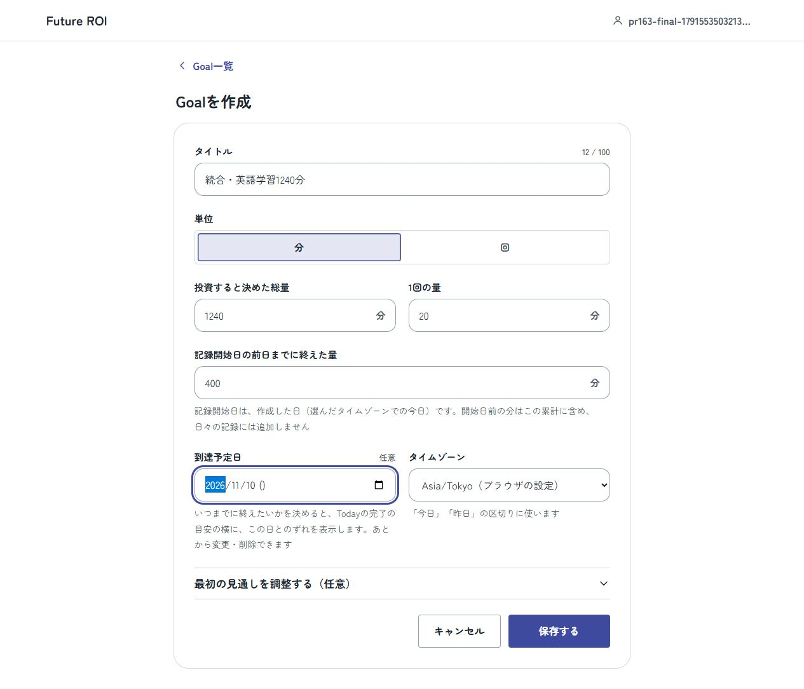
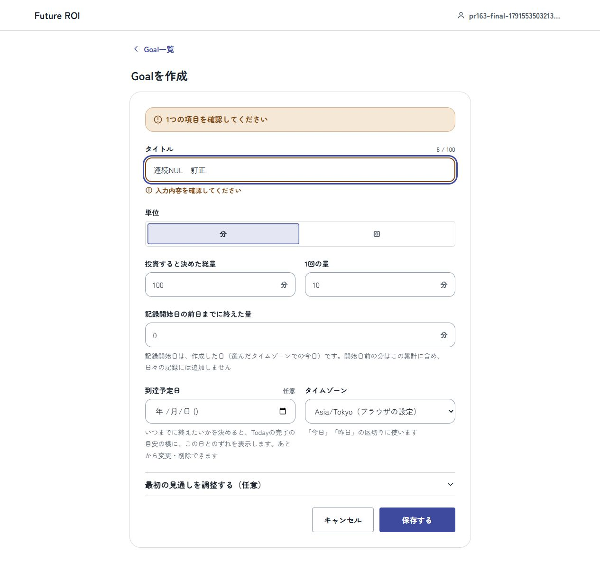
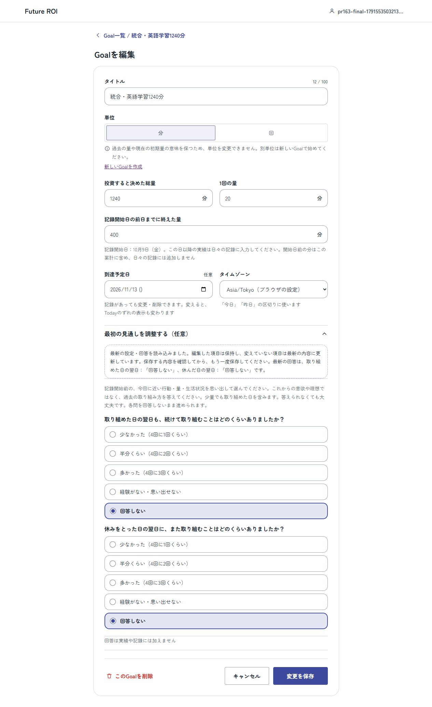
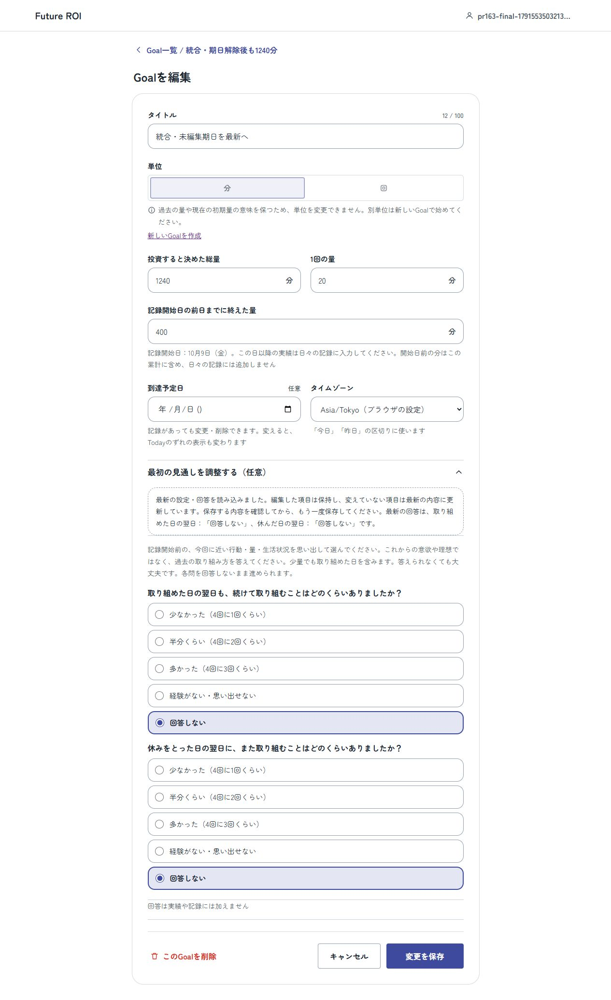
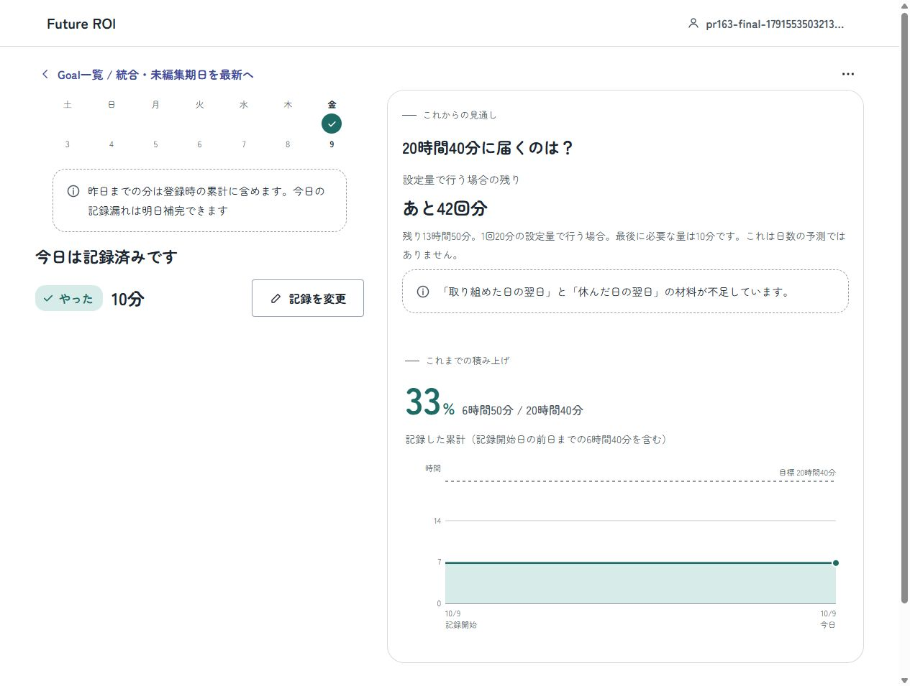
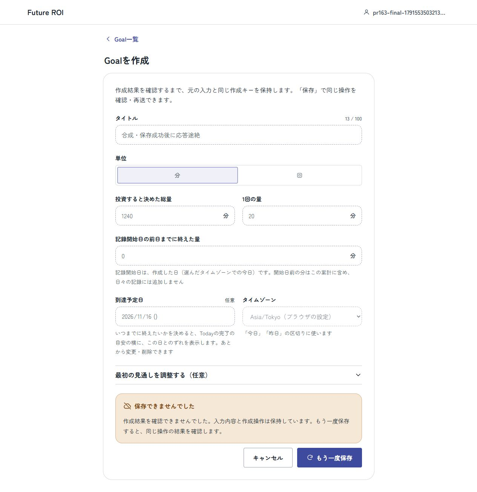

# #157・#148・#155 最終併用の検証記録

2026-10-09。PR163へPR175の最終HEADを通常mergeし、到達予定日と設定CAS／作成回復／session境界を同時に使う場合を確認した記録。製品受入・main merge・deployは未実施。

## 対象と環境

- PR163の取込み前：`7d4a3b0a8e3d59f86897132f64b1d6fe31a7e022`。
- PR175の取込み対象：`f575741c416b5c8e09ccf1365d27f51fcf8a558d`。PR159とmainの`92332486b41f7682edb66b9027c0523f78eb9b55`（#172）を含む。
- #175のsquash後のmain `593e126348d261f5342e3312cf97308b40d64528` も通常mergeした。`f575741`とmainのtreeは完全一致し、衝突解消直後のtreeも検証済み`2ba40ac`と完全一致を確認した。以後の差分は本記録と対応表の文書更新だけ。
- Windowsの専用worktree。独立Compose project `codex-task3-pr163-final`、合成アカウント／DBだけを使用。通常checkoutのEngine未commit変更、既存app8080、DB・volume・sessionを変更しない。
- 最終コードを含むDocker image：`sha256:0a76d555e96cf625cbe6dfdc7a8db3ec1b97866800920ca10f303c746efa8a28`。初回起動13:43:43 UTC。以降の追加は文書・証拠画像だけ。
- Codex In-app Browserの2タブ。PC/lightのみを今回再確認。過去の画像はこの実画面確認の根拠に使用しない。各画像は保存したファイルを開いて内容を確認した。

## 併用時の修正

1. 作成bodyのhashに設定した到達予定日を含める。省略／nullは従来のcanonical形を保持し、既存#148台帳の成功操作を再確認できる。
2. 到達予定日の変更／解除は設定版を1回増やす。省略／no-opは維持。古いGoal編集と記録は409で副作用なく止める。
3. 回復bodyのnullable期日は表示用の空文字へ正規化し、元bodyは変更しない。日付が経過した成功操作も同じキー・bodyで再確認でき、新規過去日は拒否する。単位固定の検査は最新Goalを使う。
4. 未確認の作成では、到達予定日とtimezoneも他の入力と同様に固定する。
5. Goal DTO・既存テストcallerの設定版と、記録の明示量・元unitを併用契約に揃える。時間＋分は累計等の表示だけで、記録と入力は整数分／回のまま。
6. migrationの検査は両0005の実際のファイル名を扱い、既存SQLのchecksumを変更しない。

#175最終版のowner／連続性／訪問境界、確定成功の親への引渡しと該当操作だけの終了、次の作成の訪問キーを保持した。409回復の案内は、回答だけではなく最新設定全体を確認して再保存する文言へ更新した。フォームや質問の再設計は行わない。

## 自動検証

| 確認 | 結果・範囲 |
|---|---|
| npm ci | 成功。pinned Node24.21.0／npm11.19.0 |
| npm run typecheck | 全workspace成功 |
| npm test | Engine70、API163、Web101成功、失敗0。WebのCI専用ブラウザ入口1件はローカルでskipを明示（計335、成功334、skip1）。skipを成功として数えない |
| npm run build | 成功。Viteのchunk size／build timing案内あり |
| Docker build・healthy | 成功。上記image IDと専用DBを使用 |
| Foundation | 文書・リンク・ignore・差分空白の検査成功。最終件数はPRのCIで確認する |

追加の[API回帰](../../apps/api/tests/goals-target-date-integrity.test.ts)6件は、異なる期日と省略/nullのhash、既存台帳hash、成功後の期限経過、PATCHの変更／解除／省略／no-op、stale Goal／log、timezone変更時の境界／rollbackを確認する。[両順序のmigration回帰](../../apps/api/tests/goal-pair-migrations.test.ts)2件は、163→175と175→163の量・日付・metadata・ログ・ledger保存と再適用no-opを確認する。[画面契約回帰](../../apps/web/tests/target-date-integrity.test.mjs)5件は、元body・キー不変、期限経過、最新unit固定、409の編集済み／未編集期日のリベース、null／省略の復元を確認する。

既存テストをskip・弱化して通す変更はしていない。sessionブラウザ回帰のCI入口とfixtureも保持した。CI実行結果は最終HEADのPR checksを参照する。

## 実ブラウザの操作と根拠

同じ合成アカウントとstorageのまま連続して実施。途中でstorageを直接resetしない。2タブ目は実画面で得た編集URLを開く設定競合のための操作で、初回登録→作成→Todayは画面のリンクから辿った。

| 操作／期待 | 実際 | 根拠 |
|---|---|---|
| 公開top→登録→初回作成。総量1240分・1回20分・初期400分・期日11/10を保存 | POST201、一覧は6時間40分／20時間40分。Todayは残り14時間0分、あと42回分、期日を表示 | 01 |
| 次の新規は空で編集可能。NULを含むタイトルでAPI422→訂正 | 422のsummary・項目理由・focus、他の量を保持。訂正して回単位のGoalをPOST201。次の新規も空で編集可能 | 02 |
| 人工DB遅延中に離脱→再訪→reload | 元の期日11/12と量を保持し入力固定。DBの5秒statement timeoutで初回500／rollback、明示再確認は201。成功後の応答喪失と区別する | 今回DOM／serverログ。遅延triggerとfunctionを撤去済み |
| 2タブが期日を11/11と11/13へ変更 | 先行200、後続409。最新読取後も編集した11/13を保持。全設定の確認案内と明示再保存で200 | 04 |
| 一方が期日を解除、もう一方がタイトルだけ編集 | 解除200、古い設定版で409。最新読取後は未編集の期日を空へ更新し、入力タイトルを保持して再保存200 | 05 |
| Todayで設定20分を実量10分へ変更、休みに訂正、再び10分へ訂正 | PUTは各200。累計410→400→410分、表示6時間50分／20時間40分。ログは同日1件 | 06 |
| 保存201の後に応答をゼロバイトで破棄（人工loopback proxy） | ブラウザtransportが同一キー・同一bodyを自動再送。APIは200／Idempotency-Replayed=true、同じGoal ID、Goalは1件 | proxyの201/200記録、今回一覧DOM |
| 保存201の応答を途中で切断（人工loopback proxy）→reload→明示再保存 | 「作成結果を確認できませんでした」で元body・11/16の期日を保持し入力固定。reload後も同値。元キー・body hashで200／Idempotency-Replayed=true、同じGoal ID。次の新規は空で編集可能 | 08、proxyの201/200記録 |

日付の自動fillだけではReactのstateへ反映されないことがあり、日付欄の通常キー操作とDOMのvalue属性を確認してから保存した。未反映の自動操作を製品の期日解除バグと数えない。

最終合成DBはGoal5件・作成ledger5件・ログ1件。主Goalは総量1240分、初期400分、期日null、設定版5、DONE10分。応答喪失の2ケースはそれぞれ同一キー・body hash・Goal IDで201→200。秘密・auth header・既存ユーザーデータは証拠へ含めない。

### 01 作成前の量と期日

### 02 次の作成と422後の訂正

### 04 編集した期日を409後も保持

### 05 未編集の期日は解除後の最新値へ

### 06 実量10分と正確な累計

### 08 保存成功応答が途中で切れた状態

## 残条件と再開

- 本記録は合成データでのagent検証。HumanApproved、製品受入、main merge、deployを意味しない。
- 遠い期日による軸圧縮のOptional改善は未変更・未解消。前回の[レビュー回帰記録](issue-157-review-regression.md)の残条件を保持する。
- 今回はPC/lightと上記連続操作。390px/dark、全accessibility、全401/404、異ownerの全実ブラウザ操作を今回再実施したとはしない。既存の自動回帰と、未実施範囲を分ける。
- 今回の実アプリでsession確認を人為的に保留した同一訪問create-successのF23は再実行していない。最終175からそのコードと回帰を保持し、CIのsessionブラウザ回帰も確認対象。実APIのF23結果は#175の記録と混同しない。
- 停止対象は所有するproxy・専用app/DB・2タブだけ。合成volumeを保存する。通常app8080とユーザーcheckoutは保全する。
- 再開はこのPRの最終HEADを独立worktreeへ用意し、fresh合成DBとloopback portを指定して通常Composeを起動する。今回の私的compose.envや架空passwordをGitへ保存しない。人工proxy／遅延は再開の必須条件ではない。
