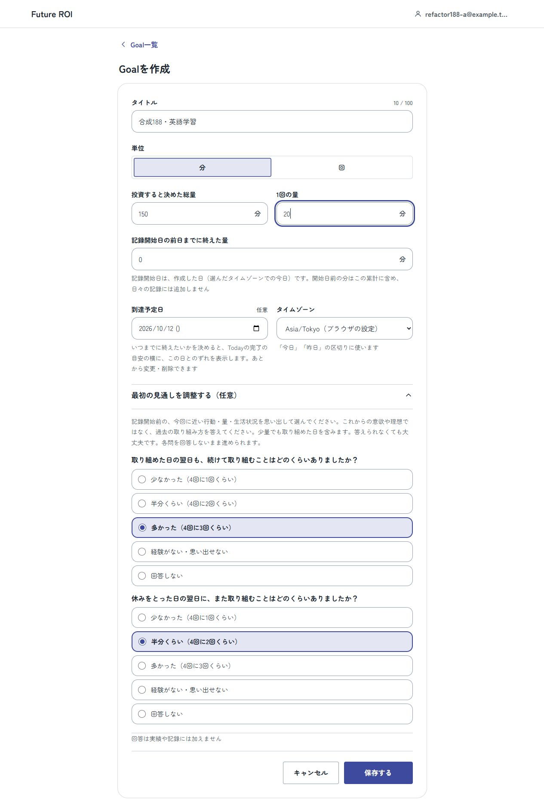
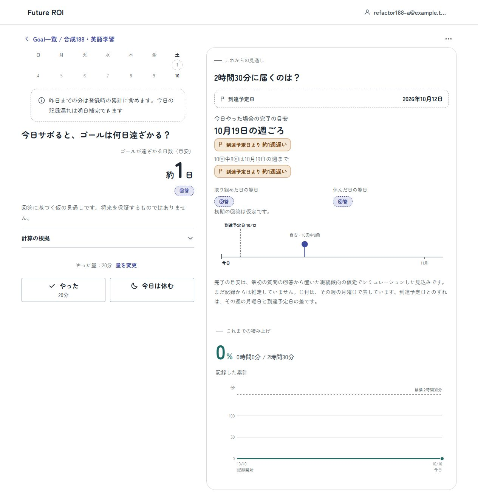
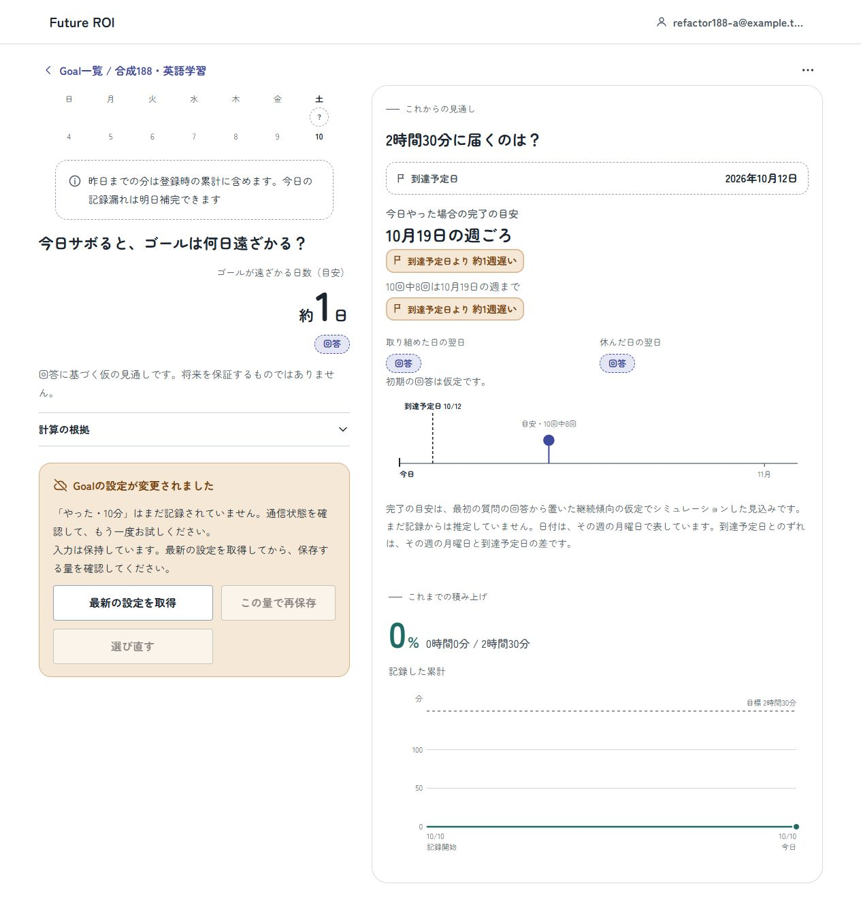
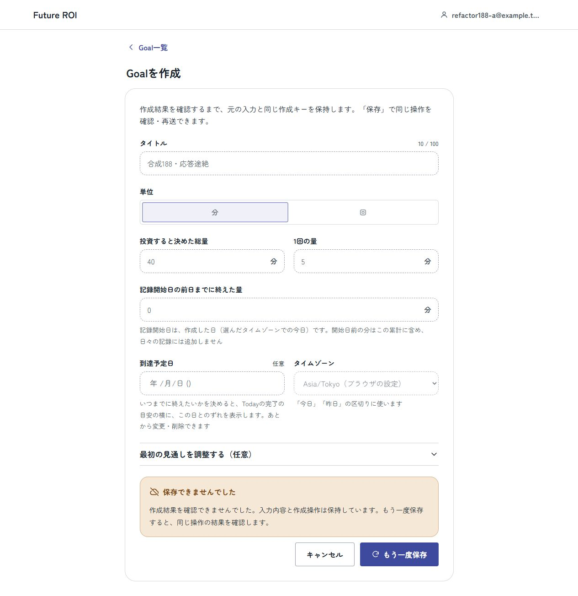
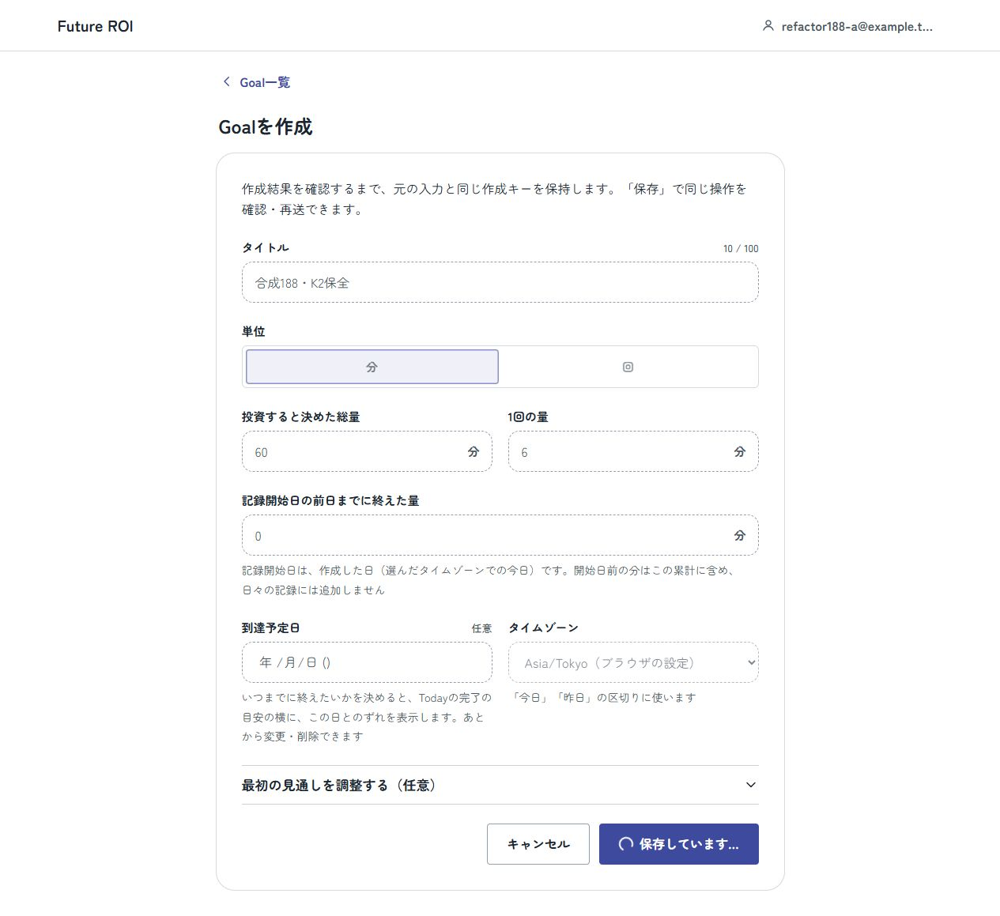
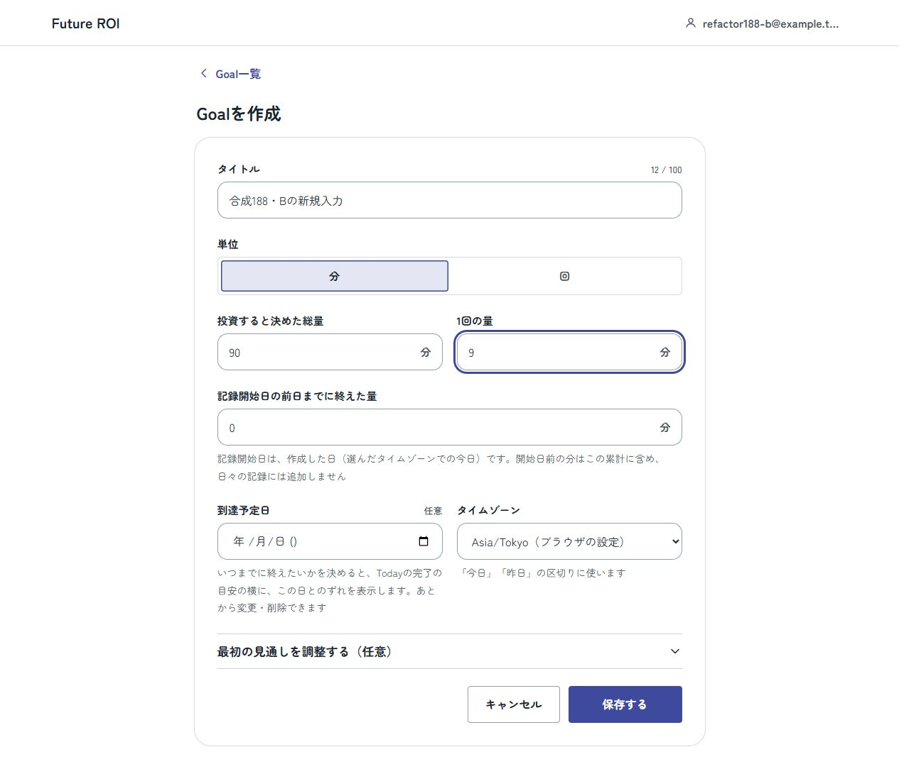

# Issue #188 責務整理・検証と履歴保全

Supporting Artifact / Not a Source of Truth。2026-10-09、[Issue #188](https://github.com/jogi-hack-2026-team/jogi-hack-2026/issues/188)。基準mainは`77c71a5f248a4dce4ce9fb8af6619b41541be9d8`（#184統合後）。現行の責務は[Architecture](../architecture.md#責務と配置を変えるとき)、検証範囲は[開発ガイド](../DEVELOPMENT_GUIDE.md#検証)を参照する。

## 変更と保つ境界

FEは製品側の`PriorForecast`から純粋検査を抽出し、制御されたGoal入力描画、親routeの成功receipt、共有暦日関数を分けた。候補UIを本番と誤認せず、draft・attempt・owner・訪問と保存の責任を維持する。BEは純粋policy・fingerprint・IDを抽出し、DB読込を名前で明示する。lock／時計／CAS／拒否順とtransactionはstoreに維持する。Engineは公開R-11型の所有者と結果構築を明示し、数値核と既存exportを保つ。

テストhelperは補完あり／要求そのままの明示名と、獲得資源の初期化・終了失敗時の掃除を整理した。CIは既存command順・job名・required checks・権限を保ち、SHA・層別件数・未実行と安全な失敗診断を追加した。速度改善や新しい製品機能の主張ではない。

## 固定Git履歴への保全

承認された3treeだけを通常削除した。音楽案111件、旧質問prior提案57件、旧モデル比較22件の計190件。Git履歴は書き換えず、全path・mode・blob・tree IDを[保存確認](issue-188-history-preservation.json)に残した。基準commitから全blobを読め、削除差分がこの190件だけであることを検査し、GitHubの同commitのrecursive treeも190件と確認した。これは固定履歴の内容保持検査で、別文書へ本文を移したことや過去の実験を再実行したことを意味しない。

現行runtime／build／CI／dependencyに3treeへの参照はなかった。文書の必要参照は固定tree/blobへ更新し、一般入口はREADMEへ集約した。独立CDF・凍結fixture・#184の負荷harnessは保持。旧候補UIと構成比較には専用workflowの依存があり、今回除外しない。元調査・再現・provenance・raw・FAILを部分的に間引いていない。Future ROIの他の履歴・計測JSONと未tracked資料は削除していない。

## 統合結果と対象SHA

製品sourceを統合した`4f5523a8e2775562206951234155007e3b6a0e7d`で、全workspace型検査・test・build、別ブラウザ回帰、実認証API/DBの手動ブラウザ確認を実行した。その後の`297635f4f17699ef7304df70ce4124689f76bbf0`はCI表示修正の2ファイルだけで、`apps/`・`packages/`・Dockerfile・Compose・package manifest/lockに差分がない。スクリーンショットを後のSHAで撮ったことにはしない。

| 検証層 | 対象・結果 | 範囲と限界 |
| --- | --- | --- |
| 統合local型・build | `4f5523a`、いずれもexit 0 | 全workspace。WindowsではCI runnerへ`npm.cmd`を直接渡した初回spawnが失敗し、同じnpm commandをNodeのnpm-cli経由で再実行した。初回失敗を成功へ読み替えない |
| 統合local test | Engine 73/73、API 189/189、Web 102中101成功・skip1、fail/cancel/todo 0 | localのWeb browser入口は明示skip。別実行の結果と区別する |
| 別Web browser回帰 | 3/3、fail/skip/cancel/todo 0 | 実DOM・React・Router・SDK＋合成transport。実API/DBを使う自動E2Eとは呼ばない |
| Engine基準比較 | 同じ`4f5523a`、1,430比較すべて一致（正常1,402・拒否28） | 値・own key順・undefined/省略・descriptor・prototype名・frozen・入力非変更・runtime export・構造化errorを比較。stackのファイル位置は比較対象外 |
| 数値核の保持 | 基準mainと11ファイルのGit blobが一致 | RNG・seed・K/H・計算/config/exportを含む。[比較記録](issue-188-engine-equivalence.json)に対象・blobを残す |
| CI診断・migration checker | `297635f`、6＋5＝11成功、fail/skip/cancel/todo 0 | 以前の診断4件を消さず、表示修正後の6件を別の結果として扱う |
| 最終証拠のlocal Foundation | 96 text files／1,419 local links、fail0 | 環境例・7 ignore cases・作業差分とstage差分のwhitespaceを検査。アプリ実行検証とは別 |
| remote CI | `297635f`、既存7チェックすべてsuccess | PR source SHAと実checkout merge SHA `0834de11f182696a533180792a7e20be1f0c0f9c`を区別。[Application run](https://github.com/jogi-hack-2026-team/jogi-hack-2026/actions/runs/37959651796)で型・Engine 73/API 189/Web 104の366成功・fail/skip/cancel/todo 0、診断6、migration checker 5、migration再実行、container/Compose smokeを確認 |
| 独立レビュー | FE・BE・Engine・helper・文書のBlocking/ShouldFixなし | CIの未集計表示P2は修正後に独立再レビュー、新指摘なし。レビューは挙動を絶対保証するものではない |

分担段階のBE 184件、helper追加5件、CI診断4件、Draft作成前Foundationの95 text files／1,408 local links、Draft統合時の96／1,411は当時の結果であり、後の件数に置換しない。最終の文書・画像追加commitのHEADとチェック状態は[PR #189](https://github.com/jogi-hack-2026-team/jogi-hack-2026/pull/189)で読み戻して記録する。製品sourceは上記検証SHAから変更しない。

CIのP2はworkspace testが集計前に失敗したときの`N/A (command)`表示と、一部集計時に未報告workspaceが消える点だった。元のexit 7／failedは維持されており、false greenではない。修正はscopeの期待workspaceを列挙して「集計不明／未到達」とする。修正前の新規回帰は4成功・2失敗、修正後は6成功。CLIのexit 7、失敗record、artifact allowlistが保たれることも確認した。workflow・権限・required check名は変更しない。

## 実ブラウザ・実API/DBの確認

今回の手動runだけを根拠にする。専用worktree・Compose project `codex-task3-refactor188`、専用origin `http://refactor188.localhost:18188`、新規合成DBとA/B架空アカウントを使った。ユーザーの8080、通常checkout、既存.env・DB・volume・ログインsessionは変更しない。実app imageは`sha256:79e511b35a61d1066bce09cb0f300afe85ba0bab178f9e6faa56e4fc12bb3ab7`、sourceは`4f5523a`。

DOMを読んで操作し、結果のDOMを再確認した。画像は保存済みbytesを開いて状態を確認し、コピー後のSHA-256も照合した。[合成runの確認値](issue-188-browser/proof.json)は選択したwriteのstatus・revision・本文hash・key hash、最終DBの架空Goal/記録、画像hashを持つ。Cookie・auth secret・password・session/account token・生のserver logは含めない。

| 操作・条件 | 期待 | 実際と根拠 |
| --- | --- | --- |
| 公開トップ→登録A→空一覧→最初のGoal | URL手入力なしで作成しTodayへ進める | 150分／1回20分、Asia/Tokyo、到達予定日2026-10-12、質問a=HIGH/b=MIDを入力。POST 201、Todayへ遷移。画像01/02とDBに日付・質問が一致 |
| 別tabで総量150→180、旧Todayで量10を保存 | stale revisionを拒否し、量を保持して明示的に再確認できる | revision 0のPUTは409、未保存10分を保持。最新設定取得後も自動保存せず、明示再保存はrevision 1・amount 10で200。DBはDONE 10分の1行。画像03は最新設定取得前の409状態 |
| POST成功後の応答を半分で切断 | frozen attemptを再確認し重複作成しない | 合成proxyで本物のAPI 201後に応答を切断。画面は「作成結果を確認できませんでした」。明示「もう一度保存」は同key・同本文hash・同Goal ID、200/replayed。元Goalは1件だけ。画像04 |
| K1応答を保持→離脱→同attemptを再確認→K2作成中に旧K1を解放 | 旧応答が新K2の入力・route・attemptを掃除しない | K1は実DBに作成済み、明示再確認は同keyの200/replayed。新visitは空フォーム。K2の60分／6分を作成中、保持した旧K1応答を解放してもK2表示と保留状態を保持。画像05 |
| AのK2応答保持→別tabでlogout→B登録→B入力中に旧A応答を解放 | Aの情報がBに出ず、Bのdraftを触らない | logout確認後にAのcontrolsは消え、Mainは再ログインの明示操作を要求。B確認後は空で編集可能。Bの90分／9分入力中に旧A応答を解放しても入力とrouteを保持。B保存は新keyの201、B一覧はBの1件だけ。画像06 |
| B logout→A login→元のMain tabでK2再確認 | ownerごとのoperationが保全され、重複せず終わる | 元tabはfrozen K2を復元。明示保存は初回と同key・同本文hash・同Goal IDの200/replayed。A一覧は4件、B Goalなし。次の新規フォームは空で編集可能。journalはtabのsessionStorageであり、別tabの空フォームを消失と扱わない |

最終DB（2026-10-09 16:37:40 UTC）はGoal 5件（A 4/B 1）、create operation 5件、action log 1件（2026-10-10、DONE 10分）。Todayの日付はAsia/Tokyoの暦日で、OS時計を変更していない。応答途絶・K1・K2の3再確認はそれぞれ同key・同本文hash・同Goal IDで、重複Goalは増えていない。

日付入力の自動化ではnative date controlに`fill()`しただけだと再描画後に値が保持されず、年/月/日をキーボードで入力してblurした。これは入力手法を修正した記録で、製品不具合と断定しない。量欄は現行mainの整数分/回で検証し、文字列「2時間30分」を受理したとは主張しない。150分の保存後の表示は2時間30分。

応答保持・切断は人工のtransport条件である。保持応答の「解放」はproxyの操作であり、離脱済みrequestの全bytesがbrowserへ届いたことや全中間frameの確認まで意味しない。旧callbackの詳細順序は別の実SDK＋合成transport回帰と合わせて判断する。

### 01 初回Goalの入力

### 02 質問のみのToday

### 03 別tabの変更による409

### 04 保存成功後の応答途絶

### 05 旧K1の解放後もK2を保持

### 06 旧A応答の解放後もB入力を保持

## 未確認・終了と再開

このPRは内部整理であり、新たなUX評価、完全なWCAG適合、390px・light/darkの全組合せ、速度改善、公開環境への配備は検証していない。手動の実API/DB確認を、自動実API E2E全経路の成功へ広げない。履歴保全は過去の比較の再実行ではない。

所有するtab 11/12を閉じ、proxy PID 50052の所有者を照合して停止し、18188が閉じたことを確認した。同projectのCompose app/DBはどちらもexited。合成DB volume `codex-task3-refactor188_postgres_data`は保持し、ユーザー環境・他taskのprocessには触れていない。再開用のローカル`refactor188-evidence/resume.ps1`は専用worktreeのHEADを確認し、同project・env file・18189 app／15688 DB／18188 proxyで再起動する。既定は検証済み`4f5523a`の製品imageを再利用し、`-Build`で最終の文書追加HEADから再buildする。Secret実値と合成login情報はローカル検証領域にのみ保持し、Gitへ入れない。通常8080との差は上記のsource SHA、専用origin/portと合成DBである。
