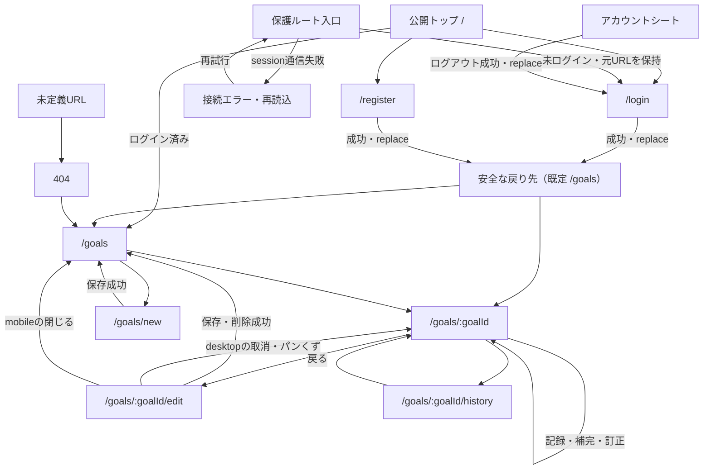

# 画面設計と実装の対応

**Supporting Doc / Not a Source of Truth.** 正式な仕様は[Product Spec](product-spec.md)、実現方式は[Architecture](architecture.md)。本書は画面・操作・状態・設計理由を調べる入口であり、R-xx、P-xx、保存条件、API契約の追加正本にはしない。共通規則は参照先で変更する。

対象は[Issue #171](https://github.com/jogi-hack-2026-team/jogi-hack-2026/issues/171)と[#146](https://github.com/jogi-hack-2026-team/jogi-hack-2026/issues/146)。コード読取の基準は main `86b396d5ae15e1b3e735a4df310e9e4216a086e4`（2026-10-10）。[PR #147](https://github.com/jogi-hack-2026-team/jogi-hack-2026/pull/147)のB案全画面・ルート構成に、merge済みの[PR #202](https://github.com/jogi-hack-2026-team/jogi-hack-2026/pull/202)の朝焼け・森の表示と情報階層が重なった状態を記述する。旧B案と現行画面を同じ見た目と扱わない。

[PR #210](https://github.com/jogi-hack-2026-team/jogi-hack-2026/pull/210)はこの基準時点では未merge。Goal保存失敗の同owner再確認後の復元は変更候補であり、本書の現行保証に含めない。[Issue #215 / PR #216](https://github.com/jogi-hack-2026-team/jogi-hack-2026/issues/215)のログアウト失効確認も未統合で、現行の失敗表示とsession削除の保証を区別する。PRのmergeと、Product Decisionの採択範囲・本人UX受入・本番確認は別に読む。[P-21](product-spec.md#p-21-todayの朝焼け山並み案)の残条件を本書で解消した扱いにしない。

## 読み方と確認の範囲

- **コード確認**：以下のルート、条件分岐、CSS、操作先を基準commitで確認した。
- **既存の検証記録**：[変更対応表](change-map.md#アプリの仕様と実装)と[PR202のQA履歴](changes/issue-199-design-qa.md)へリンクする。本書作成時の再実行ではない。
- **未確認**：基準commitを動かす実ブラウザ、390px・1280pxの全画面撮影、スクリーンリーダー、iOS/Safari、公開環境。コード上の対応を「実データで表示できた」「視覚的に一致した」と言い換えない。
- **設計資料**：[旧B案キャンバス](https://claude.ai/artifact/Hxs7396eZNtYn8iLYmyMi8)、[朝焼け参照](https://claude.ai/artifact/KQDeWMput5bt77NEj4J4Kb#artboard-eb122470b18c)。2026-10-10のWeb取得では両URLとも内容を再取得できなかった。朝焼け案は、引継ぎ調査で[資産README](../apps/web/src/features/today/assets/README.md)のSHA-256と提供HTMLの一致が報告された。本PRにはそのHTMLを含めず、再照合は未実施。旧B案の全アートボードは未取得で、番号と状態を推定で埋めない。
- 本書の比較説明のうち正式Decisionに書かれていない代替案は、**現実装を説明するための比較整理**であり、過去にチームが実際に検討・却下したという記録ではない。

## 画面一覧とルート

内部のauth/appはURLへ現れないpathless layout。実装入口は[router.tsx](../apps/web/src/router.tsx)、認証の責務は[Architectureの認証実装](architecture.md#2026-10-06の認証実装75)。

| URL | 画面・目的 | ログイン | 対応する仕様 | 主なコード |
| --- | --- | --- | --- | --- |
| `/` | 公開トップ。用途と登録・ログインへの次操作 | 不要。確認中／ログイン済みで入口を切替 | [P-16・公開導線](product-spec.md#公開トップと認証後の導線)、P-21 | [Home](../apps/web/src/routes/Home.tsx) |
| `/login` | ログイン | 不要。ログイン済みなら戻り先へreplace | [R-01](product-spec.md#requirementsmvp) | [AuthPage](../apps/web/src/routes/AuthPage.tsx) |
| `/register` | 新規登録 | 同上 | R-01 | AuthPage |
| `/goals` | Goal一覧。今日の状態と累計からTodayへ進む | 必須 | R-02 | [GoalListPage](../apps/web/src/features/goals/GoalListPage.tsx) |
| `/goals/new` | Goal作成、任意の初期質問 | 必須 | R-02・R-11、P-18〜P-20 | [GoalFormPage](../apps/web/src/features/goals/GoalFormPage.tsx) |
| `/goals/$goalId/edit` | 設定・質問の編集とGoal削除 | 必須 | 同上 | GoalFormPage |
| `/goals/$goalId` | Today。今日の記録・昨日の補完/訂正・見通し | 必須 | R-03〜R-08・R-11、P-21 | [TodayPage](../apps/web/src/features/today/TodayPage.tsx) |
| `/goals/$goalId/history` | 月別の記録履歴 | 必須 | R-03・R-04、[P-17](product-spec.md#p-17-デザインの全画面とルート構成をmustにする) | [HistoryPage](../apps/web/src/features/history/HistoryPage.tsx) |
| 未定義URL | 404。Goal一覧へ戻る | 404自体は不要。戻り先は認証保護 | P-17 | [RouteStates](../apps/web/src/routes/RouteStates.tsx) |
| ルート読込中／失敗 | 共通のpending/error表示。専用URLはない | 状態による | R-01、P-17 | RouteStates |
| `/health` | 開発用の接続確認 | 不要。利用者向けナビには出さない | [Architecture](architecture.md) | [HealthPage](../apps/web/src/routes/HealthPage.tsx) |

### 画面遷移

戻り先はGoal一覧/Todayに限らず、許可されたアプリ内pathを保持する。図のReturnからの矢印は代表例。[認証route](../apps/web/src/router.tsx)はログイン済みの認証ページ訪問も履歴を置き換える。画面表示後の401は再ログイン導線を出す場合があり、すべての通信失敗を自動ログアウト扱いにしない。

## レイアウトと共通状態

### スマートフォンとデスクトップ

| 対象 | 390pxを含む960px未満 | 1280pxを含む960px以上 | 根拠 |
| --- | --- | --- | --- |
| 共通の外枠 | 原則1列。各画面AppBar。通常ページは最大40rem | AppShellの共通バー。画面専用のAppBarは対象CSSで隠す | [page.css](../apps/web/src/ui/page.css)、[AppShell](../apps/web/src/routes/AppShell.tsx) |
| 公開トップ | 説明・認証入口・装飾・手順を縦に読む | 説明と山の装飾は2列、3つの手順は横並び | [auth.css](../apps/web/src/routes/auth.css) |
| ログイン・登録 | 1枚のフォームカード | 広い画面でも認証カードに入力を集約 | AuthPage、auth.css |
| Goal一覧 | カードを縦に並べる | 横幅・余白・見出し/追加ボタンを広げる。現行CSSにカード一覧を2列化する規則はない | [goals.css](../apps/web/src/features/goals/goals.css) |
| 作成・編集 | 基本→量→日付→任意質問。保存欄は通常の文書配置 | セクション見出し＋入力、量/日付の組を2列。取消・削除を保存付近へ | GoalFormFields、goals.css |
| Today | 100dvh内で本文と下部操作帯を分ける。本文は縦スクロール、操作帯は実高さを確保。短い画面では操作帯内部もスクロール可能 | 最大1200px。左に問い・直近/昨日・操作、右に進捗・見通し・詳細。操作帯だけ左列内sticky | [today-dawn.css](../apps/web/src/features/today/today-dawn.css) |
| 履歴 | 月送り＋7列カレンダー | 最大720pxの枠。共通バー＋DeskHeader | HistoryPage、[history.css](../apps/web/src/features/history/history.css) |
| 詳細の開閉 | 完了予測/記録の詳細は初期折畳み | 同詳細は初期展開。利用者の明示開閉は幅変更でも保持 | [ResponsiveDetails](../apps/web/src/features/today/ResponsiveDetails.tsx) |
| 昨日未記録の案内 | 初期折畳み。保存開始・失敗時は展開 | 幅にかかわらず同じ | [YesterdayDetails](../apps/web/src/features/today/YesterdayDetails.tsx) |

TodayのDOMは問い→直近/昨日→進捗・見通し・詳細→操作帯で、装飾や重複した表示用部品に保存処理を持たせない。操作帯にはAPIの日付を示す。mobile用の完了要約は既存API結果の再掲であり、別の計算ではない。実際のviewport高・文字拡大・soft keyboardでの到達性は別途実ブラウザで確認する。

### 共通状態

| 状態 | 画面と回復操作 | 確認する実装 |
| --- | --- | --- |
| 初回route読込中 | 共通pending、Spinnerとstatus。Routerの既定待ち時間後に出る | RoutePendingPage |
| 保護routeの未ログイン | 元URLを戻り先にして/loginへreplace | appLayout.beforeLoad |
| session確認の通信失敗 | 「接続できませんでした」。route再読込を試せる | SessionUnreachableError、RouteErrorPage |
| 画面データ読込中 | 一覧skeleton／画面ごとのloading。古いownerのcacheを新しい人に表示しない | 各Page、[session-cache](../apps/web/src/api/session-cache.ts) |
| 画面表示後の401 | 私的画面を停止し、理由付き再ログインへの入口。Goalフォームの案内には別タブでの再ログインもある | GoalStates、TodayのSignedOut、SaveFailure |
| データ/API取得失敗 | 取得失敗の説明と再読込。材料不足とは別状態 | LoadErrorPanel、TodayのFetchError |
| 存在しないGoal | Goalが見つからない表示＋一覧へ。未定義URLの404とは部品が異なる | GoalNotFoundPanel、TodayのNotFound |
| 予測表示だけの失敗 | ForecastBoundaryで表示範囲を隔離。保存可能な日付/Goalが確認できる場合は記録入口を残す | [ForecastBoundary](../apps/web/src/features/today/ForecastBoundary.tsx)、TodayPage |
| 保存失敗 | 未保存の対象・量/選択、再試行または選び直し。競合・日付変更・401は専用回復 | 各SaveFailure |
| 保存成功後の再取得失敗 | 保存失敗と区別して再読込を促す | TodayのSavedButStale |
| 未定義URL／route例外 | 共通404またはerror。戻る／再読込 | RouteStates |

同ownerの正常再確認でTodayの入力を保持する範囲は[D-30](architecture.md#d-30-todayの同一owner再確認で入力を保つ190)。Goalフォームの通常draftと保存失敗は同じ保証ではない。PR210の失敗復元をmainへ先取りしない。

## 画面ごとの構成と操作

### 公開トップ

用途を短く伝え、登録済み/初回の人が次へ進める入口。構成はブランド、見出し、説明、認証状態別CTA、装飾の山、3手順と注記。山はaria-hidden。Goal/記録の取得やサンプル予測の表示はしない。

| 状態 | 表示・操作・遷移 |
| --- | --- |
| session確認中 | 確認中status |
| sessionあり | Goal一覧へ |
| sessionなし | 新規登録へ／ログインへ。戻り先は/goals |
| sessionデータなしの失敗 | Homeには専用エラー分岐がなく、認証入口側の表示になる。保護routeのエラー方針とは区別する |

根拠：[Home](../apps/web/src/routes/Home.tsx)、[copy/app](../apps/web/src/copy/app.ts)。仕様：[公開導線](product-spec.md#公開トップと認証後の導線)、[P-21](product-spec.md#p-21-todayの朝焼け山並み案)。

### ログイン・新規登録

メール・パスワードを共通フォームにし、route切替でモードを変更する。ブランドから公開トップ、切替タブは戻り先と期限切れ理由を保つ。パスワード表示ボタンは表示/非表示を切り替える。

| 状態 | 表示・操作・遷移 |
| --- | --- |
| 通常 | メール・パスワード・送信。登録時はパスワード補足 |
| 入力不正 | 項目エラーと件数のまとめ。まとめへfocus |
| 送信中 | 入力・表示切替・送信操作をbusy/disabled。成功後は戻り先へreplace |
| 認証/API失敗 | フォーム上のalert。修正して明示再送 |
| 429 | 再開可能時刻と待ち案内。待ち時間中は送信不可 |
| 期限切れからの来訪 | reason=expiredの案内。タブ切替でも保持 |
| 既ログイン | フォームを出さず安全な戻り先へreplace |

根拠：[AuthPage](../apps/web/src/routes/AuthPage.tsx)、[auth/form](../apps/web/src/auth/form.ts)、[auth/redirect](../apps/web/src/auth/redirect.ts)。認証契約は[Architecture](architecture.md#2026-10-06の認証実装75)へ。

### Goal一覧・アカウント

一覧の目的は各Goalの今日の状態を見て記録へ進むこと。日付、見出し・説明、追加、Goalカードで構成。カードはタイトル、状態、APIの累計/総量、progressbar、Today入口を含み、カード全体を押すとそのGoalのTodayへ移る。一覧見出しの日付は端末、各Goalの今日の状態はAPIのGoal timezoneによる。

| 状態 | 表示・操作・遷移 |
| --- | --- |
| 1件以上 | カード一覧＋作成入口。編集はTodayから |
| 0件 | 説明・例・最初のGoal作成入口 |
| 読込中／新owner cache待ち | skeleton＋読み上げstatus |
| 取得失敗 | 再読込 |
| 未ログイン | 再ログイン案内 |
| accountを開く | メール・ログアウト・閉じるのdialog |
| accountを閉じる | Esc/閉じる/外側クリック。元の入口へfocus |
| ログアウト中／失敗 | busy中は閉じる操作を止める。clientが返すerror/通信例外はalert、errorのない応答では/loginへreplace。DBのsession削除失敗をSDKが成功として返す既知制約は[#215](https://github.com/jogi-hack-2026-team/jogi-hack-2026/issues/215)で追跡し、失効確認済みとは扱わない |

根拠：[GoalListPage](../apps/web/src/features/goals/GoalListPage.tsx)、[AccountMenu](../apps/web/src/features/account/AccountMenu.tsx)。要件は[R-01/R-02](product-spec.md#requirementsmvp)。数値・時間量は[P-18](product-spec.md#p-18-整数分を保った時間分表示)。

### Goal作成・編集・削除

構成は①名称/単位、②総量/1回量/初期量、③任意到達予定日/timezone、任意初期質問、保存欄。編集には削除入口と確認dialogを付ける。質問は初期は折畳み、既存回答・エラー・最新回答案内・文脈変更の注意がある場合は展開する。R1の「次へ進む2段階ウィザード」は実装していない。

| 状態 | 表示・操作・遷移 |
| --- | --- |
| 新規 | 初期値のフォーム。保存成功は一覧へ |
| 編集取得中／失敗／404 | loading、再読込、またはGoalなし |
| 通常編集 | 保存済み値を初期表示。変更した項目を保存。成功は一覧へ |
| 入力不正／422 | まとめ・項目エラー。先頭の該当欄へfocus。未保存値を修正 |
| 保存中 | 二重送信防止・入力停止・保存中表示 |
| 編集409 | 入力を保持し最新設定/回答の明示読込。GET成功後に利用者が再保存 |
| 作成結果不明 | 保持した同owner/同key/元bodyで結果確認。新規成功や確定失敗と決めつけない |
| 作成結果削除済み410 | 対象操作を確認できた場合だけ「新しいGoalとして作成」入口 |
| 回復情報破損／確認不可 | 回復案内・一覧確認。自動で別操作に置き換えない |
| 既存量/記録により項目固定 | 対象欄をdisabledにして理由を表示。単位の回復入口も条件付き |
| unit/1回量の文脈変更 | 質問回答欄の操作を止め、保存時の回答撤回について説明 |
| 削除確認 | Goal名と記録も消えることを示す。初期focusは取消。確定成功/既削除404なら一覧へ |
| 削除失敗 | dialog内に失敗/再ログイン案内。勝手に完了扱いにしない |
| 別画面へ離脱後の遅延応答 | 今の画面を一覧へ強制移動しない。作成回復の詳細はP-20/D-29へ |

mobileの「×」は編集でも一覧へ戻る。desktopの編集パンくず/取消はそのGoalのTodayへ、新規の取消は一覧へ戻る。この差を統一したと記述しない。全離脱を防ぐ未保存確認dialogは本実装にない。

根拠：[GoalFormPage](../apps/web/src/features/goals/GoalFormPage.tsx)、[GoalFormFields](../apps/web/src/features/goals/form/GoalFormFields.tsx)、[goal-form](../apps/web/src/features/goals/goal-form.ts)、[create-attempt](../apps/web/src/features/goals/create-attempt.ts)。共通規則：[R-02](product-spec.md#requirementsmvp)、[R-11](product-spec.md#質問から始める見通しr-11)、[P-19](product-spec.md#p-19-到達予定日b案)、[P-20](product-spec.md#p-20-量の意味と保存操作の保全148)、[D-29](architecture.md#d-29-量と作成操作の保全148)。

### Today

目的は今日を記録し、そのGoalの現在位置・未来の見通しを読むこと。上部にGoal名と一覧への戻り、Goalメニュー。本文は問い/記録済み/達成の主状態、直近7日と昨日、進捗、完了見込み、詳細。メニューから設定、履歴、条件を満たす昨日の訂正へ進む。

| 主状態 | 表示・操作 |
| --- | --- |
| 未記録・材料あり | 現行の問いと中心指標。出所・注釈、進捗、設定量で続ける完了見込み。「やった／今日は休む」 |
| 未記録・材料不足 | 不足理由。完了欄もAPI由来の不足または条件付き計画。中心不足かつ未回答なら任意の質問入力として編集へ |
| 回答/回答＋実績由来 | 数字に対応する出所と説明。回答を実績件数と表現しない |
| P50/P80の範囲外 | 欠けた日付を作らず該当する範囲外の説明。材料不足とは別 |
| 今日記録済み | 中心の問い比較を出さず記録内容と変更入口。完了見込みはCURRENT_STATEの表示 |
| 今日の選び直し | 保存済み選択を初期表示、変更をやめる入口。保存中は取消も止める |
| 達成済み | 予測を出さず達成・累計/総量・開始/到達情報・履歴/一覧。誤記録の訂正入口は残す |
| snapshot不整合 | 食い違ったGoal/Today/記録を混ぜず再取得。回復できなければ説明と再読込 |
| 計算/通信失敗 | エラーと再読込。Goalと対象日が有効なら記録操作を残せる |
| 今日の量編集 | 名前付きgroupにfocus。±/直接入力で未保存量を変え、明示保存。異なる有効量には設定量前提の注記 |
| 保存中／失敗／日付変更 | 共通の保存回復に従う。旧日の入力を新しい日に黙って保存しない |

「やった」は表示中の既定/選択量で1回押すと保存、「今日は休む」は休んだ記録を保存する。±は入力を開くだけで保存しない。進捗の目標/累計/残り/超過は実績表示。未保存の量から「+20分で41%→42%」という未来プレビューを計算・表示しない。予測の数値意味・不足条件は[Today表示仕様](product-spec.md#today-decision画面の表示仕様)と[P-21](product-spec.md#p-21-todayの朝焼け山並み案)を参照し、本書で新定義しない。

昨日の状態はToday内で扱う。

| 昨日の状態 | 表示・操作 |
| --- | --- |
| 未記録で補完対象 | 初期折畳みの案内を開き、やった/休んだ/量変更/後で答える。後で答えるは記録を作らない |
| 保存済み | 日付・内容・変更の要約行。直近7日の昨日とGoalメニューにも訂正入口 |
| 訂正中 | 保存済み量/選択が初期値。明示保存または取消。今日の編集との排他 |
| 補完/訂正の失敗 | 未保存の変更内容と回復操作。補完と既存記録の訂正を取り違えない |
| 記録開始日前 | 昨日の補完・訂正を出さず開始日前の扱いを案内 |
| 訂正中に昨日が変わった | 元対象日を保持して保存を止め、新しい画面で選び直す |
| 取消 | 同じowner/Goal/日付の有効な入口へfocus。消えた入口なら再表示された昨日の変更へ |

根拠：[TodayPage](../apps/web/src/features/today/TodayPage.tsx)、[OutlookPanel](../apps/web/src/features/today/OutlookPanel.tsx)、[ProgressSummary](../apps/web/src/features/today/ProgressSummary.tsx)、[RecordChoiceBar](../apps/web/src/features/logs/RecordChoiceBar.tsx)、[AmountEditor](../apps/web/src/features/logs/AmountEditor.tsx)、[YesterdayPrompt](../apps/web/src/features/logs/YesterdayPrompt.tsx)、[YesterdayCorrection](../apps/web/src/features/logs/YesterdayCorrection.tsx)。保存・日付・不足の共通規則は[R-03〜R-08](product-spec.md#requirementsmvp)、[P-14](product-spec.md#p-14-記録のルール)、P-20/D-29へ。

### 記録の履歴

対象Goal名、月、前/次月、凡例、7列のカレンダーで記録を振り返る。開始月からAPIの今日の月まで移動できる。月を直接編集する画面ではない。

| 状態 | 表示・操作・遷移 |
| --- | --- |
| 通常 | やった/休んだ/未記録を形と名前で区別。開始前/未来はoutside。日を押して編集する機能はない |
| 最初/最後の月 | 範囲外へ行く月送りをdisabled |
| 読込中 | status。Goalとログがそろうのを待つ |
| 取得失敗／404／401 | 再読込、Goalなし、または再ログイン案内 |
| owner変更 | 表示月と旧cacheを持ち越さない |
| 戻る | そのGoalのTodayへ |

根拠：[HistoryPage](../apps/web/src/features/history/HistoryPage.tsx)、[calendar](../apps/web/src/features/history/calendar.ts)、[DayMark](../apps/web/src/features/history/DayMark.tsx)。記録の変更可能範囲は[P-14](product-spec.md#p-14-記録のルール)。

### 404・routeエラー

目的は読込・描画に失敗した理由と回復先を示すこと。ルートの既定部品であり、未知のURLに専用ルートは追加しない。共通AppBarと説明パネル、または読込statusで構成する。

| 状態 | 表示・操作・遷移 |
| --- | --- |
| 未定義URL | 404の見出し・説明とGoal一覧へのリンク。未ログインでリンクを押すと一覧入口の認証確認へ |
| session通信失敗 | 「接続できませんでした」。再読込でresetとrouter.invalidateを実行し、session確認からやり直す |
| 一般route読込・描画例外 | 一般エラーの見出し・説明と再読込。同じrouteを再試行 |
| route読込待ち | 共通AppBar・Spinner・status。Router既定の待ち時間後に表示 |

根拠：[RouteStates](../apps/web/src/routes/RouteStates.tsx)、[router](../apps/web/src/router.tsx)、[copy/app](../apps/web/src/copy/app.ts)。画面Scopeは[P-17](product-spec.md#p-17-デザインの全画面とルート構成をmustにする)。Goal固有404とAPIの所有者保護は[Architecture](architecture.md#api契約)に従う。

## 設計理由と代替案

正式な採択範囲は各リンクを正本とする。下表の「現行」はコードがそうなっている意味で、利用者理解の検証を終えた意味ではない。専用フォームrouteとmodalの比較など、正本に個別の理由がない項目は現実装を説明するための比較案であり、採択当時の理由は未確認とする。

| 判断・背景 | 現行の案と理由 | 比べられる案・今回は使わない理由 | トレードオフ／見直す条件 | 正式な参照 |
| --- | --- | --- | --- | --- |
| 開発用外枠が主要Flowと不統一 | B案で認証・一覧・履歴・例外を揃え、PR202で朝焼け/森へ展開 | Todayだけ整える案は入口・設定で一貫性を欠く | 全画面の配色回帰が必要。明瞭さを損なう画面があれば見直す | [P-17](product-spec.md#p-17-デザインの全画面とルート構成をmustにする)、[P-21](product-spec.md#p-21-todayの朝焼け山並み案) |
| 毎日の入力と昨日の補完 | Todayへまとめ、今日/昨日の対象日と保存状態を分ける | 別ページなら用途は分離できるが日々の移動が増える | 情報量と誤操作リスク。日付/排他/focusを維持し、取り違えの観測で再検討 | [P-14](product-spec.md#p-14-記録のルール)、[P-17](product-spec.md#p-17-デザインの全画面とルート構成をmustにする) |
| 長いGoal設定と削除 | 作成/編集は専用route、削除だけ確認dialog | 全フォームをmodalにするとURL・戻る・長い入力の扱いが増える | mobile/desktopの取消先差、離脱時の入力。実際の誤離脱で見直す。専用routeの個別P番号は新設しない | [R-02](product-spec.md#requirementsmvp)、[P-17](product-spec.md#p-17-デザインの全画面とルート構成をmustにする)、[Architecture認証実装](architecture.md#2026-10-06の認証実装75) |
| 認証確認の重複と通信失敗 | app/authのpathless親で入口確認を集約 | 各画面に同じguardを複製すると分類/戻り先がずれやすい | 画面表示後の401・cache境界は別途必要。認証/権限が画面別に増える場合に見直す | [P-17](product-spec.md#p-17-デザインの全画面とルート構成をmustにする)、[Architecture認証実装](architecture.md#2026-10-06の認証実装75) |
| 補助指標の多さ | 補助指標1を画面から外す。Engine出力は変更しない | 根拠の折畳みに残す案もP-12改訂範囲外 | 観測回数の透明性は減る。情報不足が実利用で問題になればP-12改訂として再検討 | [P-12改訂](product-spec.md#p-12-中心指標と表示の規則) |
| 昨日訂正の発見しやすさ | 直近7日・昨日行・メニューの3入口を同じ訂正へ接続 | 1入口に絞ると画面は簡素だが、どこから気づくかを限定する | 重複、条件付きdisabled、focus復帰が必要。利用者の迷いを確認して見直す | [P-17](product-spec.md#p-17-デザインの全画面とルート構成をmustにする) |
| desktopの広い横幅 | Todayは記録操作と見通しを2列。フォームは関連入力を2列 | mobileの1列をそのまま広げると視線移動/余白が増える | DOM順・Tab順と視覚配置の整合を確認する。狭い高さ/文字拡大で再検討 | [P-17](product-spec.md#p-17-デザインの全画面とルート構成をmustにする)、[P-21](product-spec.md#p-21-todayの朝焼け山並み案) |
| 書体の一貫性と外部通信 | 丸ゴシックをビルド同梱。明朝数字は固定版の静的資産 | system fontだけなら軽いが参照の字体が揃わない。外部CDNは追加通信を必要とする | 資産量/更新照合/ライセンス管理。負荷や保守が利益を上回れば見直す | [P-17](product-spec.md#p-17-デザインの全画面とルート構成をmustにする)、[資産README](../apps/web/src/features/today/assets/README.md) |
| Todayで現在位置と行き先を読む | 進捗→完了見込み→詳細。数字32px、mobileへ既存完了要約を再掲 | 原画の100px・見通し→進捗はCoreを目立たせるが要約が初期画面外になりやすい | Coreの強調が弱まる。本人UX受入・注釈理解は残る。コピー/計算変更は含まない | [P-21](product-spec.md#p-21-todayの朝焼け山並み案) |
| dockの重なりと短い画面 | 原画の絶対top固定を用いず、本文と操作の高さを分離 | top704px固定は参照の1枚絵に近いが内容量/高さ/拡大で重なる | 内部スクロールが増える。iOS keyboard/safe-areaの実測で再検討 | [P-21](product-spec.md#p-21-todayの朝焼け山並み案) |
| light-onlyと面の区別 | 空/白/淡い緑系の面、root/画面はlight固定 | OS暗色対応を維持するなら全画面/グラフ/native controlの対比確認が必要 | OS暗色へ追従しない。P-17のdark対象外だけを削除理由にしない | [P-21](product-spec.md#p-21-todayの朝焼け山並み案) |
| 保存失敗の自動再送を避ける | 対象日・量・版と、未確定作成操作を保持して明示回復 | 無条件再送/新key発行/古いcache採用は意味変更・重複作成の危険 | 回復操作が増える。契約と回帰を保った上でのみ簡略化 | [P-20](product-spec.md#p-20-量の意味と保存操作の保全148)、[D-29](architecture.md#d-29-量と作成操作の保全148) |

## アクセシビリティ

実装上の手当てと実機受入を区別する。

- 各ページのtitle、見出し、label、入力エラーの関連付け、status/alertを用意する。[FormField](../apps/web/src/ui/components/FormField.tsx)、[PageTitle](../apps/web/src/ui/components/PageTitle.tsx)。
- progressbarは値と名前、グラフは説明、記録日は状態名を持つ。色だけで完了/休み/未記録、予定日との差を伝えない。
- Goalメニューは最初の項目へfocus、矢印/Home/End、Escape、Tabを扱う。[GoalMenu](../apps/web/src/features/today/GoalMenu.tsx)。
- account/削除はnative dialog。取消側を初期focusにし、閉じた後は入口へ。保存中の取消禁止は結果を見失わないため。[ConfirmDialog](../apps/web/src/ui/components/ConfirmDialog.tsx)。
- 今日の変更開始/保存後、量変更の開始/取消、昨日訂正取消のfocus遷移をコードで管理する。owner/日付/画面境界を越えて戻さない。
- reduced-motionの規則がある。共通tap tokenは44pxだが、Todayの一部summaryには32px/40pxのmin-height指定があり、「全操作が44px以上」とは本書で断定しない。
- キーボード到達性、200%文字拡大、320px、native date/select、読み上げ順、対比、iOS safe-area/soft keyboardは基準commitで追加確認が必要。既存QAの成功を包括的なWCAG適合と扱わない。

## 論点・既知の制約

以下の期限/区分は#171を仕上げるための整理案で、他メンバーが新しい作業や期日を約束したという記録ではない。文書へのチーム事前承諾待ちは追加しない。表の「提出前」は2026-10-12のCode Freezeまでを指す。「提出後案」は検討時期の案であり、#146などのMust・期限・完了条件を延期または対象外へ変更する決定ではない。UI/APIの新仕様を本書だけで採択しない。具体判断が必要なら、該当する既存Decisionの判断者へ確認して正本へ記録する。

| 論点 | 現在の実装・未確認 | 選択肢 | 判断する人・記録先 | 期限・区分 |
| --- | --- | --- | --- | --- |
| R1の2段階入力 | 同一フォーム内の任意details。ウィザードではない | 現行維持／明示2段階 | R-11の表示担当KaitoとFE、Product判断者。D-26/P-15へ | 10/12前に現状・残件を整理。2段階化は未採択の提出後案 |
| R2/R4見出し・回答を見直す入口 | Core出所/条件付き計画あり。未回答かつ中心不足時だけ編集への質問導線。常設の「回答を見直す」はない | 現行維持／編集への常設入口 | 同上 | 10/12前は現行を正確に記載。常設入口への変更は未採択の提出後案 |
| R5 Today回答dialog | 未実装。質問はGoal編集で行う。PR147もD-26未決として対象外 | 既存編集を利用／Today dialogを追加 | 同上 | 10/12前に#146の未完条件として明記。追加は未採択の提出後案 |
| 「今日20分やると」+20分/41→42% | 未保存量による予測/進捗previewはない | 現行維持／別途仕様・検証を追加 | Product/予測責任者、P-21/D-26 | 提出後案。未採択機能を今回実装しない |
| 「目標まであと量/回分」 | ProgressSummaryに実残量、条件付きPlanにあと回分が既にある | 現行の意味/出所で表示／新しい予測ラベルを追加 | Product判断者、P-18/P-21/D-26 | 提出前は既存表示を説明。追加計算・日数への読み替えはしない |
| H-AとH-B | H-Aの既存問いを保持。ボタンの「今日は休む」は別のコピー | H-A維持／H-Bへ正式改訂 | P-17/P-21の判断者。P-11/P-12へ | 提出前は採択済みH-A。再改訂は承認がある場合のみ |
| #121の白い面の区別 | 現行tokensは背景#eef8fb/白/面2#f4f8f3。Today専用overrideあり。旧「全て白」は現在の事実ではない | 現行を実機確認／コントラスト改善 | FE・本人UX確認、P-21 | 提出前の確認。旧文書の事実訂正は同時反映 |
| E2補足・D7保存中文言 | 現行copyは補足「1回の量…が初期値です。実際の量に変えられます。」、保存中は「保存中…」。原画との差は未確認 | 現行維持／原画確認後に最小訂正 | FE、固定コピー変更ならProduct判断者 | 10/12前に原画照合できた範囲だけ記録。差を捏造しない |
| desktopバー2段 | 作成/編集/履歴はfr-page--deskでAppBarを隠すコードがあり、既知の未修正として残さない | 基準commitで1段を検証／残れば最小修正 | FE、#146/#171 | 提出前の1280px確認 |
| Core32px・注釈・light-only | PR202は統合済み。P-21は個別了承/最終UXの未確認を記録 | 現行の受入確認／正式判断に基づく変更 | P-21記載のKaito、依頼者のUX受入 | 提出前の受入確認。mergeを代替証拠にしない |
| ログアウト失効確認 | mainはSDKの成功応答とDBのsession削除完了が一致しない故障条件あり。#215/PR216は修正候補 | 現行制約を明記／修正レビュー後に統合 | PR216担当・Human Reviewer、[Architecture認証実装](architecture.md#2026-10-06の認証実装75) | 10/12前の既存修正候補。公開環境・失効受入は別確認 |
| Goal保存失敗と同owner再確認 | PR210で復元改善を提案中。mainでは未保証 | mainの制約を明記／レビュー後に210を統合 | PR210担当・Human Reviewer、D-29 | 提出前の既存修正候補。文書で先に完了扱いにしない |
| 視覚・実機の確認 | 390/1440の既存記録はあるが、基準commitの全画面390/1280未撮影 | 同じfixtureで再撮影／未確認の明記 | FE/確認担当、#171 PR | 提出前に証拠取得。未実施のまま#146受入を完了にしない |

### 議論と決定の置き場所

画面についての議論は#171のPRレビューコメントで行う。Productの決定はProduct SpecのDecision Log、方式の決定はArchitectureのDecision Logへ、根拠・影響・旧判断との関係を残す。本表には結論と正本へのリンクだけを更新する。日常のQAや作業履歴をここへ積み上げず、PRまたは既存のSupporting履歴へ置く。

## アートボード対応と見比べる材料

[#146の対応表](ui/artboard-map.md)で、旧B案の番号、現在のroute/状態、表示させる条件、未確認・対象外を区別する。朝焼け案とB案の全状態を混同しない。

既存画像は以下にあるが、**基準commitでの今回の再撮影ではなく、1280pxを1440px画像で代用しない**。

- [Today mobile 390](ui/today-dawn/preview-mobile-390.png)、[desktop 1440](ui/today-dawn/preview-desktop-1440.png)
- [公開トップ390](ui/dawn-app/home-390.png)、[公開トップ1440](ui/dawn-app/home-1440.png)
- [ログイン390](ui/dawn-app/login-390.png)、[一覧390](ui/dawn-app/goals-390.png)、[Goalフォーム390](ui/dawn-app/goal-form-390.png)、[履歴390](ui/dawn-app/history-390.png)、[account390](ui/dawn-app/account-390.png)

#171のPRには画面/状態ごとに390px・1280px、viewport高さ、commit、fixture、操作と結果を記録する。画像をrepoへ置く場合はdocs/ui配下、置かない場合はPR本文へ添付し、その正確なリンクを表に加える。実データは専用テストアカウント/合成Goalで用意し、既存利用者の記録を変更して状態を作らない。

## 保守と確認の入口

1. [変更対応表](change-map.md)から対象の仕様→コード→既存回帰へ進む。文言はcopy、見た目はtokens/各CSS、操作と状態はPage/featureを起点にする。
2. 状態・操作を変えた場合は本書と対応表を同期し、正式仕様を変更した場合だけProduct/Architectureの該当節を改訂する。
3. 既存回帰の入口は[auth-pages](../apps/web/tests/auth-pages.test.mjs)、[history](../apps/web/tests/history.test.mjs)、[today-presentation](../apps/web/tests/today-presentation.test.mjs)、[record-log](../apps/web/tests/record-log.test.mjs)、[goal-form](../apps/web/tests/goal-form.test.mjs)、[responsive-details browser](../apps/web/tests/responsive-details.browser-check.mjs)、[session-draft browser](../apps/web/tests/session-draft.browser.tsx)。
4. 文書のFoundationと実ブラウザ確認は別々に報告する。手順は[README](../README.md)、[CONTRIBUTINGの文書更新](../CONTRIBUTING.md#文書更新を完了する前)。実行した文書検証の基準SHA・結果と、未実施のアプリ検証は#171のPR/Issueへ記録する。

## Issue171の条件との対応

| 条件 | 本書の入口 | 残る確認 |
| --- | --- | --- |
| 全画面のルート・構成・操作・状態・遷移 | [画面一覧](#画面一覧とルート)、[遷移図](#画面遷移)、[画面別](#画面ごとの構成と操作) | 基準commitの390px/1280px全画面・各状態での実操作と原画照合 |
| 設計判断・比較理由・トレードオフ・正式決定リンク | [設計理由と代替案](#設計理由と代替案) | 資料にない当時の理由を創作しない。P-21の最終受入を別確認 |
| 共通仕様を複製せずFoundationが通る | 冒頭の正本参照、[保守と確認の入口](#保守と確認の入口) | 実行結果はPR/Issueで確認。文書チェックをアプリ受入と混同しない |
| 論点ごとの現行・選択肢・判断者・期限・提出前後 | [論点・既知の制約](#論点既知の制約) | 未決の判断者/期限案を他メンバーの約束として扱わない |
| 比較材料と全画面390px/1280px | [アートボード対応と見比べる材料](#アートボード対応と見比べる材料) | 旧B案全artboard未取得。既存画像は前段、今回の全画面証拠は別担当の結果待ち |

この文書PRだけを根拠に#171・#146をCloseしない。mainへの反映と最終受入は別に追跡する。
